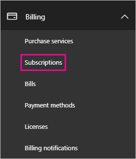

# Unable to add Power BI to Office 365 partner subscription

Microsoft 365 enables companies to resell Microsoft 365 bundled and integrated with their own solutions, providing end-customers with a single point of contact for purchasing, billing, and support.

If you are interested in acquiring Power BI alongside your Office 365 subscription, we recommend you contact your partner to do so. If your partner does not currently offer Power BI, you have different options to pursue.

## Work with your partner to purchase Power BI

If you want to buy a subscription to Power BI Pro or Power BI Premium, work with your partner to consider what options you have:

* Your partner agrees to add Power BI to their portfolio so that you can purchase from them.

* Your partner is able to transition you to a model where you can buy Power BI directly from Microsoft or another partner who offers Power BI.

## Purchase from Microsoft or another channel

Depending on the relationship with your partner, you might be able to purchase Power BI directly from Microsoft or another partner. You can verify whether you can add Power BI subscriptions in the Microsoft 365 admin center (requires membership in the Global Administrator or Billing Administrator role).

1. Go to the [Microsoft 365 admin center](https://admin.microsoft.com/AdminPortal/Home#/homepage).

1. In the left menu, open **Billing**:

    * If you see **Subscriptions**, you can acquire the service from Microsoft directly, or you can contact another partner that offers Power BI.

        

    * If you don't see **Subscriptions**, you can't buy from Microsoft directly or from another partner.

If your partner does not offer Power BI and you can't buy directly from Microsoft or another partner, consider signing up for a free trial.

## Sign up for a free trial

You can sign up for a free trial of Power BI. If you don't purchase Power BI Pro at the end of the trial period, you still have a free license that offers many of the features of Power BI. For more information, see [Sign up for Power BI as an individual](../fundamentals/service-self-service-signup-for-power-bi.md).

### Enable ad-hoc subscriptions

By default, individual sign-ups (also known as ad-hoc subscriptions) are disabled. In this case, you see the following message when you try to sign up: *Your IT department has turned off signup for Microsoft Power BI*.


To enable ad-hoc subscriptions, you can contact your partner and request that they turn it on. If you are an administrator of your tenant, and know how to use Azure Active Directory PowerShell commands, you can enable ad-hoc subscriptions yourself. [Azure Active Directory PowerShell for Graph](/powershell/azure/active-directory/install-adv2/)

1. Sign in to Azure Active Directory using your Microsoft 365 credentials. The first line of the script below prompts you for your credentials. The second line connects to Azure Active Directory.

    ```powershell
    $msolcred = get-credential
    connect-msolservice -credential $msolcred
    ```

    

1. Once you're signed in, run the following command to check the current setting for `AllowAdHocSubscriptions`.

    ```powershell
    Get-MsolCompanyInformation
    ```

1. Run the following command to enable free sign ups.

    ```powershell
    Set-MsolCompanySettings -AllowAdHocSubscriptions $true
    ```

## Next steps

[Power BI licensing in your organization](service-admin-licensing-organization.md)

More questions? [Try asking the Power BI Community](https://community.powerbi.com/)