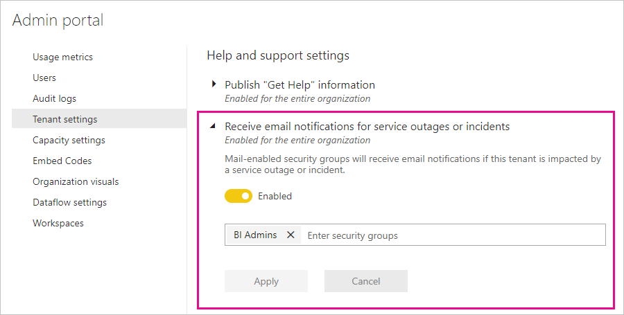

# Service interruption notifications

It's important to have insight to availability of your mission-critical business applications. Power BI provides incident notification so you can optionally receive emails if there's a service disruption or degradation. While the Power BI 99.9% service level agreement (SLA) makes these occurrences rare, we want to ensure that you're kept informed. The following screenshot shows the type of email you'll receive if you enable notifications:

At this time, we send emails for the following _reliability scenarios_:

- Open report reliability
- Model refresh reliability
- Query refresh reliability

Notifications are sent when there's an _extended delay_ in operations like opening reports, dataset refresh, or query executions. After an incident is resolved, you receive a follow-up email.

> [!NOTE]
> This feature is currently available only for dedicated capacities in Power BI Premium. It's not available for shared or embedded capacity.

## Capacity and reliability notifications

When a Power BI Premium capacity is experiencing extended periods of high resource use that potentially impacts reliability, a notification email is sent. Examples of such impacts include extended delays in operations such as opening a report, dataset refresh, and query executions. 

The notification email provides information about the reason for the high resource usage, including the following details:

* Dataset ID of the responsible dataset
* Operation type
* CPU time associated with the high resource usage. Here's the [definition of CPU time](https://wikipedia.org/wiki/CPU_time) in Wikipedia.

Power BI also sends email notifications when an overload in a Power BI Premium capacity is detected. The email explains the likely reason for the overload, which operations generated the load in the previous 10 minutes, and how much load each operation generated.

If you have more than one Premium capacity, the email includes information about those capacities during the overloaded period. This info helps you consider moving the workspaces containing resource-intensive items to capacities with the least load.

Overload email notifications are only sent when an overload threshold is triggered. You won't receive a second email when the load on that Premium capacity returns to non-overloaded levels.

The following image shows an example notification email:

## Enable notifications

A Power BI admin enables notifications in the admin portal:

1. Identify or create an email-enabled security group that should receive notifications.

1. In the admin portal, select **Tenant settings**. Under **Help and support settings**, expand **Receive email notifications for service outages or incidents**.

1. Enable notifications, enter a security group, and select **Apply**.

    

> [!NOTE]
> Power BI sends notifications from the account no-reply-powerbi@microsoft.com. Ensure that this account is added to your safe sender list so that notifications don't end up in a junk email folder.

## Service health in Microsoft 365

This article describes how to receive service notifications through Power BI. You can also monitor Power BI service health through Microsoft 365. Opt in to receive email notifications about service health from Microsoft 365. Learn more in [How to check Microsoft 365 service health](/microsoft-365/enterprise/view-service-health).

## Next steps

[Power BI Pro and Power BI Premium support options](service-support-options.md)

More questions? [Try the Power BI Community](https://community.powerbi.com/)