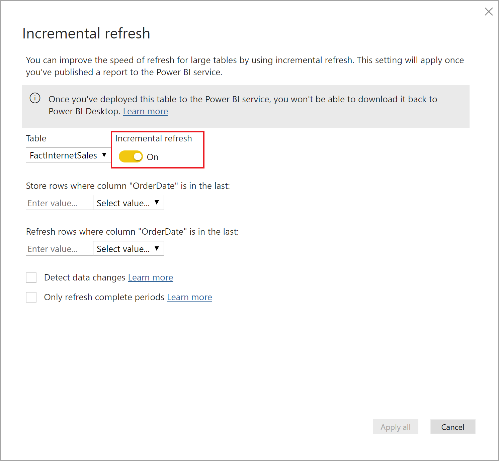
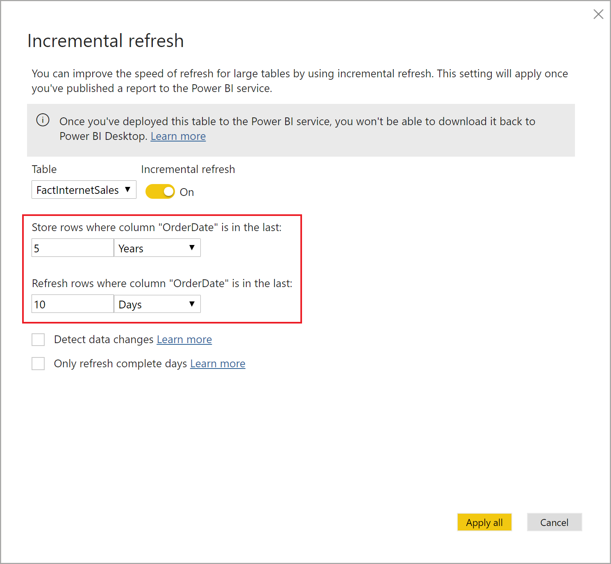
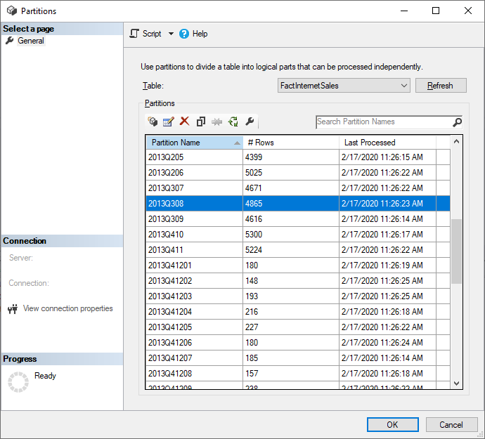
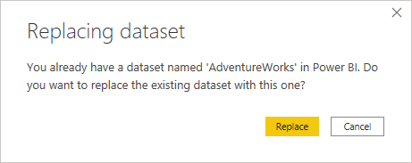
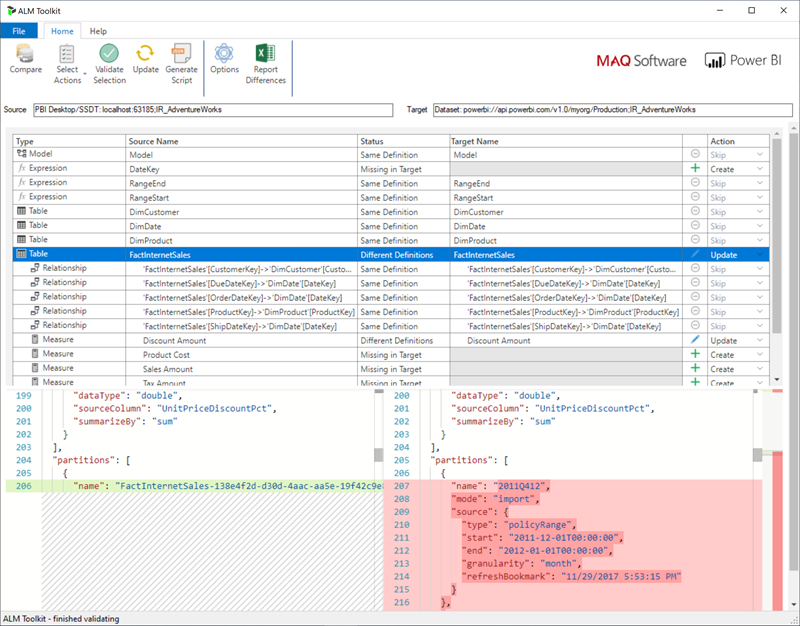

# Incremental refresh in Power BI

Incremental refresh enables very large datasets in Power BI with the following benefits:

> [!div class="checklist"]
> * **Refreshes are faster** - Only data that has changed needs to be refreshed. For example, refresh only the last five days of a ten-year dataset.
> * **Refreshes are more reliable** - It's no longer necessary to maintain long-running connections to volatile source systems.
> * **Resource consumption is reduced** - Less data to refresh reduces overall consumption of memory and other resources.

> [!NOTE]
> Incremental refresh is now available for Power BI Pro, Premium, and shared subscriptions and datasets.

> [!NOTE]
> Power BI Premium recently released a new version of Premium, called **Premium Gen2**, which is currently in preview. Premium Gen2 will simplify the management of Premium capacities, and reduce management overhead. Premium Gen2 significantly improves scheduled refresh, by enabling autoscaling to avoid refresh conflicts. For more information, see [Power BI Premium Generation 2 (preview)](service-premium-what-is.md#power-bi-premium-generation-2-preview).


## Configure incremental refresh

Incremental refresh policies are defined in Power BI Desktop and applied when published to the Power BI service.

### Filter large datasets in Power BI Desktop

Large datasets with potentially billions of rows may not fit into a Power BI Desktop model because the PBIX file is limited by the memory resources available on the desktop computer. Such datasets are therefore commonly filtered upon import. This type of filtering applies whether using incremental refresh or not. For incremental refresh, you filter by using Power Query date/time parameters.

#### RangeStart and RangeEnd parameters

For incremental refresh, datasets are filtered by using Power Query date/time parameters with the reserved, case-sensitive names **RangeStart** and **RangeEnd**. These parameters are used to filter the data imported into Power BI Desktop, and also to dynamically partition the data into ranges once published to the Power BI service. The parameter values are substituted by the service to filter for each partition. There's no need to set them in dataset settings in the service. Once published, the parameter values are overridden automatically by the Power BI service.

To define the parameters with default values, in the Power Query Editor, select **Manage Parameters**.


With the parameters defined, you can then apply the filter by selecting the **Custom Filter** menu option for a column.


Ensure rows are filtered where the column value *is after or equal to* **RangeStart** and *before* **RangeEnd**. Other filter combinations may result in double counting of rows.


> [!IMPORTANT]
> Verify queries have an equal to (=) on either **RangeStart** or **RangeEnd**, but not both. If the equal to (=) exists on both parameters, a row could satisfy the conditions for two partitions, which could lead to duplicate data in the model. For example,  
> \#"Filtered Rows" = Table.SelectRows(dbo_Fact, each [OrderDate] **>= RangeStart** and [OrderDate] **<= RangeEnd**) could result in duplicate data.

> [!TIP]
> While the data type of the parameters must be date/time, it's possible to convert them to match the requirements of the datasource. For example, the following Power Query function converts a date/time value to resemble an integer surrogate key of the form *yyyymmdd*, which is common for data warehouses. The function can be called by the filter step.
>
> `(x as datetime) => Date.Year(x)*10000 + Date.Month(x)*100 + Date.Day(x)`

Select **Close and Apply** from the Power Query Editor. You should have a subset of the dataset in Power BI Desktop.

#### Filter date column updates

The filter on the date column is used to dynamically partition the data into ranges in the Power BI service. Incremental refresh isn't designed to support cases where the filtered date column is updated in the source system. An update is interpreted as an insertion and a deletion, not an actual update. If the deletion occurs in the historical range and not the incremental range, it won't get picked up. This can cause data refresh failures due to partition-key conflicts.

#### Query folding

It's important the partition filters are pushed to the source system when queries are submitted for refresh operations. To push filtering down means the datasource should support query folding. Most data sources that support SQL queries support query folding. However, data sources like flat files, blobs, and web feeds typically do not. In cases where the filter is not supported by the datasource back-end, it cannot be pushed down. In such cases, the mashup engine compensates and applies the filter locally, which may require retrieving the full dataset from the data source. This can cause incremental refresh to be very slow, and the process can run out of resources either in the Power BI service or in the on-premises data gateway if used.

Given the various levels of query folding support for each datasource, it's recommended that verification is performed to ensure the filter logic is included in the source queries. To make this easier, Power BI Desktop attempts to perform this verification for you. If unable to verify, a warning is displayed in the incremental refresh dialog when defining the incremental refresh policy. SQL based data sources such as SQL, Oracle, and Teradata can rely on this warning. Other data sources may be unable to verify without tracing queries. If Power BI Desktop is unable to confirm, the following warning is displayed. If you see this warning and want to check that the necessary query folding is occurring, you can use the Query Diagnostics feature, or trace queries received by the source database.

 

### Define the refresh policy

Incremental refresh is available on the context menu for tables, except for Live Connection models.


#### Incremental refresh dialog

The incremental refresh dialog is displayed. Use the toggle to enable the dialog.



> [!NOTE]
> If the Power Query expression for the table doesn't refer to the parameters with reserved names, the toggle is disabled.

The header text explains the following:

- Refresh policies are defined in Power BI Desktop, and they are applied by refresh operations in the service.

- If you're able to download the PBIX file containing an incremental-refresh policy from the Power BI service, it cannot be opened in Power BI Desktop. While this may be supported in the future, keep in mind these datasets can grow to be so large that they are impractical to download and open on a typical desktop computer.

#### Refresh ranges

The following example defines a refresh policy to store data for five full calendar years plus data for the current year up to the current date, and incrementally refresh ten full days of data. The first refresh operation loads historical data. Subsequent refreshes are incremental, and (if scheduled to run daily) perform the following operations:

- Add a new day of data.

- Refresh ten full days up to the current date.

- Remove calendar years that are older than five years prior to the current date. For example, if the current date is January 1 2019, the year 2013 is removed.

The first refresh in the Power BI service may take longer to import all five full calendar years. Subsequent refreshes may be finished in a fraction of the time.



#### Current date

The *current date* is based on the system date at the time of refresh. If scheduled refresh is enabled for the dataset in the Power BI service, the specified time zone will be taken into account when determining the current date. Both manually invoked and scheduled refreshes through the Power BI service observe the time zone if available. For example, a refresh that occurs at 8 PM Pacific Time (US and Canada) with time zone specified will determine the current date based on Pacific Time, not GMT (which would otherwise be the next day). Refresh operations not invoked through the Power BI service, such as the [TMSL refresh command](/analysis-services/tmsl/refresh-command-tmsl?view=power-bi-premium-current), will not consider the scheduled refresh time zone


> [!NOTE]
> Definition of these ranges might be all you need, in which case you can go straight to the publishing step below. The additional dropdowns are for advanced features.

### Advanced policy options

#### Detect data changes

Incremental refresh of ten days is more efficient than full refresh of five years. However, it's possible to do even better. If you select the **Detect data changes** checkbox, you can select a date/time column used to identify and refresh only the days where the data has changed. This assumes such a column exists in the source system, which is typically for auditing purposes. **This should not be the same column used to partition the data with the RangeStart/RangeEnd parameters.** The maximum value of this column is evaluated for each of the periods in the incremental range. If it has not changed since the last refresh, there is no need to refresh the period. In the example, this could further reduce the days incrementally refreshed from ten to around two.


> [!TIP]
> The current design requires that the column to detect data changes is persisted and cached into memory. You may want to consider one of the following techniques to reduce cardinality and memory consumption.
>
> Persist only the maximum value of this column at time of refresh, perhaps using a Power Query function.
>
> Reduce the precision to a level that is acceptable given your refresh-frequency requirements.
>
> Define a custom query for detecting data changes using the XMLA endpoint and avoid persisting the column value altogether. See custom queries for detect data changes below for more information.

#### Only refresh complete periods

Let's say your refresh is scheduled to run at 4:00 AM every morning. If data appears in the source system during those 4 hours, you may not want to account for it. Some business metrics such as barrels per day in the oil and gas industry make no sense with partial days.

Another example is refreshing data from a financial system where data for the previous month is approved on the 12th calendar day of the month. You could set the incremental range to 1 month and schedule the refresh to run on the 12th day of the month. With this option checked, it would for example refresh January data on February 12th.


> [!NOTE]
> Refresh operations in the service run under UTC time. This can determine the effective date and affect complete periods. We plan to add the ability to override the effective date for a refresh operation.

## Publish to the service

You can now refresh the model. The first refresh may take longer to import the historical data. Subsequent refreshes can be much quicker because they use incremental refresh.

## Query timeouts

The [troubleshooting refresh](../connect-data/refresh-troubleshooting-refresh-scenarios.md) article explains that refresh operations in the Power BI service are subject to timeouts. Queries can also be limited by the default timeout for the data source. Most relational sources allow overriding timeouts in the M expression. For example, the expression below uses the [SQL Server data-access function](/powerquery-m/sql-database) to set it to 2 hours. Each period defined by the policy ranges submits a query observing the command timeout setting.

```powerquery-m
let
    Source = Sql.Database("myserver.database.windows.net", "AdventureWorks", [CommandTimeout=#duration(0, 2, 0, 0)]),
    dbo_Fact = Source{[Schema="dbo",Item="FactInternetSales"]}[Data],
    #"Filtered Rows" = Table.SelectRows(dbo_Fact, each [OrderDate] >= RangeStart and [OrderDate] < RangeEnd)
in
    #"Filtered Rows"
```

## XMLA endpoint benefits for incremental refresh

The [XMLA endpoint](service-premium-connect-tools.md) for datasets in a Premium capacity can be enabled for read-write operations, which can provide considerable benefits for incremental refresh. Refresh operations through the XMLA endpoint are not limited to [48 refreshes per day](../connect-data/refresh-data.md#data-refresh), and the [scheduled refresh timeout](../connect-data/refresh-troubleshooting-refresh-scenarios.md#scheduled-refresh-timeout) is not imposed, which can be useful in incremental refresh scenarios.

### Refresh management with SQL Server Management Studio (SSMS)

With XMLA endpoint read-write enabled, SSMS can be used to view and manage partitions generated by the application of incremental refresh policies. This allows, for example, to refresh a specific historical partition not in the incremental range to perform a back-dated update without having to refresh all historical data. You can also use SSMS to load historical data for very large datasets by incrementally adding/refreshing historical partitions in batches.



#### Override incremental refresh behavior

With SSMS, you also have more control over how to invoke incremental refreshes from using the [Tabular Model Scripting Language (TMSL)](/analysis-services/tmsl/tabular-model-scripting-language-tmsl-reference?view=power-bi-premium-current) and the [Tabular Object Model (TOM)](/analysis-services/tom/introduction-to-the-tabular-object-model-tom-in-analysis-services-amo?view=power-bi-premium-current). For example, in SSMS, in Object Explorer, right-click a table and then select the **Process Table** menu option. Then click the **Script** button to generate a TMSL refresh command.


The following parameters can be inserted into the TMSL refresh command to override the default incremental refresh behavior.

- **applyRefreshPolicy** – If a table has an incremental refresh policy defined, applyRefreshPolicy will determine if the policy is applied or not. If the policy is not applied, a process full operation will leave partition definitions unchanged and all partitions in the table will be fully refreshed. Default value is true.

- **effectiveDate** – If an incremental refresh policy is being applied, it needs to know the current date to determine rolling window ranges for the historical range and the incremental range. The effectiveDate parameter allows you to override the current date. This is useful for testing, demos, and business scenarios where data is incrementally refreshed up to a date in the past or the future (for example, budgets in the future). The default value is the current date.

```json
{ 
  "refresh": {
    "type": "full",

    "applyRefreshPolicy": true,
    "effectiveDate": "12/31/2013",

    "objects": [
      {
        "database": "IR_AdventureWorks", 
        "table": "FactInternetSales" 
      }
    ]
  }
}
```

To learn more about overriding default incremental refresh behavior with TMSL, see [Refresh command](/analysis-services/tmsl/refresh-command-tmsl?view=power-bi-premium-current).

### Custom queries for detect data changes

You can use TMSL and/or TOM to override the detected data changes behavior. Not only can this be used to avoid persisting the last-update column in the in-memory cache, it can enable scenarios where a configuration/instruction table is prepared by ETL processes for the purpose of flagging only the partitions that need to be refreshed. This can create a more efficient incremental refresh process where only the required periods are refreshed, no matter how long ago data updates took place.

The pollingExpression is intended to be a lightweight M expression or name of another M query. It must return a scalar value and will be executed for each partition. If the value returned is different to what it was the last time an incremental refresh occurred, the partition is flagged for full processing.

The following example covers all 120 months in the historical range for backdated changes. Specifying 120 months instead of 10 years means data compression may not be quite as efficient, but avoids having to refresh a whole historical year, which would be more expensive when a month would suffice for a backdated change.

```json
"refreshPolicy": {
    "policyType": "basic",
    "rollingWindowGranularity": "month",
    "rollingWindowPeriods": 120,
    "incrementalGranularity": "month",
    "incrementalPeriods": 120,
    "pollingExpression": "<M expression or name of custom polling query>",
    "sourceExpression": [
    "let ..."
    ]
}
```

## Metadata-only deployment

When publishing a new version of a PBIX file from Power BI Desktop to a workspace in Power BI Premium, if a dataset with the same name already exists, you are prompted to replace the existing dataset.



In some cases you may not want to replace the dataset, especially with incremental refresh. The dataset in Power BI Desktop could be much smaller than the one in the service. If the dataset in the service has an incremental refresh policy applied, it may have several years of historical data that will be lost if the dataset is replaced. Refreshing all the historical data could take hours and result in system downtime for users.

Instead, it's better to perform a metadata-only deployment. This allows deployment of new objects without losing the historical data. For example, if you have added a few measures, you can deploy only the new measures without needing to refresh the data, saving a lot of time.

When configured for read-write, the XMLA endpoint provides compatibility with tools that make this happen. For example, the ALM Toolkit is a schema diff tool for Power BI datasets and can be used to perform deployment of metadata only.

Download and install the latest version of the ALM Toolkit from the [Analysis Services Git repo](https://github.com/microsoft/Analysis-Services/releases). Documentation links and information on supportability are available via the Help ribbon. To perform a metadata only deployment, perform a comparison and select the running Power BI Desktop instance as the source, and the existing dataset in the service as the target. Consider the differences displayed and skip the update of the table with incremental refresh partitions, or use the Options dialog to retain partitions for table updates. Validate the selection to ensure the integrity of the target model and then update.



## See also

[Dataset connectivity with the XMLA endpoint](service-premium-connect-tools.md)   
[Troubleshooting refresh scenarios](../connect-data/refresh-troubleshooting-refresh-scenarios.md)


Power BI has introduced Power BI Premium Gen2 as a preview offering, which improves the Power BI Premium experience with improvements in the following:
* Performance
* Per-user licensing
* Greater scale
* Improved metrics
* Autoscaling
* Reduced management overhead

For more information about Power BI Premium Gen2, see [Power BI Premium Generation 2 (preview)](service-premium-what-is.md#power-bi-premium-generation-2-preview).