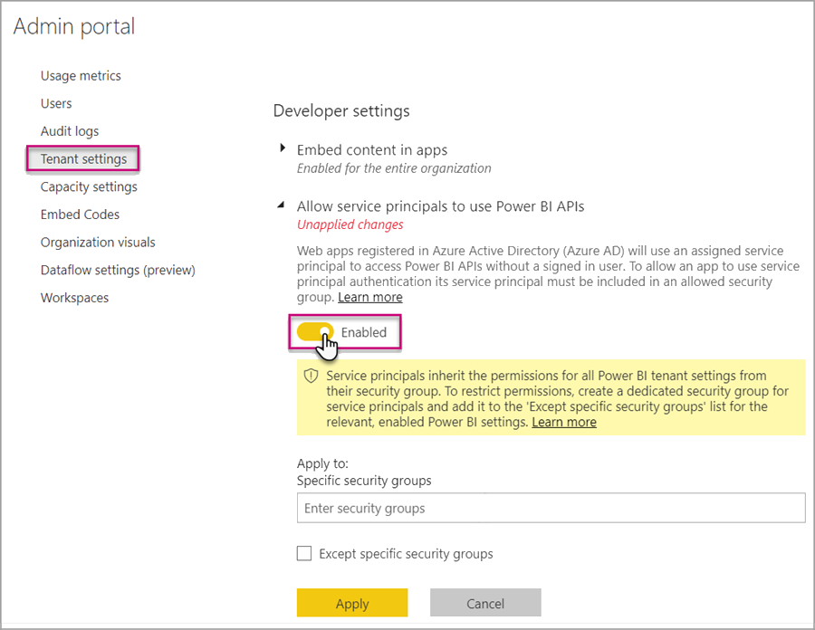
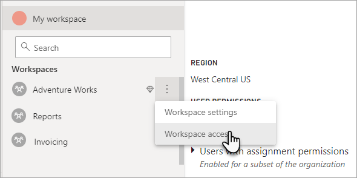
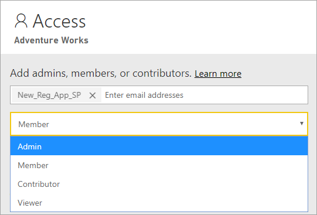

# Automate Premium workspace and dataset tasks with service principals

Service principals are an Azure Active Directory *app registration* you create within your tenant to perform unattended resource and service level operations. They're a unique type of user identity with an app name, application ID, tenant ID, and *client secret* or certificate for a password.

Power BI Premium uses the same service principal functionality as Power BI Embedded. To learn more, see [Embedding Power BI content with service principals](../developer/embedded/embed-service-principal.md).

In **Power BI Premium**, service principals can also be used with the [XMLA endpoint](service-premium-connect-tools.md) to automate dataset management tasks such as provisioning workspaces, deploying models, and dataset refresh with:

- PowerShell
- Azure Automation
- Azure Logic Apps
- Custom client applications

Only [New workspaces](../collaborate-share/service-new-workspaces.md) support XMLA endpoint connections using service principals. Classic workspaces aren't supported. A service principal has only those permissions necessary to perform tasks for workspaces that it is assigned. Permissions are assigned through workspace Access, much like regular UPN accounts.

To perform write operations, the capacity's **Datasets workload** must have the [XMLA endpoint enabled for read-write](service-premium-connect-tools.md#enable-xmla-read-write). Datasets published from Power BI Desktop should have the [Enhanced metadata format](../connect-data/desktop-enhanced-dataset-metadata.md) feature enabled.

> [!NOTE]
> The XMLA endpoint feature in Power BI Premium is **Preview**. Features in preview should not be used in a production environment. Certain functionality, support, and documentation is limited.  Refer to the [Microsoft Online Services Terms (OST)](https://www.microsoft.com/licensing/product-licensing/products?rtc=1) for details.

## Create a service principal

Service principals are created as an app registration in the Azure portal or by using PowerShell. When creating your service principal, be sure to copy and save separately the app name, Application (client) ID, Directory (tenant) ID, and client secret. For steps on how to create a service principal, see:

[Create service principal - Azure portal](/azure/active-directory/develop/howto-create-service-principal-portal)   
[Create service principal - PowerShell](/azure/active-directory/develop/howto-authenticate-service-principal-powershell)

## Create an Azure AD security group

By default, service principals have access to any tenant settings they're enabled for. Depending on your admin settings, access can include specific security groups or the entire organization.

To restrict service principal access to specific tenant settings, you can allow access to specific security groups. Alternatively, you can create a dedicated security group for service principals, and exclude it from the desired tenant settings. For steps on how to create a security group and add a service principal, see [Create a basic group and add members using Azure Active Directory](/azure/active-directory/fundamentals/active-directory-groups-create-azure-portal).

## Enable service principals

Before using service principals in Power BI, an admin must first enable service principal access in the Power BI admin portal.

In the Power BI **Admin portal** > **Tenant settings**, expand **Allow service principals to use Power BI APIs**, and then click **Enabled**. To apply permissions to a security group, add the group name to **Specific security groups**.



## Workspace access

In order for your service principal to have the necessary permissions to perform Premium workspace and dataset operations, you must add the service principal as a workspace Member or Admin. Using Workspace access in the Power BI service is described here, but you can also use the [Add Group User REST API](/rest/api/power-bi/groups/addgroupuser).

1. In the Power BI service, for a workspace, select **More** > **Workspace access**.

    

2. Search by application name, Add the service principal as an **Admin** or **Member** to the workspace.

    

## Connection strings for the XMLA endpoint

Once you've created a service principal, enabled service principals for your tenant, and added the service principal to Workspace access, you can use it as a user identity in connection strings with the XMLA endpoint. The difference is for the User ID and Password parameters you specify the application ID, tenant ID, and application secret.

`Data Source=powerbi://api.powerbi.com/v1.0/myorg/<workspace name>; Initial Catalog=<dataset name>;User ID=app:<appId>@<tenantId>;Password=<app_secret>;`

### PowerShell

#### Using SQLServer module

In the following example, AppId, TenantId, and AppSecret are used to authenticate a dataset refresh operation:

```powershell
Param (
        [Parameter(Mandatory=$true)] [String] $AppId,
        [Parameter(Mandatory=$true)] [String] $TenantId,
        [Parameter(Mandatory=$true)] [String] $AppSecret
       )
$PWord = ConvertTo-SecureString -String $AppSecret -AsPlainText -Force

$Credential = New-Object -TypeName "System.Management.Automation.PSCredential" -ArgumentList $AppId, $PWord

Invoke-ProcessTable -Server "powerbi://api.powerbi.com/v1.0/myorg/myworkspace" -TableName "mytable" -DatabaseName "mydataset" -RefreshType "Full" -ServicePrincipal -ApplicationId $AppId -TenantId $TenantId -Credential $Credential
```

### AMO and ADOMD

When connecting with client applications and web apps, [AMO and ADOMD client libraries](/azure/analysis-services/analysis-services-data-providers) version 15.1.42.26 (June 2020) and higher installable packages from NuGet support service principals in connection strings using the following syntax: `app:AppID` and password or `cert:thumbprint`.

In the following example, `appID` and a `password` are used to perform a model database refresh operation:

```csharp
string appId = "xxx";
string authKey = "yyy";
string connString = $"Provider=MSOLAP;Data source=powerbi://api.powerbi.com/v1.0/<tenant>/<workspacename>;Initial catalog=<datasetname>;User ID=app:{appId};Password={authKey};";
Server server = new Server();
server.Connect(connString);
Database db = server.Databases.FindByName("adventureworks");
Table tbl = db.Model.Tables.Find("DimDate");
tbl.RequestRefresh(RefreshType.Full);
db.Model.SaveChanges();
```

## Next steps

[Dataset connectivity with the XMLA endpoint](service-premium-connect-tools.md)  
[Azure Automation](/azure/automation)  
[Azure Logic Apps](/azure/logic-apps/)  
[Power BI REST APIs](/rest/api/power-bi/)