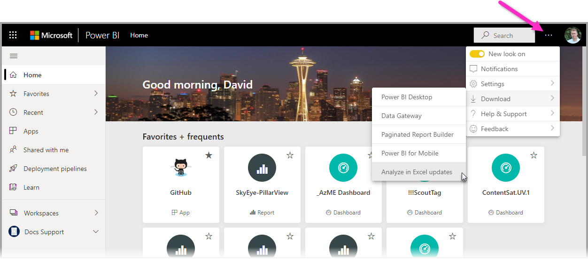
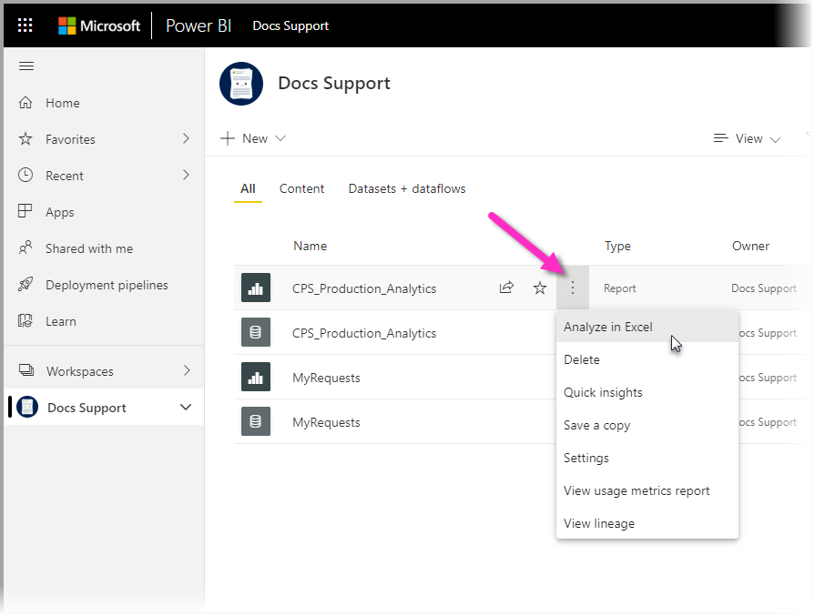
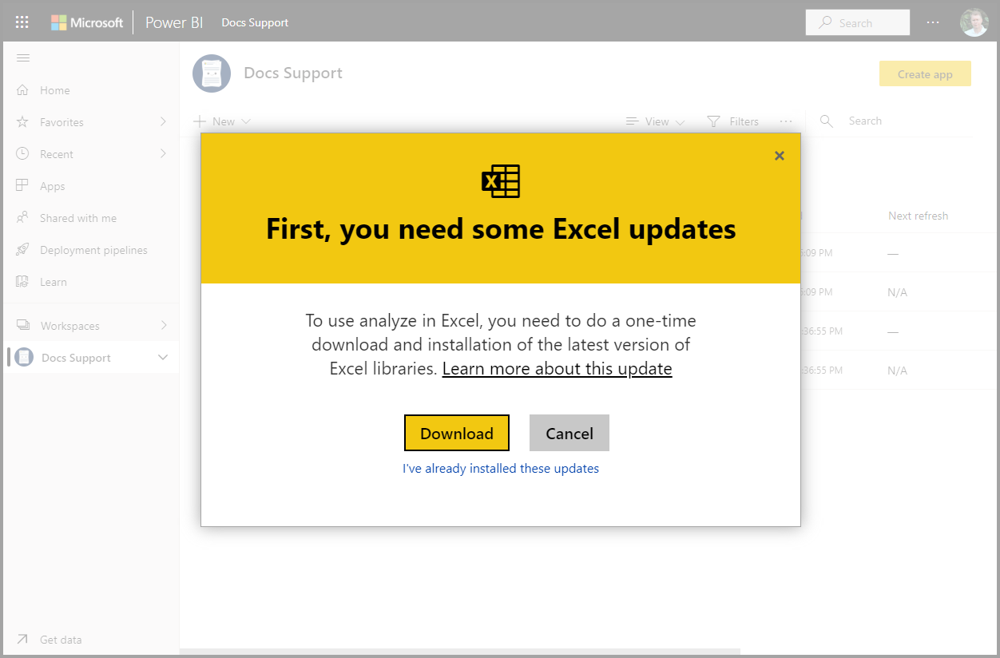
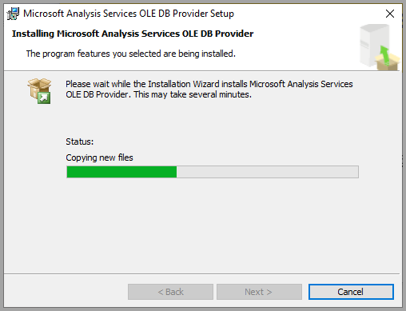
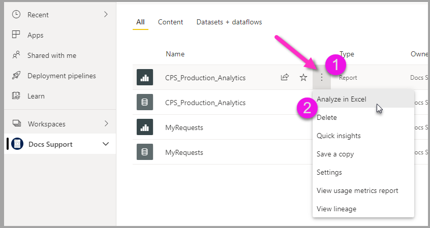
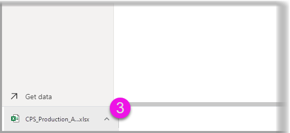
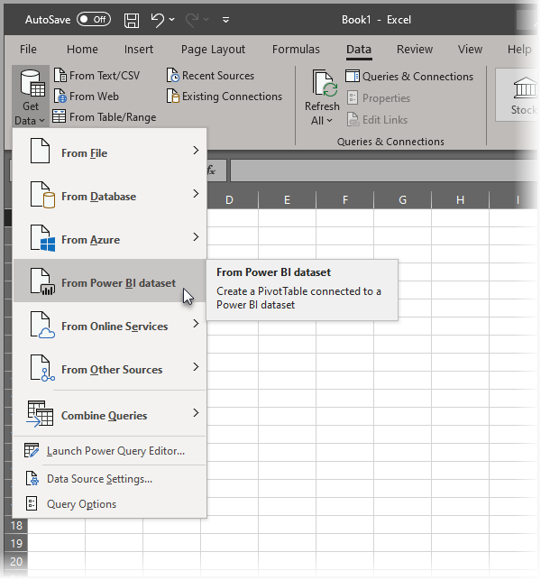

# Analyze in Excel
With **Analyze in Excel**, you can bring Power BI datasets into Excel, and then view and interact with them using PivotTables, charts, slicers, and other Excel features. To use **Analyze in Excel** you must first download the feature from Power BI, install it, and then select one or more datasets to use in Excel. 

This article shows you how to install and use Analyze in Excel, describes its limitations, then provides some next steps. Here's what you'll learn:

* [Install Analyze in Excel](#install-analyze-in-excel)
* [Connect to Power BI data](#connect-to-power-bi-data)
* [Use Excel to analyze the data](#use-excel-to-analyze-the-data)
* [Saving and sharing your workbook](#saving-and-sharing-your-new-workbook)
* [Requirements](#requirements)

Let's jump in, and get the installation process started.

## Install Analyze in Excel

You must install **Analyze in Excel** from links provided in the Power BI service. Power BI detects the version of Excel you have on your computer, and automatically downloads the appropriate version (32-bit or 64-bit). The Power BI service runs in a browser. You can sign in to the Power BI using the following link:

* [Sign in to Power BI](https://app.powerbi.com)

Once you've signed in and the Power BI service is running in your browser, select the **More options** item (the ...) in the upper-right corner and then select **Download > Analyze in Excel updates**. This menu item applies to new installations of updates of Analyze in Excel.

Alternatively, you can navigate in the Power BI service to a dataset you want to analyze, and select the **More options** item for a dataset, report, or other Power BI item. From the menu that appears, select the **Analyze in Excel** option, as shown in the following image.

Either way, Power BI detects whether you have Analyze in Excel installed, and if not, you're prompted to download. 

When you select download, Power BI detects the version of Excel you have installed and downloads the appropriate version of the Analyze in Excel installer. You see a download status in the bottom of your browser, or wherever your browser displays download progress. 

When the download completes, run the installer (.msi) to install Analyze in Excel. The name of the installation process is different from Analyze in Excel; the name will be **Microsoft Analysis Services OLE DB Provider** as shown in the following image, or something similar.

Once it completes, you're ready to select a report in the Power BI service (or other Power BI data element, like a dataset), and then analyze it in Excel.

## Connect to Power BI data

In the Power BI service, navigate to the dataset or report you want to analyze in Excel, and then:

1. Select the **More options** menu.

1. Select **Analyze in Excel** from the menu items that appear.

    The following image shows selecting a report.

    
    
    >[!NOTE]
    >Remember that if you select Analyze in Excel from a Report menu, it is the report's underlying dataset that is brought into Excel.

    The Power BI service then creates an Excel file of the dataset that's designed (and structured) for use with **Analyze in Excel**, and begins a download process in your browser.
    
    

    The file name matches the dataset (or report, or other data source) from which it was derived. So if the report was called *Quarterly Report*, then the downloaded file would be **Quarterly Report.xlsx**.

3. Launch the Excel file.

    >[!NOTE]
    >The first time you open the file, you may have to **Enable Editing** and then **Enable Content**, depending on your [Protected view](https://support.microsoft.com/en-gb/office/what-is-protected-view-d6f09ac7-e6b9-4495-8e43-2bbcdbcb6653?ui=en-us&rs=en-gb&ad=gb) and [Trusted document](https://support.microsoft.com/en-us/office/trusted-documents-cf872bd8-47ec-4c02-baa5-1fdba1a11b53) settings.
    >
    >
    >
    >

## Use Excel-to-analyze-the-data

Once you've enabled editing and content, Excel presents you with an empty **PivotTable** and **Fields** list from the Power BI dataset, ready to be analyzed.

The Excel file has an MSOLAP connection string that connects to your dataset in Power BI. When you analyze or work with the data, Excel queries that dataset in Power BI and returns the results to Excel. If that dataset connects to a live data source using DirectQuery, Power BI queries the data source and returns the result to Excel.

With that connection to the data in Power BI now established, you can create PivotTables, charts, and analyze that dataset just as you would work with a local dataset in Excel.

**Analyze in Excel** is especially useful for datasets and reports that connect to the following data sources:

* *Analysis Services Tabular* or *Multidimensional* databases
* Power BI Desktop files or Excel workbooks with data models that have model measures created using Data Analysis Expressions (DAX).

> [!IMPORTANT]
> Using **Analyze in Excel** exposes all detail-level data to any users with permission to the dataset.

There are a handful of things to consider when you begin using Analyze in Excel, which might require an extra step or two to reconcile. These possibilities are described in the following sections. 

### Sign in to Power BI
Although you’re signed in to Power BI in your browser, the first time you open a new Excel file in Excel you may be asked to sign in to Power BI with your Power BI account. This authenticates the connection from Excel to Power BI.

### Users with multiple Power BI accounts
Some users have multiple Power BI accounts. If that's you, you might be signed in to Power BI with one account, but your other account has access to the dataset being used in Analyze in Excel. In that case, you might see a **Forbidden** error, or a sign-in failure when attempting to access a dataset that's being used in an Analyze in Excel workbook.

If that happens, you'll be provided an opportunity to sign in again, at which time you can sign in with the Power BI account that has access to the dataset being accessed by Analyze in Excel. You can also select your name in the top ribbon in Excel, which identifies which account is currently signed in. Sign out and sign back in with the other account.

## Saving and sharing your new workbook

You can **Save** the Excel workbook you create with the Power BI dataset, just like any other workbook. However, you cannot publish or import the workbook back into Power BI, because you can only publish or import workbooks into Power BI that have data in tables, or that have a data model. Since the new workbook simply has a connection to the dataset in Power BI, publishing or importing it into Power BI would be going in circles!

Once your workbook is saved, you can share it with other Power BI users in your organization. 

When a user with whom you’ve shared your workbook opens it, they’ll see your PivotTables and data as they appeared when the workbook was last saved, which may not be the latest version of the data. To get the latest data, users must use the **Refresh** button on the **Data** ribbon. And since the workbook is connecting to a dataset in Power BI, users attempting to refresh the workbook must sign in to Power BI and install the Excel updates the first time they attempt to update using this method.

Since users need to refresh the dataset, and refresh for external connections is not supported in Excel Online, it’s recommended that users open the workbook in the desktop version of Excel on their computer.

> [!NOTE]
> Administrators for Power BI tenants can use the *Power BI Admin Portal* to disable the use of **Analyze in Excel** with on-premises datasets housed in Analysis Services (AS) databases. When that option is disabled, **Analyze in Excel** is disabled for AS databases, but continues to be available for use with other datasets.

## Other ways to access Power BI datasets from Excel
Users with specific Office SKUs can also connect to Power BI datasets from within Excel by using the **Get Data** feature in Excel. If your SKU does not support this feature, the **Get Data** menu option does not appear.

From the **Data** ribbon menu, select **Get Data > From Power BI dataset** as shown in the following image.

A pane appears, in which you can browse datasets to which you have access, see if datasets are certified or promoted, and determine whether data protection labels have been applied to those datasets. 

For more information about getting data into Excel in this way, see [Create a PivotTable from Power BI datasets](https://support.office.com/article/31444a04-9c38-4dd7-9a45-22848c666884) in the Excel documentation.

You can also access **featured tables** in Excel, in the **Data Types** gallery. To learn more about featured tables, and how to access them, see [Access Power BI featured tables in Excel (preview)](service-excel-featured-tables.md).

## Requirements
There are a few requirements for using **Analyze in Excel**:

* **Analyze in Excel** is supported for Microsoft Excel 2010 SP1 and later.

* Excel PivotTables do not support drag-and-drop aggregation of numeric fields. Your dataset in Power BI *must have pre-defined measures*. Read about [creating measures](../transform-model/desktop-measures.md).
* Some organizations may have Group Policy rules that prevent installing the required **Analyze in Excel** updates to Excel. If you’re unable to install the updates, check with your administrator.
* **Analyze in Excel** requires that the dataset be in Power BI Premium or that the user have a Power BI Pro license. To learn more about the differences in functionality between license types, take a look at the _Power BI features comparison_ section of [Power BI pricing](https://powerbi.microsoft.com/pricing/).
* Users can connect to datasets through Analyze in Excel if they have permission for the underlying dataset.  A user could have this permission in several ways, such as having the Member role in the workspace containing the dataset, having a report or dashboard shared to them that uses the dataset, or having Build permission for the dataset, in either a workspace or an app that contains the dataset. Read more about [Build permission](../connect-data/service-datasets-build-permissions.md) for datasets.
* Guest users cannot use **Analyze in Excel** for datasets sent from (originating from) another tenant. 
* **Analyze in Excel** is a Power BI service feature, and is not available in Power BI Report Server or Power BI Embedded. 
* **Analyze in Excel** is only supported on computers running Microsoft Windows.

For users who need to uninstall the **Analyze in Excel** feature, you can do so using the **Add or remove programs** system setting on your Windows computer.

## Troubleshooting
There may be times when using Analyze in Excel that you get an unexpected result, or the feature doesn't work as you expected. [This page provides solutions for common issues when using Analyze in Excel](desktop-troubleshooting-analyze-in-excel.md).

## Next steps

You might also be interested in the following articles:

* [Use cross-report drillthrough in Power BI Desktop](../create-reports/desktop-cross-report-drill-through.md)
* [Using slicers Power BI Desktop](../visuals/power-bi-visualization-slicers.md)
* [Troubleshooting Analyze in Excel](desktop-troubleshooting-analyze-in-excel.md)
* [Access Power BI featured tables in Excel (preview)](service-excel-featured-tables.md).

