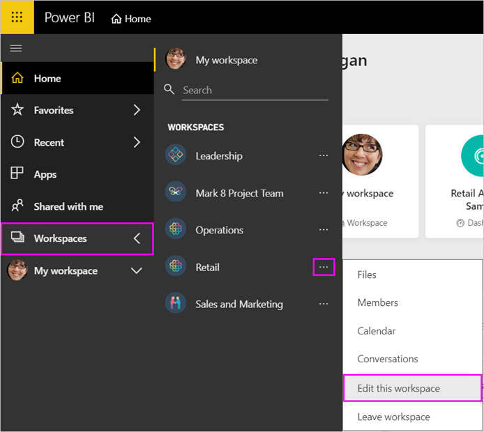
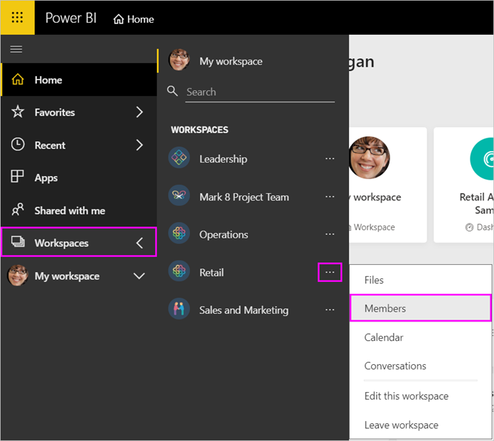
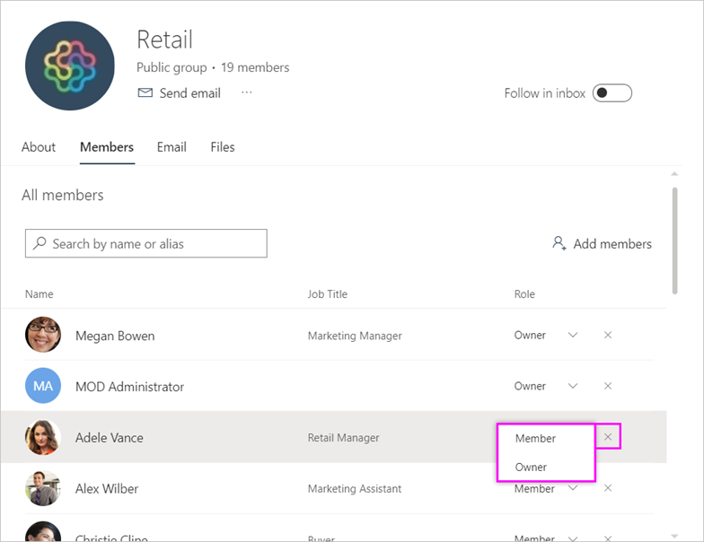

# Manage your workspace in Power BI and Office 365

As creator or admin of a [workspace in Power BI](service-create-distribute-apps.md) or in Office 365, you manage some aspects of the workspace in Power BI. Other aspects you manage in Office 365.

> [!NOTE]
> The new workspace experience changes the relationship between Power BI workspaces and Office 365 groups. You aren't automatically creating an Office 365 group every time you create one of the new workspaces. Read about [creating the new workspaces](service-create-the-new-workspaces.md).

In **Power BI** you can:

* Add or remove workspace members, including making a workspace member an admin.
* Edit the workspace name.
* Delete the workspace, which also deletes the Office 365 group.

In **Office 365** you can:

* Add or remove your workspace's group members, including making a member an owner.
* Edit the group name, image, description, and other settings.
* See the group email address.
* Delete the group.

You need a [Power BI Pro license](../service-features-license-type.md) to be an admin or member of a workspace. Your app users need a Power BI Pro license, too, unless your workspace is in a Power BI Premium capacity. Read [What is Power BI Premium?](../admin/service-premium-what-is.md) for details.

## Edit your workspace in Power BI

1. In the Power BI service, select the arrow next to **Workspaces** > select **More options** (...) next to your workspace name > **Edit this workspace**.

   

   > [!NOTE]
   > You only see **Edit this workspace** if you’re a workspace admin.

1. Here you can rename the workspace, add or remove members, or delete the workspace.

   

1. Select **Save** or **Cancel**.

## Edit Power BI workspace properties in Office 365

You can also edit aspects of a workspace directly in Outlook for Office 365.

### Edit the members of the workspace group

1. In the Power BI service, select the arrow next to **Workspaces** > select **More options** (...) next to your workspace name > **Members**.

   

   This opens the Outlook for Office 365 group view of your workspace. You may need to sign in to your corporate account.

1. Select the role next to a teammate's name to make the person a **Member** or an **Owner**. Select the **X** to remove the person from the group.

   

### Add an image and set other workspace properties

When you distribute your app from the workspace, the image you add here is the image for your app. See [Add an image to your Office 365 workspace](service-create-workspaces.md#add-an-image-to-your-office-365-workspace-optional) in the **Create the new workspaces** article.

1. In the Outlook for Office 365 view of your workspace, go to the **About** tab and select **Edit**.

    
1. You can edit the name, description, and language for group-related notifications. You can also add an image, and set other properties here.

   

1. Select **Save** or **Discard**.

## Next steps

* [Publish an app in Power BI](service-create-distribute-apps.md)

* More questions? [Try the Power BI Community](https://community.powerbi.com/)
