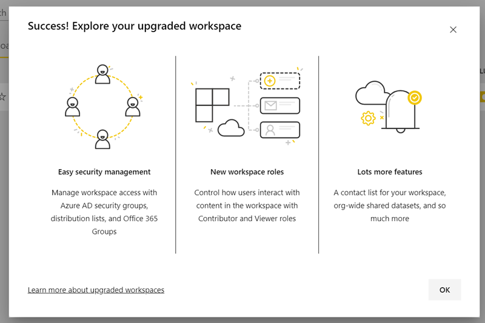
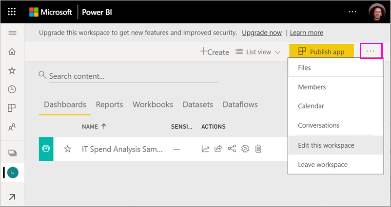
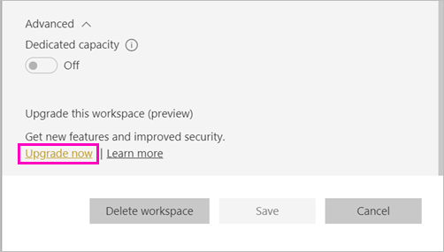
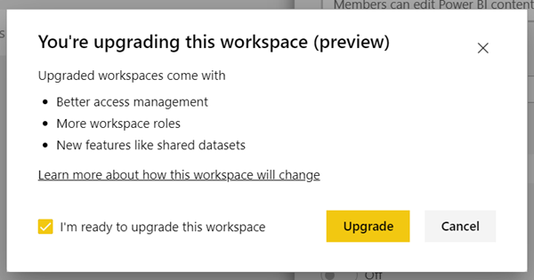
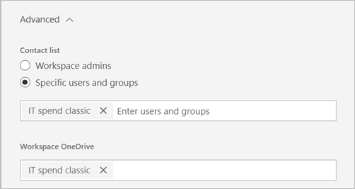
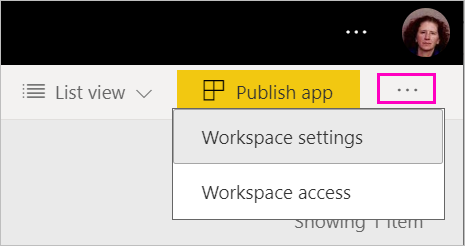
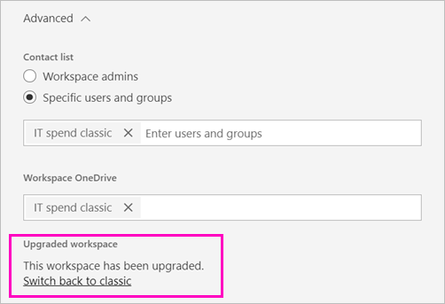
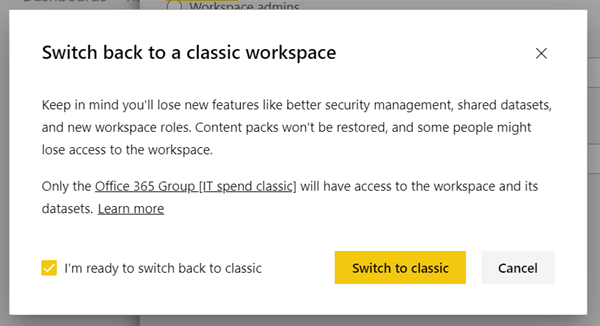
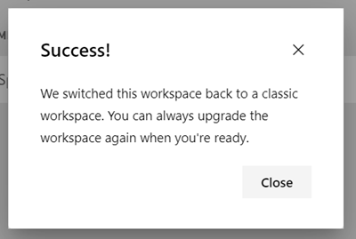

# Upgrade classic workspaces to the new workspaces in Power BI

This article explains how to upgrade, or *migrate*, a classic workspace to the new workspace experience. You can upgrade any classic workspace. The new workspaces have more granular workspace roles so you can better manage access to content. You also have more flexibility managing upgraded workspaces because they're more loosely connected to their original Microsoft 365 group. Learn about the [new workspace experience](service-new-workspaces.md).

>[!NOTE]
>Workspace upgrade is available as a Public Preview. 

However, there may be changes to your workspace that you need to be aware of and plan for. For example, content packs aren't supported in the new workspace experience. See the [Upgrade considerations and limitations](#upgrade-considerations-and-limitations) section, later in this article.

## Things to do after upgrading

You should do several things *after* you upgrade. It's best to plan them *before* you upgrade:
- Review the access list and understand the [permissions after upgrade](#permissions-after-upgrade).
- Review the [contact list](#modify-the-contact-list) and make sure it's set as you desire.
- If you've not already, learn about the [new workspace experience](service-new-workspaces.md).

## Upgrade a classic workspace

Any workspace admin can upgrade the workspace. For classic workspaces, to be a workspace admin you must be an Owner of the underlying Microsoft 365 group. To upgrade a workspace, follow these steps.

1. In the workspace content list, select **More options** (**...**) > **Edit this workspace**.

    

1. Expand **Advanced** and select **Upgrade now**.

    

1. Review the dialog box information. You see warnings if you've published or installed content packs in the workspace. When you're ready, check **I'm ready to upgrade this workspace**, then select **Upgrade**.

    

2. During upgrade, you see the **Upgrading** message. It usually takes less than a minute to upgrade your workspace.

1. After upgrade finishes, you see the **Success** dialog box. We recommend reading [Organize work in the new workspaces in Power BI](service-new-workspaces.md) so you're familiar with how new workspaces differ from classic workspaces.

### Impact on other workspace users

We recommend upgrading during off-hours when few users are actively viewing or editing items in the workspace.

Users who are actively using the workspace are asked to refresh their browser. Users who are editing a report are given the option to save before they refresh.

## Upgrade considerations and limitations

- The URLs and IDs of your workspace, the content it contains, and the app published from the workspace don't change. Content from content packs installed in your workspace is handled separately. See [Content packs during upgrade](#content-packs-during-upgrade) in this article for details.
- Content packs aren't supported in the new workspace experience. Read the sections about [published content packs](#published-content-packs) or [installed content packs](#installed-content-packs) to learn about how they're handled during upgrade. We recommend deleting content packs installed or published in your workspace before you upgrade.
- The Microsoft 365 group for your classic workspace isn't affected by the workspace upgrade in Power BI. Any Teams, SharePoint sites, mailboxes, or other resources managed by Microsoft 365 aren't changed. They remain intact after you upgrade your Power BI workspace. The Microsoft 365 group continues to exist as before.
- There are changes to how your workspace is secured after the upgrade. See the [workspace permissions after upgrade](#permissions-after-upgrade) section for details.
- An option to **go back to a classic workspace** is provided in case you need it. However, it doesn't fully restore some aspects of your workspace before it was upgraded. If you start using features that work only in the new workspace experience, you won't be able to go back. The go back option is available for 30 days after you upgrade.

## Permissions after upgrade

Select **Access** in the menu bar at the top of the workspace content list to review permissions after upgrade.

Each Microsoft 365 group Owner is added individually to the Admin role for the upgraded workspace. The Microsoft 365 group itself is added to a workspace role. The role it's added to depends on whether the classic workspace is *read-only* or *read-write*:

- When the workspace is set to **Members can edit Power BI content**, after upgrade the Microsoft 365 group is added to the workspace access list with the **Member** role.
- When the workspace is set to **Members can only read Power BI content**, after upgrade the Microsoft 365 group is added to the workspace access list with the **Viewer** role.

Because the Microsoft 365 group is given a role in the workspace, any user added to the Microsoft 365 group after upgrade has that role in the workspace. However, if you add new Owners to the Microsoft 365 group after the upgrade, they don't have the Admin role for the workspace.

### Differences in roles before and after upgrade

Workspace roles are different in the classic and new workspaces. The new workspace experience enables you to give workspace roles to Microsoft 365 groups, security groups, or distribution lists.

- **Members** can share individual items and give access to the entire workspace through the Member, Contributor, or Viewer roles
- **Viewers** can only view content and can't export underlying data or analyze in Excel for any workspace datasets, unless they have the Build permission.

Any users who have access to items in the workspace through sharing or app permission continue to have access to those items. Anyone with access to the workspace also has access to the app published from the workspace. These users aren't listed in the app access list.

We recommend evaluating whether to use the new Contributor role. After upgrade, you can change the Microsoft 365 group to have the Contributor role in the Access pane.

After upgrade, you may consider creating a security or Microsoft 365 group or distribution list for workspace admins, instead of managing access through role assignments to individual users.

Read more about [roles in the new workspaces](service-new-workspaces.md#roles-in-the-new-workspaces).

## Licensing after upgrade

Users in the Admin, Member, or Contributor workspace roles need a Power BI Pro license to access the workspace.

If the workspace is in the shared capacity, users in the Viewer workspace role also need a Power BI Pro license to access the workspace. However, if the workspace is in a Premium capacity, users in the Viewer role don't need a Pro license to access the workspace.

## Other new workspace features

The new workspace experience has features that the classic workspaces don't have. One difference is the ability to set a contact list that's different from the workspace admins or owners. One similarity is that it's still connected to the Microsoft 365 group SharePoint document library.

### Modify the contact list

1. Select **Settings** in the menu bar at the top of the workspace content list to access workspace settings.

    

2. Under **Advanced**, the workspace **Contact list** is configured to be the Microsoft 365 group the workspace was upgraded from. You can add more users or groups to the contact list, or switch it to workspace admins.

    

### The workspace OneDrive 

After upgrade, the workspace **OneDrive** is connected to the Microsoft 365 group SharePoint document library. This document library shows as the **OneDrive** option in the **Get Data > Files** experience. Be aware that not all workspace users may have permission to that document library, if they're not in the Microsoft 365 group.

## Content packs during upgrade

The new workspace experience doesn't support content packs. Instead, use apps and shared datasets to distribute content in the workspace. We recommend removing published or installed content packs from the workspace prior to upgrade. However, if there are published or installed content packs when you upgrade, the upgrade process attempts to preserve the content, as described below.  There is no way to restore the content pack or the association of content to the content pack after you upgrade.

### Published content packs

Content packs published from the workspace are removed during the upgrade. You won't be able to publish or update them after upgrade, even if you revert back to the classic workspace. If others have installed your content pack in their own workspaces, after upgrade they see a copy of the content pack content in their workspaces. See the **installed content packs** section for details.

### Installed content packs

When you upgrade your workspace, or the workspace from which the content pack is published is upgraded, important changes happen to installed content packs. After the upgrade, your workspace contains a copy of the content pack content. It's connected to the original dataset in the original workspace.

However, there are important changes:

- The content no longer updates if the content pack is updated.
- The URLs and item identifiers change and require any bookmarks or links you've shared with others to be updated.
- Any user customizations on the original content pack from your workspace are lost. Customizations include subscriptions, alerts, personal bookmarks, persistent filters, and favorites.
- New users may not have access to the datasets that were in the content pack. You need work with the dataset owner to ensure workspace users have access to the data.

## Go back to a classic workspace

As part of the upgrade experience, you have the option to go back to a classic workspace for 30 days after the upgrade. This capability restores the association of workspace content with the original Microsoft 365 group. It's available in case your organization encounters major issues using the new workspace experience. However, there are limitations. Read [Considerations for switching back to classic](#considerations-for-switching-back-to-classic) in this article first.

To go back, you need to be an Owner of the Microsoft 365 group the workspace was associated with before it was upgraded. Follow these steps.

1. In the workspace content list, select **More options** (**…**)  > **Workspace settings**.

    

1. Expand **Advanced** and select **Switch back to classic**. If this option isn't available to you, see [Considerations for switching back to classic](#considerations-for-switching-back-to-classic) in this article.

    

1. When you're ready, check the **I'm ready to switch back to classic** box and select **Switch to classic**. You may see warnings or blockers in this dialog box. Read the [considerations for switching back](#considerations-for-switching-back-to-classic) in this article if you encounter these issues.

    

1. When the switch back is complete, you see a confirmation dialog box.

    

### Considerations for switching back to classic

You can't switch back if any of the following statements about your workspace are true:

- The Microsoft 365 group was deleted.
- It's been more than 30 days since you upgraded.
- Datasets in the workspace are used by reports or dashboards in other workspaces. How does this happen? Say you published a content pack from the workspace before upgrade, and someone installed the content pack in another workspace. Immediately after upgrade, the datasets are used by the reports and dashboards in that content pack.
- The workspace is part of an application life-cycle management pipeline.
- The workspace is used for template apps.
- The workspace uses the large models capability.
- The workspace uses the new usage metrics feature.

When you switch back to a classic workspace, you aren't restoring an exact copy of the original workspace. The following changes occur:

- Permissions for the workspace are set by the Microsoft 365 group the upgraded workspace was originally connected to.
  - Any admins of the Microsoft 365 group become admins of the classic workspace.
  - Any members of the Microsoft 365 group become members of the classic workspace. If the classic workspace was set to **members can only read Power BI content**, this setting is restored.
  - Any users or user groups added to the workspace after upgrade completed (outside the Microsoft 365 group) lose access to the workspace. Add them to the Microsoft 365 group to give them access. Note that Microsoft 365 groups don't allow nesting security or distribution groups in the membership.
  - Users who received access to the app for the workspace continue to have access to the app.
  - Users who received access to items in the workspace through sharing continue to have access to them.
- Content packs published from the classic workspace before upgrade aren't restored.
- Content packs installed in the classic workspace before upgrade aren't restored.
- Subscriptions created by users in the workspace after upgrade are removed. Subscriptions that existed before upgrade continue to work as expected.
- Data alerts aren't preserved. They're removed.
- If you renamed the workspace after upgrade, the name of the workspace is restored to match the name of the Microsoft 365 group.
- In-progress operations like refreshes aren't impacted by workspace upgrade.

## Manage migration to the new workspaces for your tenant 

Some organizations desire to move many or all workspaces to the new workspace experience. The workspace upgrade tooling focuses on enabling workspace admins to upgrade. For organizations wanting to manage such a process, they can take the following steps.

1. The workspaces list in the Power BI admin portal and the corresponding API provides a list of all workspaces in Power BI. Classic workspaces are shown as type Group in the list.
2. Work with individual group owners or your admin in Microsoft 365, to have them upgrade the workspaces. If you want to upgrade the workspace, you need to become an Owner of the group.

The workspace upgrade capability doesn't provide tools for bulk or programmatic upgrade. Additionally, new Microsoft 365 groups created in your organization will continue to appear in Power BI.
   
   
## Known issues

There are several known issues that you may encounter:
- After upgrading users may see a "Failure to load model" warning dialog. This message is shown erroneously and can be ignored. 
- After upgrading some workspace names are different than before upgrade. When this occurs, the workspace name is either reverted to a previous name for the workspace or the workspace name become blank. To resolve this issue, rename the workspace to the desired name.
- After upgrading a workspace that had an installed content pack, you may see additional dashboards in the workspace which were not visible before the upgrade. This occurs in some cases where a content pack has not been updated recently. You can safely remove these dashboards.

## Next steps

* [Organize work in the new workspace experiences](service-new-workspaces.md)
* [Create the new workspaces](service-create-the-new-workspaces.md)
* [Create the classic workspaces](service-create-workspaces.md)
* Questions? [Try asking the Power BI Community](https://community.powerbi.com/)
