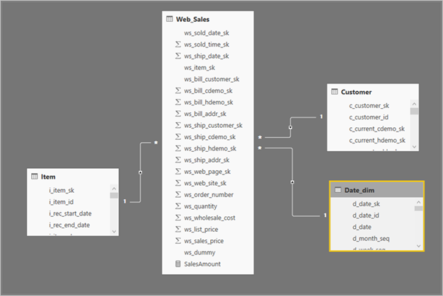
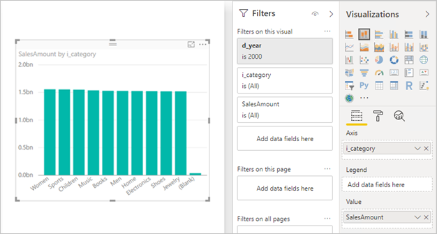
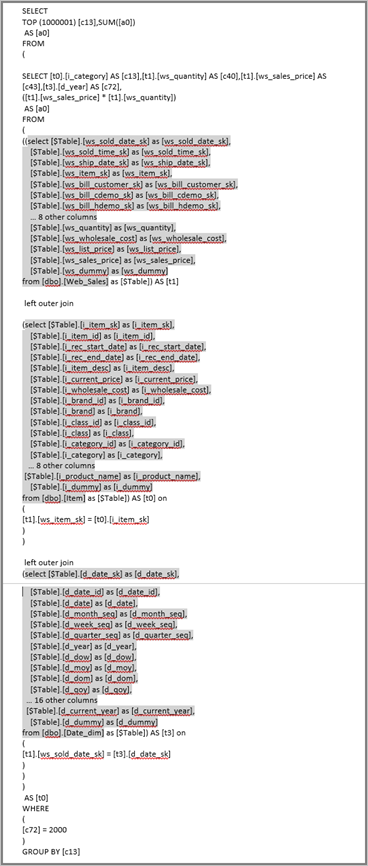

# Troubleshoot developing DirectQuery models in Power BI Desktop

This article targets data modelers developing Power BI DirectQuery models, developed by using either Power BI Desktop or the Power BI service. It describes how to diagnose performance issues, and how to get more detailed information to allow reports to be optimized.

## Performance Analyzer

It's strongly recommended that any diagnosis of performance issues starts in Power BI Desktop, rather than in Power BI (the service or Power BI Report Server). It's commonly the case that performance issues are simply based on the level of performance of the underlying data source, and these are more easily identified and diagnosed in the much more isolated environment of Power BI Desktop, and initially eliminates certain components (such as the Power BI gateway). Only if the performance issues are found to not be present with Power BI Desktop should investigation focus on the specifics of the report in Power BI. The [Performance Analyzer](../create-reports/desktop-performance-analyzer.md) is a useful tool for identifying issues throughout this process.

Similarly, it is recommended to first try to isolate any issues to an individual visual, rather than many visuals on a page.

Let's say those steps (in the previous paragraphs of this topic) have been taken—we now have a single visual on a page in Power BI Desktop that is still sluggish. To determine what queries are being sent to the underlying source by Power BI Desktop, you can use the Performance Analyzer. It's also possible to view traces/diagnostic information that might be emitted by the underlying data source. Such traces might also contain useful information about the details of how the query was executed, and how it can be improved.

Further, even in the absence of such traces from the source, it's possible to view the queries sent by Power BI, along with their execution times, as described next.

## Review trace files

By default, Power BI Desktop logs events during a given session to a trace file called **FlightRecorderCurrent.trc**.

For some DirectQuery sources, this log includes all queries sent to the underlying data source (the remaining DirectQuery sources may be supported in the future). The sources that write queries to the log are the following:

- SQL Server
- Azure SQL Database
- Azure SQL Data warehouse
- Oracle
- Teradata
- SAP HANA

The trace file can be found in the **AppData** folder for the current user: _\\\<User>\AppData\Local\Microsoft\Power BI Desktop\AnalysisServicesWorkspaces_

Here's an easy way to get to this folder: In Power BI Desktop select _File > Options and settings > Options_, and then select the **Diagnostics** page. The following dialog window appears:


When you select the **Open crash dump/traces folder** link, under Crash Dump Collection, the following folder opens: _\\\<User>\AppData\Local\Microsoft\Power BI Desktop\Traces_

Navigating to that folder's parent folder displays the folder containing _AnalysisServicesWorkspaces_, which will contain one workspace subfolder for every open instance of Power BI Desktop. These subfolders are named with an integer suffix, such as _AnalysisServicesWorkspace2058279583_.

Inside that folder is a _\Data_ subfolder that contains the trace file FlightRecorderCurrent.trc for the current Power BI session. The corresponding workspace folder is deleted when the associated Power BI Desktop session ends.

The trace files can be opened by using the SQL Server Profiler tool, which is available as a free download as part of SQL Server Management Studio. You can get that from [this location](/sql/ssms/download-sql-server-management-studio-ssms?view=sql-server-2017).

Once you download and install SQL Server Management Studio, run SQL Server Profiler.


To open the trace file, take the following steps:

1. In SQL Server Profiler, select _File > Open > Trace_ file
2. Enter the path to the trace file for the currently open Power BI session, such as:
_\\\<User>\AppData\Local\Microsoft\Power BI Desktop\AnalysisServicesWorkspaces\AnalysisServicesWorkspace2058279583\Data_
3. Open _FlightRecorderCurrent.trc_

All events from the current session are displayed. An annotated example is shown below, which highlights groups of events. Each group has the following:

- A _Query Begin_ and _Query End_ event, which represent the start and end of a DAX query generated by the UI (for example, from a visual, or from populating a list of values in the filter UI)
- One or more pairs of _DirectQuery Begin_ and _DirectQuery End_ events, which represent a query sent to the underlying data source, as part of evaluating the DAX query

Note that multiple DAX queries can be executed in parallel, so events from different groups can be interleaved. The value of the ActivityID can be used to determine which events belong to the same group.


Other columns of interest are as follows:

- **TextData:** The textual detail of the event. For _Query Begin/End_ events this will be the DAX query. For _DirectQuery Begin/End_ events, this will be the SQL query sent to the underlying source. The _TextData_ value for the currently selected event is also displayed in the region at the bottom.
- **EndTime:** When the event completed.
- **Duration:** The duration, in milliseconds, taken to execute the DAX or SQL query.
- **Error:** Indicates if an error occurred, in which case the event is also displayed in red.

In the image above, some of the less interesting columns have been narrowed, to allow the interesting columns to be seen more easily.

The recommended approach to capturing a trace to help diagnose a potential performance issue is the following:

- Open a single Power BI Desktop session (to avoid the confusion of multiple workspace folders)
- Perform the set of actions of interest in Power BI Desktop. Include a few additional actions beyond that, to ensure that the events of interest are flushed into the trace file.
- Open SQL Server Profiler and examine the trace, as described earlier. Remember that the trace file will be deleted upon closing Power BI Desktop. Also, further actions in Power BI Desktop will not immediately appear—the trace file should be closed and reopened to see the new events.
- Keep individual sessions reasonably small (10 seconds of actions, not hundreds) to make it easier to interpret the trace file (and because there is a limit on the size of the trace file, thus for long sessions there is a chance of early events being dropped).

## Understand queries sent to the source

The general format of queries generated and sent by Power BI Desktop use subqueries for each of the model tables referenced, where the subquery is defined by the Power Query query. For example, assume the following TPC-DS tables in a SQL Server relational database:



Consider the following visual and its configuration, noting that the **SalesAmount** measure is defined with the following expression:

```dax

SalesAmount = SUMX(Web_Sales, [ws_sales_price] * [ws_quantity])

```



Refreshing that visual will result in the T-SQL query shown below the next paragraph. As you can tell, there are three subqueries for the **Web_Sales**, **Item**, and **Date_dim** model tables. Each of these tables returns all the model table columns, even though only four columns are actually referenced by the visual. These subqueries (they're shaded) are exactly the definition of the Power Query queries. Use of subqueries in this manner has not been found to impact performance, for the data sources so far supported for DirectQuery. Data sources like SQL Server optimize away the references to unused columns.

One reason Power BI employs this pattern is because you can define a Power Query query to use a specific query statement. So, it's used "as provided", without an attempt to rewrite it. Note that this patterns restricts using query statements that use Common Table Expressions (CTEs) and stored procedures. These statements cannot be used in subqueries.



## Gateway performance

For information about troubleshooting gateway performance, read the [Troubleshoot gateways - Power BI](service-gateway-onprem-tshoot.md) article.

## Next steps

For more information about DirectQuery, check out the following resources:

- [Use DirectQuery in Power BI Desktop](desktop-use-directquery.md)
- [DirectQuery models in Power BI Desktop](desktop-directquery-about.md)
- [DirectQuery model guidance in Power BI Desktop](../guidance/directquery-model-guidance.md)
- Questions? [Try asking the Power BI Community](https://community.powerbi.com/)
