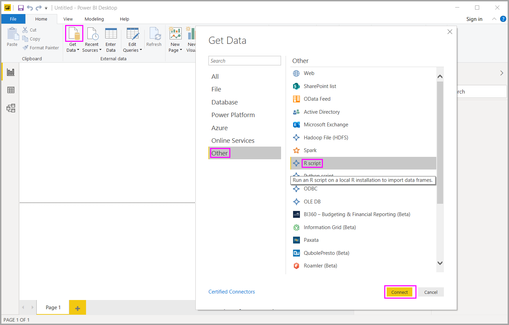
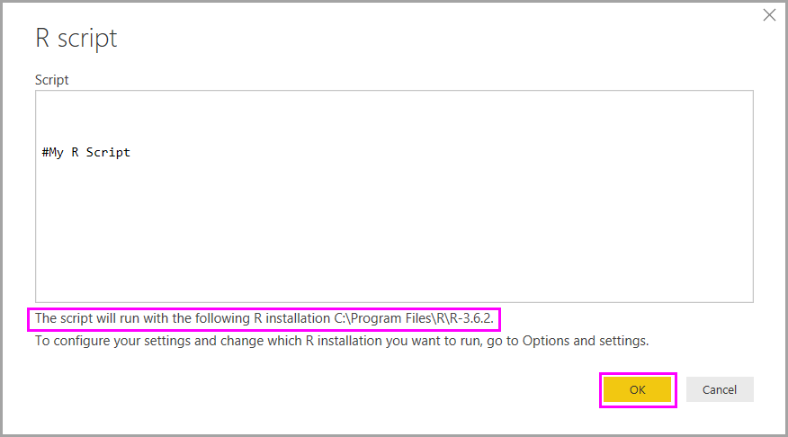

# Run R scripts in Power BI Desktop

You can run R scripts directly in Power BI Desktop and import the resulting datasets into a Power BI Desktop data model.

## Install R

To run R scripts in Power BI Desktop, you need to install R on your local machine. You can download and install R for free from many locations, including the [Microsoft R Application Network](https://mran.revolutionanalytics.com/download/) and the [CRAN Repository](https://cran.r-project.org/bin/windows/base/). The current release supports Unicode characters and spaces (empty characters) in the installation path.

## Run R scripts

Using just a few steps in Power BI Desktop, you can run R scripts and create a data model. With the data model, you can create reports and share them on the Power BI service. R scripting in Power BI Desktop now supports number formats that contain decimals (.) and commas (,).

### Prepare an R script

To run an R script in Power BI Desktop, create the script in your local R development environment, and make sure it runs successfully.

To run the script in Power BI Desktop, make sure the script runs successfully in a new and unmodified workspace. This prerequisite means that all packages and dependencies must be explicitly loaded and run. You can use `source()` to run dependent scripts.

When you prepare and run an R script in Power BI Desktop, there are a few limitations:

* Because only data frames are imported, remember to represent the data you want to import to Power BI in a data frame.
* Columns typed as Complex and Vector aren't imported, and they're replaced with error values in the created table.
* Values that are `N/A` are translated to `NULL` values in Power BI Desktop.
* If an R script runs longer than 30 minutes, it times out.
* Interactive calls in the R script, such as waiting for user input, halts the script’s execution.
* When setting the working directory within the R script, you *must* define a full path to the working directory, rather than a relative path.

### Run your R script and import data

Now you can run your R script to import data into Power BI Desktop:

1. In Power BI Desktop, select **Get Data**, choose **Other** > **R script**, and then select **Connect**:

    

2. If R is installed on your local machine, just copy your script into the script window and select **OK**. The latest installed version is displayed as your R engine.

    

3. Select **OK** to run the R Script. When the script runs successfully, you can then choose the resulting data frames to add to the Power BI model.

You can control which R installation to use to run your script. To specify your R installation settings, choose **File** > **Options and settings** > **Options**, then select **R scripting**. Under **R script options**, the **Detected R home directories** dropdown list shows your current R installation choices. If the R installation you want isn't listed, pick **Other**, and then browse to or enter your preferred R installation folder in **Set an R home directory**.

### Refresh

You can refresh an R script in Power BI Desktop. When you refresh an R script, Power BI Desktop runs the R script again in the Power BI Desktop environment.

## Next steps

Take a look at the following additional information about R in Power BI.

* [Create Power BI visuals using R](../create-reports/desktop-r-visuals.md)
* [Use an external R IDE with Power BI](desktop-r-ide.md)
