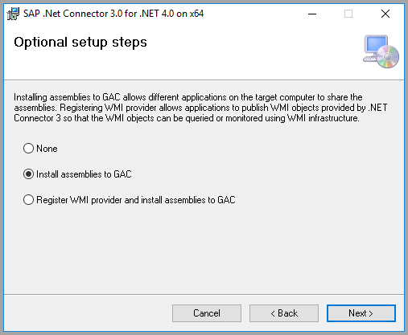
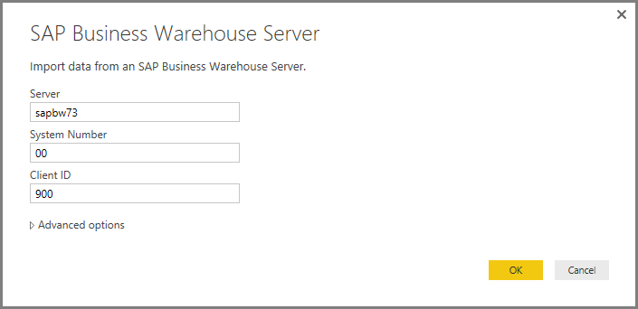
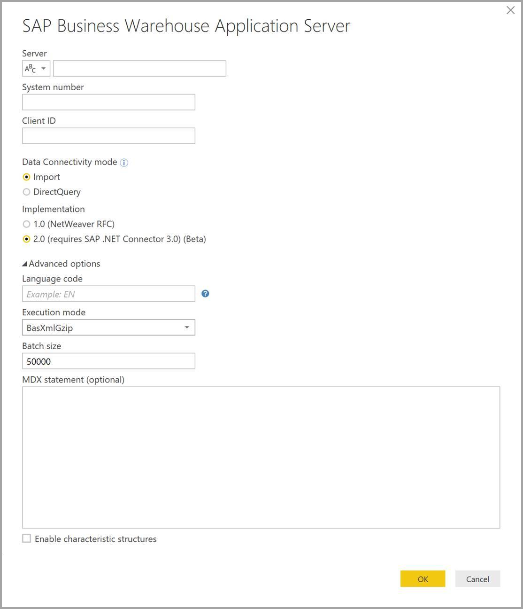
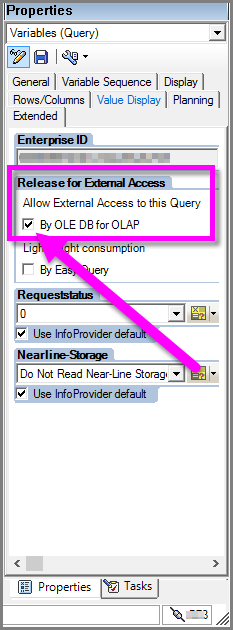

# Use the SAP Business Warehouse connector in Power BI Desktop

With Power BI Desktop, you can access *SAP Business Warehouse (BW)* data.

For information about how SAP customers can benefit from connecting Power BI to their existing SAP BW systems, see the [Power BI and SAP BW whitepaper](https://aka.ms/powerbiandsapbw). For details about using DirectQuery with SAP BW, see [DirectQuery and SAP Business Warehouse (BW)](desktop-directquery-sap-bw.md).

Starting with the June 2018 release of Power BI Desktop and generally available in October 2018, you can use the *SAP BW connector* with an implementation that has significant improvements in performance and capabilities. Microsoft developed SAP BW connector *Implementation 2.0*. Select either version 1 of the SAP BW Connector, or the Implementation 2.0 SAP Connector. The following sections describe the installation of each version, in turn. You can choose one or the other connector when connecting to SAP BW from Power BI Desktop.

We suggest you use the Implementation 2.0 SAP Connector whenever possible.

## Installation of version 1 of the SAP BW Connector

We recommend using the Implementation 2.0 SAP Connector whenever possible. This section describes installation of version 1 of the SAP BW Connector.

1. Install the *SAP NetWeaver* library on your local computer. You can get the SAP NetWeaver library from your SAP administrator or directly from the [SAP Software Download Center](https://support.sap.com/swdc). Since the SAP Software Download Center changes its structure frequently, more specific guidance for navigating that site isn't available. The SAP NetWeaver library is usually included in the SAP Client Tools installation.

   You can search for *SAP Note #1025361* to get the download location for the most recent version. Make sure the architecture for the SAP NetWeaver library (32-bit or 64-bit) matches your Power BI Desktop installation. Install all files included in the *SAP NetWeaver RFC SDK* according to the SAP Note.
2. In Power BI Desktop, select **Get Data**. The **Database** options include *SAP Business Warehouse Application Server* and *SAP Business Warehouse Message Server*.

   

## Installation of Implementation 2.0 SAP Connector

Implementation 2.0 of the SAP Connector requires the SAP .NET Connector 3.0. Access to the download requires a valid S-user. Contact your SAP Basis team to get the SAP .NET Connector 3.0.

You can download the [SAP .NET Connector 3.0](https://support.sap.com/en/product/connectors/msnet.html) from SAP.

The connector comes in 32-bit and 64-bit versions. Choose the version that matches your Power BI Desktop installation. Currently, the website lists two versions for .NET 4.0 framework:

* SAP Connector for Microsoft .NET 3.0.22.0 for Windows 32-bit (x86) as zip file (6.896 KB), June 1, 2019
* SAP Connector for Microsoft .NET 3.0.22.0 for Windows 64-bit (x64) as zip file (7.180 KB), June 1, 2019

When you install, in **Optional setup steps**, make sure you select *Install assemblies to GAC*.



> [!NOTE]
> The first version of SAP BW implementation required NetWeaver DLLs. If you're using Implementation 2.0 of the SAP Connector, and not using the first version, the NetWeaver DLLs are not required.

## Version 1 SAP BW Connector features

The version 1 SAP BW Connector in Power BI Desktop lets you import data from your *SAP Business Warehouse Server* cubes or use DirectQuery.

To learn more about the SAP BW Connector and how to use it with DirectQuery, see [DirectQuery and SAP Business Warehouse (BW)](desktop-directquery-sap-bw.md).

When you connect, specify a **Server**, **System Number**, and **Client ID** to establish the connection.



You can also specify two additional **Advanced options**: **Language code**, and a custom **MDX statement** to run against the specified server.


If you don't specify an MDX statement, the connection setting displays the list of cubes available in the server. You can drill down and select items from the available cubes, including dimensions and measures. Power BI exposes queries and cubes exposed by the [Open Analysis Interfaces](https://help.sap.com/saphelp_nw70/helpdata/en/d9/ed8c3c59021315e10000000a114084/content.htm).

When you select one or more items from the server, the Navigator dialog creates a preview of the output table.


The **Navigator** dialog also provides display options:

* **Display Only selected items**. By default, **Navigator** displays all items.  This option is useful for verifying the final set of items selected. An alternative approach to viewing selected items is to select the column names in the preview area.
* **Enable data previews**. This value is the default. Displays data previews. Disabling data previews reduces the number of server calls, since it no longer requests data for the previews.
* **Technical names**. SAP BW supports the notion of *technical names* for objects within a cube. Technical names allow a cube owner to expose *friendly names* for cube objects, as opposed to only exposing the *physical names* for those objects in the cube.


After selecting all necessary objects, you can decide what to do next by selecting one of the following options:

* Select **Load** to load the entire set of rows for the output table into the Power BI Desktop data model. The **Report** view opens. You can begin visualizing the data or making further modifications using the **Data** or **Relationships** views.
* Select **Edit** to open **Query Editor**. Specify additional data transformation and filtering steps before the entire set of rows is brought into the Power BI Desktop data model.

In addition to importing data from SAP BW cubes, you can also import data from a wide range of other data sources in Power BI Desktop, and then you can combine them into a single report. This ability presents all sorts of interesting scenarios for reporting and analytics on top of SAP BW data.

## Using Implementation 2.0 SAP BW Connector

Create a new connection to use Implementation 2.0 of the SAP BW Connector. To create a new connection, take the following steps.

1. Select **Get Data**. Select either **SAP Business Warehouse Application Server** or **SAP Business Warehouse Message Server**, and then connect.

2. In the new connection dialog, select the implementation. Selecting **2.0** for **Implementation**, as shown in the following image, enables **Execution mode**, **Batch size** and **Enable characteristic structures**.

    

3. Select **OK**. After this point, experience is the same as described in [Version 1 SAP BW Connector features](#version-1-sap-bw-connector-features) for the version 1 SAP BW Connector.

### New options for Implementation 2.0

Implementation 2.0 supports the following options:

* *ExecutionMode* specifies the MDX interface used to execute queries on the server. The following options are valid:

  * `SapBusinessWarehouseExecutionMode.BasXml`
  * `SapBusinessWarehouseExecutionMode.BasXmlGzip`
  * `SapBusinessWarehouseExecutionMode.DataStream`

    The default value is `SapBusinessWarehouseExecutionMode.BasXmlGzip`.

    Using `SapBusinessWarehouseExecutionMode.BasXmlGzip` may improve performance when experiencing high latency for large datasets.

* *BatchSize* specifies the maximum number of rows to retrieve at a time when executing an MDX statement. A small number translates into more calls to the server while retrieving a large dataset. A large number of rows may improve performance, but could cause memory issues on the SAP BW server. The default value is 50000 rows.

* *EnableStructures* indicates whether characteristic structures are recognized. The default value for this option is false. Affects the list of objects available for selection. Not supported in Native query mode.

The *ScaleMeasures* option has been deprecated in this implementation. The behavior is now the same as setting *ScaleMeasures* to false, always showing unscaled values.

### Additional improvements for Implementation 2.0

The following list describes some of the additional improvements that come with the new implementation:

* Improved performance.
* Ability to retrieve several million rows of data, and fine-tuning through the batch size parameter.
* Ability to switch execution modes.
* Support for compressed mode. Especially beneficial for high latency connections or large datasets.
* Improved detection of `Date` variables.
* [Experimental] Expose `Date` (ABAP type DATS) and `Time` (ABAP type TIMS) dimensions as dates and times respectively, instead of text values.
* Better exception handling. Errors that occur in BAPI calls are now surfaced.
* Column folding in BasXml and BasXmlGzip modes. For example, if the generated MDX query retrieves 40 columns but the current selection only needs 10, this request will be passed onto the server to retrieve a smaller dataset.

### Changing existing reports to use Implementation 2.0

Changing existing reports to use Implementation 2.0 is only possible in import mode. Follow these steps:

1. Open an existing report, select **Edit Queries** in the ribbon, and then select the SAP Business Warehouse query to update.

1. Right-click the query and select **Advanced Editor**.

1. In the **Advanced Editor**, change the `SapBusinessWarehouse.Cubes` call as follows:

    Determine whether the query already contains an option record, such as the following example:

    

    If so, add the `Implementation` 2.0 option, and remove the `ScaleMeasures` option, if present, as shown:

    

    If the query doesn't already include an options record, just add it. For the following option:

    

    Just change it to:

    

Every effort has been made to make Implementation 2.0 of the SAP BW Connector compatible with version 1. However, there may be some differences because of the different SAP BW MDX execution modes being used. To resolve any discrepancies, try switching between execution modes.

## Troubleshooting

This section provides troubleshooting situations (and solutions) for working with the SAP BW connector.

1. Numeric data from SAP BW returns decimal points instead of commas. For example, 1,000,000 is returned as 1.000.000.

   SAP BW returns decimal data with either a `,` (comma) or a `.` (dot) as the decimal separator. To specify which of those SAP BW should use for the decimal separator, the driver used by Power BI Desktop makes a call to `BAPI_USER_GET_DETAIL`. This call returns a structure called `DEFAULTS`, which has a field called `DCPFM` that stores *Decimal Format Notation*. The field takes one of the following values:

   * ' ' (space) = Decimal point is comma: N.NNN,NN
   * 'X' = Decimal point is period: N,NNN.NN
   * 'Y' = Decimal point is N NNN NNN,NN

   Customers who have reported this issue found that the call to `BAPI_USER_GET_DETAIL` is failing for a particular user, who is showing the incorrect data, with an error message similar to the following message:

   ```xml
    You are not authorized to display users in group TI:
        <item>
            <TYPE>E</TYPE>
            <ID>01</ID>
            <NUMBER>512</NUMBER>
            <MESSAGE>You are not authorized to display users in group TI</MESSAGE>
            <LOG_NO/>
            <LOG_MSG_NO>000000</LOG_MSG_NO>
            <MESSAGE_V1>TI</MESSAGE_V1>
            <MESSAGE_V2/>
            <MESSAGE_V3/>
            <MESSAGE_V4/>
            <PARAMETER/>
            <ROW>0</ROW>
            <FIELD>BNAME</FIELD>
            <SYSTEM>CLNTPW1400</SYSTEM>
        </item>
   ```

   To solve this error, users must ask their SAP admin to grant the SAPBW user being used in Power BI the right to execute `BAPI_USER_GET_DETAIL`. It’s also worth verifying that the user has the required `DCPFM` value, as described earlier in this troubleshooting solution.

2. Connectivity for SAP BEx queries
   
   You can perform BEx queries in Power BI Desktop by enabling a specific property, as shown in the following image:
   
   
   
3. The **Navigator** window doesn't display a data preview and instead provides an *object reference not set to an instance of an object* error message.
   
   SAP users need access to specific BAPI function modules to get metadata and retrieve data from SAP BW's InfoProviders. These modules include:

   * BAPI_MDPROVIDER_GET_CATALOGS
   * BAPI_MDPROVIDER_GET_CUBES
   * BAPI_MDPROVIDER_GET_DIMENSIONS
   * BAPI_MDPROVIDER_GET_HIERARCHYS
   * BAPI_MDPROVIDER_GET_LEVELS
   * BAPI_MDPROVIDER_GET_MEASURES
   * BAPI_MDPROVIDER_GET_MEMBERS
   * BAPI_MDPROVIDER_GET_VARIABLES
   * BAPI_IOBJ_GETDETAIL

   To solve this issue, verify that the user has access to the various MDPROVIDER modules and `BAPI_IOBJ_GETDETAIL`. To further troubleshoot this or similar issues, you can enable tracing. **Select File** > **Options and settings** > **Options**. In **Options**, select **Diagnostics**, then select **Enable tracing**. Attempt to retrieve data from SAP BW while tracing is active, and examine the trace file for more detail.

## SAP BW Connection support

The following table details the current support for SAP BW.

|Product  |Mode  |Authentication  |Connector  |SNC Library  |Supported  |
|---------|---------|---------|---------|---------|---------|
|Power BI Desktop     |Any         | User / password  | Application Server | N/A  | Yes  |
|Power BI Desktop     |Any         | Windows          | Application Server | sapcrypto + gsskrb5/gx64krb5  | Yes  |
|Power BI Desktop     |Any         | Windows via impersonation | Application Server | sapcrypto + gsskrb5/gx64krb5  | Yes  |
|Power BI Desktop     |Any         | User / password        | Message Server | N/A  | Yes  |
|Power BI Desktop     |Any         | Windows        | Message Server | sapcrypto + gsskrb5/gx64krb5  | Yes  |
|Power BI Desktop     |Any         | Windows via impersonation | Message Server | sapcrypto + gsskrb5/gx64krb5  | Yes  |
|Power BI Gateway     |Import      | Same as Power BI Desktop |         |   |   |
|Power BI Gateway     |DirectQuery | User / password        | Application Server | N/A  | Yes  |
|Power BI Gateway     |DirectQuery | Windows via impersonation (fixed user, no SSO) | Application Server | sapcrypto + gsskrb5/gx64krb5  | Yes  |
|Power BI Gateway     |DirectQuery | Use SSO via Kerberos for DirectQuery queries option | Application Server | sapcrypto + gsskrb5/gx64krb5   | Yes  |
|Power BI Gateway     |DirectQuery | User / password        | Message Server | N/A  | Yes  |
|Power BI Gateway     |DirectQuery | Windows via impersonation (fixed user, no SSO) | Message Server | sapcrypto + gsskrb5/gx64krb5  | Yes  |
|Power BI Gateway     |DirectQuery | Use SSO via Kerberos for DirectQuery queries option | Message Server | gsskrb5/gx64krb5  | No  |
|Power BI Gateway     |DirectQuery | Use SSO via Kerberos for DirectQuery queries option | Message Server | sapcrypto  | Yes  |

## Next steps

For more information about SAP and DirectQuery, check out the following resources:

* [DirectQuery and SAP HANA](desktop-directquery-sap-hana.md)
* [DirectQuery and SAP Business Warehouse (BW)](desktop-directquery-sap-bw.md)
* [Using DirectQuery in Power BI](desktop-directquery-about.md)
* [Power BI data sources](power-bi-data-sources.md)
* [Power BI and SAP BW whitepaper](https://aka.ms/powerbiandsapbw)
