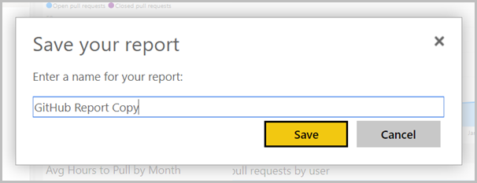
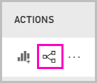

# Copy reports from other workspaces

When you find a report you like in a workspace or an app, you can make a copy of it and save it to a different workspace. Then you can modify your copy of the report, adding or deleting visuals and other elements. You don't have to worry about creating the data model. It's already created for you. And it's much easier to modify an existing report than it is to start from scratch. However, when you make an app from your workspace, sometimes you can't publish your copy of the report in the app. See [Considerations and limitations in the article "Use datasets across workspaces"](service-datasets-across-workspaces.md#considerations-and-limitations) for details.

## Prerequisites

- To copy or a report, you need a Pro license, even if the original report is in a workspace in a Premium capacity.
- To copy a report, or to create a report in one workspace based on a dataset in another workspace, you need Build permission for the dataset. For datasets in the original workspace, the people with Admin, Member, and Contributor roles automatically have Build permission through their workspace role. See [Roles in the new workspaces](../collaborate-share/service-new-workspaces.md#roles-in-the-new-workspaces) for details.

## Save a copy of a report in a workspace

1. In a workspace, go to the Reports list view.

    

1. Under **Actions**, select **Save a copy**.

    

    You only see the **Save a copy** icon if the report is in a new experience workspace, and you have [Build permission](service-datasets-build-permissions.md). Even if you have access to the workspace, you have to have Build permission for the dataset.

3. In **Save a copy of this report**, give the report a name and select the destination workspace.

    

    You can save the report to the current workspace or a different one in the Power BI service. You only see workspaces that are new experience workspaces, in which you're a member. 
  
4. Select **Save**.

    Power BI automatically creates a copy of the report, and an entry in the list of datasets if the report is based on a dataset outside of the workspace. The icon for this dataset is different from the icon for datasets in the workspace: 
    
    That way, members of the workspace can tell which reports and dashboards use datasets that are outside the workspace. The entry shows information about the dataset, and a few select actions.

    

    See [Your copy of the report](#your-copy-of-the-report) in this article for more about the report and related dataset.

## Copy a report in an app

1. In an app, open the report you want to copy.
2. In the menu bar, select **More options** (**...**) > **Save a copy**.

    

    You only see the **Save a copy** option if the report is in a new experience workspace, and you have [Build permission](service-datasets-build-permissions.md).

3. Give your report a name > **Save**.

    

    Your copy is automatically saved to your My Workspace.

4. Select **Go to report** to open your copy.

## Your copy of the report

When you save a copy of the report, you create a live connection to the dataset, and you can open the report creation experience with the full dataset available. 

You haven't made a copy of the dataset. The dataset still resides in its original location. You can use all tables and measures in the dataset in your own report. Row-level security (RLS) restrictions on the dataset are in effect, so you only see data you have permissions to see based on your RLS role.

## View related datasets

When you have a report in one workspace based on a dataset in another workspace, you may need to know more about the dataset it's based on.

1. In the Reports list view, select **View related**.

    

1. The **Related content** dialog box shows all related items. In this list, the dataset looks like any other. You can't tell it resides in a different workspace. This issue is known.
 
    

## Delete a report and its shared dataset

You may decide you no longer want the report and its associated shared dataset in workspace.

1. Delete the report. In the list of reports in the workspace, select the **Delete** icon.

    

2. In the list of datasets, you see the shared datasets don't have **Delete** icons. Refresh the page, or go to a different page and return. The dataset will be gone. If not, check **View related**. It may be related to another table in your workspace.

    

    > [!NOTE]
    > Deleting the shared dataset in this workspace doesn't delete the dataset. It just deletes the reference to it.

## Next steps

- [Use datasets across workspaces](service-datasets-across-workspaces.md)
- Questions? [Try asking the Power BI Community](https://community.powerbi.com/)
