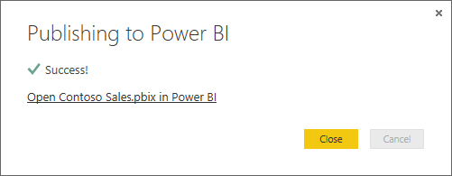

# Get data from Power BI Desktop files

**Power BI Desktop** makes business intelligence and reporting easy. Whether you're connecting to a many different data sources, querying and transforming data, modeling your data, and creating powerful and dynamic reports, **Power BI Desktop** makes business intelligence tasks intuitive and fast. If you're not familiar with **Power BI Desktop**, check out [Getting started with Power BI Desktop](../fundamentals/desktop-getting-started.md).

Once you bring data into **Power BI Desktop** and create a few reports, it’s time to get your saved file into the **Power BI service**.

## Where your file is saved makes a difference
**Local** - If you save your file to a local drive on your computer or another location in your organization, you can *import* your file or you can *publish* from Power BI Desktop to get its data and reports into Power BI. Your file will actually remain on your local drive, so the whole file isn’t really moved into Power BI. What really happens is a new dataset is created in Power BI and data and the data model from the Power BI Desktop file are loaded into the dataset. If your file has any reports, those will appear in your Power BI site under Reports.

**OneDrive - Business** – If you have OneDrive for Business and you sign into it with the same account you sign into Power BI with, this is by-far the most effective way to keep your work in Power BI Desktop and your dataset, reports, and dashboards in Power BI in-sync. Because both Power BI and OneDrive are in the cloud, Power BI *connects* to your file on OneDrive about every hour. If any changes are found, your dataset, reports, and dashboards are automatically updated in Power BI.

**OneDrive - Personal** – If you save your files to your own OneDrive account, you’ll get many of the same benefits as you would with OneDrive for Business. The biggest difference is when you first connect to your file (using Get Data > Files > OneDrive – Personal) you’ll need to sign in to your OneDrive with your Microsoft account, which is usually different from what you use to sign in to Power BI. When signing in with your OneDrive with your Microsoft account, be sure to select the Keep me signed in option. This way, Power BI will be able to connect to your file about every hour and make sure your dataset in Power BI is in-sync.

**SharePoint Team-Sites** – Saving your Power BI Desktop files to SharePoint – Team Sites is much the same as saving to OneDrive for Business. The biggest difference is how you connect to the file from Power BI. You can specify a URL or connect to the root folder.

## Import or connect to a Power BI Desktop file from Power BI
>[!IMPORTANT]
>The maximum file size you can import into Power BI is 1 gigabyte.

1. In Power BI, in the navigator pane, click ** Get Data**.
   
   
2. In **Files**, click **Get**.
   
   
3. Find your file. Power BI Desktop files have a .PBIX extension.
   
   

## Publish a file from Power BI Desktop to your Power BI site
Using Publish from Power BI Desktop is similar using Get Data in Power BI, in terms of initially importing your file data from a local drive or connecting to it on OneDrive. However, there are differences: if you upload from a local drive, you'll want to refresh that data frequently to ensure the online and local copies of the data are current with each other. 

Here’s the quick how to, but you can see [Publish from Power BI Desktop](../create-reports/desktop-upload-desktop-files.md) to learn more.

1. In Power BI Desktop, click **File** > **Publish** > **Publish to Power BI**, or click **Publish** on the ribbon.
   
   
2. Sign in to Power BI. You'll only need to do this the first time.
   
   When complete, you'll get a link to open your report in your Power BI site.
   
   

## Next steps
**Explore your data** - Once you get data and reports from your file into Power BI, it's time to explore. If your file already has reports in it, they'll appear in the navigator pane in **Reports**. If your file just had data, you can create new reports; just right-click the new dataset and then click **Explore**.

**Refresh external data sources** - If your Power BI Desktop file connects to external data sources, you can setup scheduled refresh to make sure your dataset is always up-to-date. In most cases, setting up scheduled refresh is quite easy to do, but going into the details is outside the scope of this article. See [Data refresh in Power BI](refresh-data.md) to learn more.
