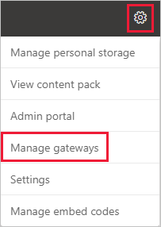
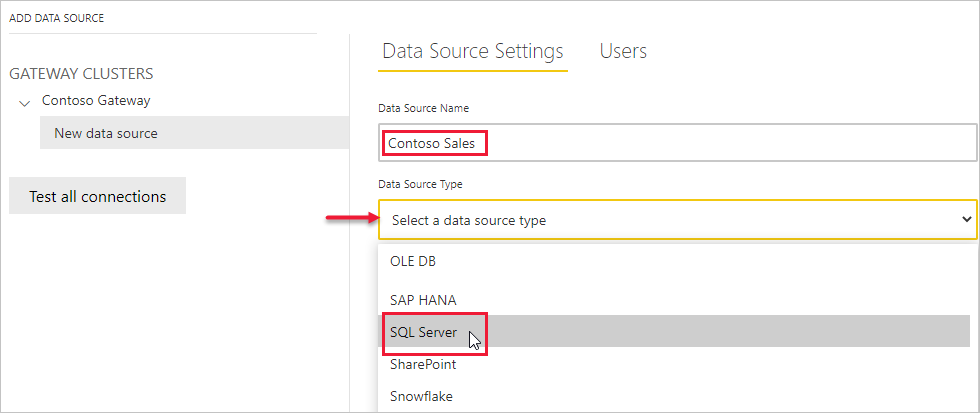
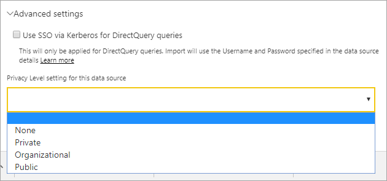
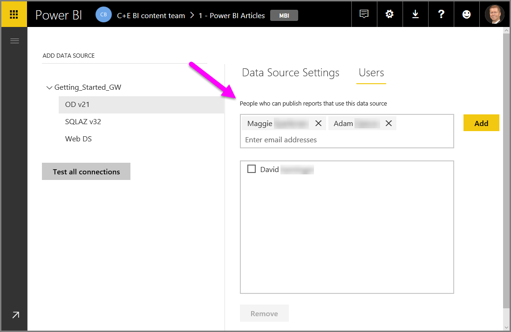

# Manage data sources

[!INCLUDE [gateway-rewrite](../includes/gateway-rewrite.md)]

Power BI supports many [on-premises data sources](power-bi-data-sources.md), and each has its own requirements. A gateway can be used for a single data source or multiple data sources. For this example, we show you how to add SQL Server as a data source. The steps are similar for other data sources.

Most data sources management operations can be performed by using APIs as well. For more information, see [REST APIs (Gateways)](/rest/api/power-bi/gateways).

## Add a data source

1. In the upper-right corner of the Power BI service, select the gear icon  > **Manage gateways**.

    

2. Select a gateway and then select **Add data source**. Or, go to **Gateways** > **Add data source**.

    

3. Select the **Data Source Type**.

    

4. Enter information for the data source. For this example, it's **Server**, **Database**, and other information. 

    

5. For SQL Server, you choose an **Authentication Method** of **Windows** or **Basic** (SQL Authentication). If you choose **Basic**, enter the credentials for your data source.

6. Under **Advanced settings**, you could configure [Single Sign-On(SSO)](service-gateway-sso-overview.md) for your data source. 

    

You could either configure **Use SSO via Kerberos for DirectQuery queries**  or **Use SSO via Kerberos for DirectQuery And Import queries** for DirectQuery based Reports and **Use SSO via Kerberos for DirectQuery And Import queries** for Refresh based Reports.

If you use the **Use SSO via Kerberos for DirectQuery queries** and use this data source for a DirectQuery based Report, it will use the user that's mapped to the (Azure) Active Directory user that signs in to the Power BI service. For a Refresh based Report, it will use the credentials that you enter in the **Username** and **Password** fields.

If you use the **Use SSO via Kerberos for DirectQuery And Import queries**, you do not need to provide any credentials. If this data source is used for DirectQuery based Report, it will use the user that's mapped to the (Azure) Active Directory user that signs in to the Power BI service.  For a Refresh based Report, it will use the dataset owner's security context

> [!NOTE]
>SSO for Import Queries is available only for the list of SSO data sources using [Kerberos constrained delegation](service-gateway-sso-kerberos.md).

7. Under **Advanced settings**, optionally configure the [privacy level](https://support.office.com/article/Privacy-levels-Power-Query-CC3EDE4D-359E-4B28-BC72-9BEE7900B540) for your data source (doesn't apply to [DirectQuery](desktop-directquery-about.md)).

    

8. Select **Add**. You see *Connection Successful* if the process succeeds.

    

You can now use this data source to include data from SQL Server in your Power BI dashboards and reports.

## Remove a data source

You can remove a data source if you no longer use it. Removing a data source breaks any dashboards and reports that rely on that data source.

To remove a data source, go to the data source and then select **Remove**.

## Use the data source for scheduled refresh or DirectQuery

After you create the data source, it's available to use with either DirectQuery connections or through scheduled refresh.

> [!NOTE]
>Server and database names must match between Power BI Desktop and the data source within the on-premises data gateway.

The link between your dataset and the data source in the gateway is based on your server name and database name. These names must match. For example, if you supply an IP address for the server name, in Power BI Desktop, you must use the IP address for the data source in the gateway configuration. If you use *SERVER\INSTANCE* in Power BI Desktop, you must use the same in the data source configured for the gateway.

If you're listed in the **Users** tab of the data source configured in the gateway, and the server and database name match, you see the gateway as an option to use with scheduled refresh.

> [!WARNING]
> If your dataset contains multiple data sources, each data source must be added in the gateway. If one or more data sources aren't added to the gateway, you won't see the gateway as available for scheduled refresh.

### Limitations

OAuth is a supported authentication scheme only for custom connectors with the on-premises data gateway. You can't add other data sources that require OAuth. If your dataset has a data source that requires OAuth and this data source isn't a custom connector, you won't be able to use the gateway for scheduled refresh.

## Manage users

After you add a data source to a gateway, you give users and email-enabled security groups access to the specific data source (not the entire gateway). The data source users list controls only who is allowed to publish reports that include data from the data source. Report owners can create dashboards, content packs, and apps, and then share those items with other users.

You can also give users and security groups administrative access to the gateway.

### Add users to a data source

1. In the upper-right corner of the Power BI service, select the gear icon  > **Manage gateways**.

2. Select the data source where you want to add users.

3. Select **Users**, and enter a user from your organization who you want to grant access to the selected data source. For example, in the following screen, you add Maggie and Adam.

    

4. Select **Add**, and the added member's name shows up in the box.

    

Remember that you need to add users to each data source that you want to grant access to. Each data source has a separate list of users. Add users to each data source separately.

### Remove users from a data source

On the **Users** tab for the data source, you can remove users and security groups that use this data source.

## Store encrypted credentials in the cloud

When you add a data source to the gateway, you must provide credentials for that data source. All queries to the data source will run by using these credentials. The credentials are encrypted securely. They use symmetric encryption so that they can't be decrypted in the cloud before they're stored in the cloud. The credentials are sent to the machine that runs the gateway, on-premises, where they're decrypted when the data sources are accessed.

## List of available data source types

For information about which data sources the on-premises data gateway supports, see [Power BI data sources](power-bi-data-sources.md).

## Next steps

* [Manage your data source - Analysis Services](service-gateway-enterprise-manage-ssas.md)
* [Manage your data source - SAP HANA](service-gateway-enterprise-manage-sap.md)
* [Manage your data source - SQL Server](service-gateway-enterprise-manage-sql.md)
* [Manage your data source - Oracle](service-gateway-onprem-manage-oracle.md)
* [Manage your data source - Import/scheduled refresh](service-gateway-enterprise-manage-scheduled-refresh.md)
* [Guidance for deploying a data gateway](service-gateway-deployment-guidance.md)

More questions? Try the [Power BI Community](https://community.powerbi.com/).
