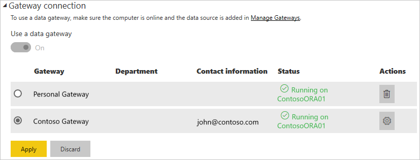

# Manage your data source - Import/scheduled refresh

[!INCLUDE [gateway-rewrite](../includes/gateway-rewrite.md)]

After you [install the on-premises data gateway](/data-integration/gateway/service-gateway-install), you need to [add data sources](service-gateway-data-sources.md#add-a-data-source) that can be used with the gateway. This article looks at how to work with gateways and data sources that are used for scheduled refresh as opposed to DirectQuery or live connections.

## Add a data source

For more information about how to add a data source, see [Add a data source](service-gateway-data-sources.md#add-a-data-source). Select a data source type.

All of the data source types listed can be used for scheduled refresh with the on-premises data gateway. Analysis Services, SQL Server, and SAP HANA can be used for either scheduled refresh or DirectQuery/live connections.

Then fill in the information for the data source, which includes the source information and credentials that are used to access the data source.

> [!NOTE]
> All queries to the data source run by using these credentials. To learn more about how credentials are stored, see [Store encrypted credentials in the cloud](service-gateway-data-sources.md#store-encrypted-credentials-in-the-cloud).

For a list of data source types that can be used with scheduled refresh, see [List of available data source types](service-gateway-data-sources.md#list-of-available-data-source-types).

After you fill in everything, select **Add**. You can now use this data source for scheduled refresh with your on-premises data. You see *Connection Successful* if it succeeded.

### Advanced settings

Optionally, you can configure the privacy level for your data source. This setting controls how data can be combined. It's only used for scheduled refresh. To learn more about privacy levels for your data source, see [Privacy levels (Power Query)](https://support.office.com/article/Privacy-levels-Power-Query-CC3EDE4D-359E-4B28-BC72-9BEE7900B540).

## Use the data source for scheduled refresh

After you create the data source, it's available to use with either DirectQuery connections or through scheduled refresh.

> [!NOTE]
> The server and database names must match between Power BI Desktop and the data source within the on-premises data gateway.

The link between your dataset and the data source within the gateway is based on your server name and database name. These names must match. For example, if you supply an IP address for the server name within Power BI Desktop, you must use the IP address for the data source within the gateway configuration. If you use *SERVER\INSTANCE* in Power BI Desktop, you also must use it within the data source configured for the gateway.

If you're listed in the **Users** tab of the data source configured within the gateway and the server name and database name match, you see the gateway as an option to use with scheduled refresh.

> [!WARNING]
> If your dataset contains multiple data sources, each data source must be added within the gateway. If one or more data sources aren't added to the gateway, you won't see the gateway as available for scheduled refresh.

## Limitations

OAuth isn't a supported authentication scheme with the on-premises data gateway. You can't add data sources that require OAuth. If your dataset has a data source that requires OAuth, you can't use the gateway for scheduled refresh.

## Next steps

* [Troubleshooting the on-premises data gateway](/data-integration/gateway/service-gateway-tshoot)
* [Troubleshoot gateways - Power BI](service-gateway-onprem-tshoot.md)

More questions? Try the [Power BI Community](https://community.powerbi.com/).
