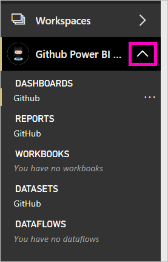
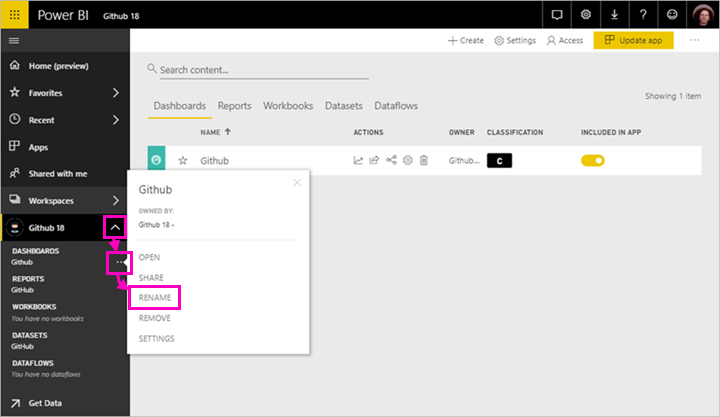
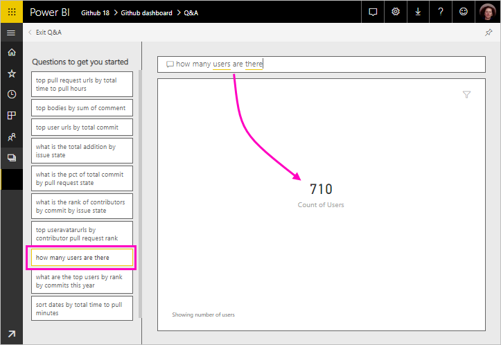
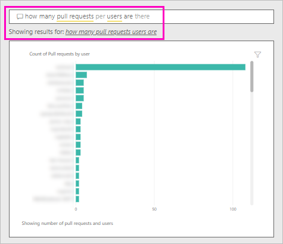
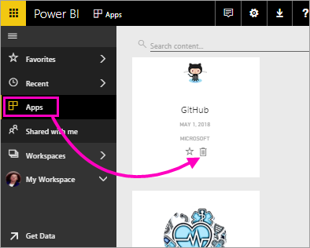

# Tutorial: Connect to a GitHub repo with Power BI
In this tutorial, you connect to real data in the GitHub service with Power BI, and Power BI automatically creates dashboards and reports. You connect to the Power BI content public repository (also known as a *repo*) and see answers to questions like: How many people contribute to the Power BI public content? Who contributes the most? Which day of the week has the most contributions? And other questions. 

In this tutorial, you complete the following steps:

> [!div class="checklist"]
> * Sign up for a GitHub account, if you don't have one yet 
> * Sign in to your Power BI account, or sign up, if you don't have one yet
> * Open the Power BI service
> * Find the GitHub app
> * Enter the information for the Power BI public GitHub repo
> * View the dashboard and report with GitHub data
> * Clean up resources by deleting the app

If you're not signed up for Power BI, [sign up for a free trial](https://app.powerbi.com/signupredirect?pbi_source=web) before you begin.

## Prerequisites

To complete this tutorial, you need a GitHub account, if you don't already have one. 

- Sign up for a [GitHub account](/contribute/get-started-setup-github).

## How to connect
1. Sign in to the Power BI service (`https://app.powerbi.com`). 
2. In the nav pane, select **Apps**, then **Get apps**.
   
    

3. Select **Apps**, type **GitHub** in the search box > **Get it now**.
   
    

4. In **Install this Power BI App?** select **Install**.
5. In **Your new app is ready**, select **Go to app**.
6. In **Get started with your new app**, select **Connect**.

    

7. Enter the repository name and repository owner of the repo. The URL for this repo is https://github.com/MicrosoftDocs/powerbi-docs, so **Repository Owner** is **MicrosoftDocs**, and **Repository** is **powerbi-docs**. 
   
    

5. Enter the GitHub credentials you created. Power BI might skip this step if you're already signed in to GitHub in your browser. 

6. For **Authentication Method**, keep **oAuth2** selected \> **Sign In**.

7. Follow the GitHub authentication screens. Grant Power BI permission to the GitHub data.
   
   Now Power BI can connect with GitHub and connect to the data.  The data is refreshed once a day.

8. After Power BI imports the data, you see the contents of your new GitHub workspace. 
9. Select the arrow next to the workspace name in the nav pane. You see the workspace contains a dashboard and a report. 

    

10. Select **More options** (...) next to the dashboard name > **Rename** > type **GitHub dashboard**.
 
     

8. Select the global navigation icon to minimize the nav pane, so you have more room.

    

10. Select your GitHub dashboard.
    
    The GitHub dashboard contains live data, so the values you see may be different.

    

    

## Ask a question

1. Put your cursor in **Ask a question about your data**. Power BI offers **Questions to get your started**. 

1. Select **how many users are there**.
 
    

13. In between **how many** and **users are there**, type **pull requests per**. 

     Power BI creates a bar chart showing the number of pull requests per person.

    

13. Select the pin to pin it to your dashboard, then **Exit Q&A**.

## View the GitHub report 

1. In the GitHub dashboard, select the column chart **Pull Requests by Month** to open the related report.

    

2. Select a user name in the **Total pull requests by user** chart. In this example, we see most of their hours were in February.

    

3. Select the **Punch Card** tab to view the next page in the report. 
 
    

    Apparently Tuesday at 3 pm is the most common time and day of the week for *commits*, when people check in their work.

## Clean up resources

Now that you've finished the tutorial, you can delete the GitHub app. 

1. In the nav pane, select **Apps**.
2. Hover over the GitHub tile and select the **Delete** garbage can.

    

## Next steps

In this tutorial, you've connected to a GitHub public repo and gotten data, which Power BI has formatted in a dashboard and report. You've answered some questions about the data by exploring the dashboard and report. Now you can learn more about connecting to other services, such as Salesforce, Microsoft Dynamics, and Google Analytics. 
 
> [!div class="nextstepaction"]
> [Connect to the online services you use](service-connect-to-services.md)