# Tutorial: Invoke a Machine Learning Studio (classic) model in Power BI (Preview)

In this tutorial, we walk through the experience of incorporating insights from an **Azure Machine Learning Studio (classic)** model into Power BI. This tutorial includes guidance for granting a Power BI user access to an Azure ML model, creating a dataflow, and applying the insights from the Azure ML model to your dataflow. It also references the quickstart guide for creating an Azure ML model if you don't already have a model.

The tutorial takes you through the following steps:

> [!div class="checklist"]
> * Create and publish an Azure Machine Learning model
> * Grant access to a Power BI user to use the model
> * Create a dataflow
> * Apply insights from the Azure ML model to the dataflow

## Create and publish an Azure ML model

Follow the instructions at [Walkthrough Step 1: Create a Machine Learning Studio (classic) workspace](/azure/machine-learning/studio/walkthrough-1-create-ml-workspace) to create a **Machine Learning** workspace.

You can use these steps with any Azure ML model or dataset you already have. If you don't have a published model, you can create a model in minutes by referring to [Create your first data science experiment in Azure Machine Learning Studio (classic)](/azure/machine-learning/studio/create-experiment), which sets up an Azure ML model for Automobile Price Prediction.

Follow the steps at [Deploy an Azure Machine Learning Studio (classic) web service](/azure/machine-learning/studio/tutorial-part3-credit-risk-deploy) to publish the Azure ML model as a web service.

## Grant a Power BI user access

To access an Azure ML model from Power BI, you must have **Read** access to the Azure subscription and the resource group and **Read** access to the Azure Machine Learning Studio (classic) web service  for Machine Learning Studio (classic) models.  For Azure Machine Learning model, you need **Read** access to the Machine Learning workspace.

The following steps assume you are the coadministrator for the Azure subscription and resource group to which the model was published.

Sign in to the [Azure portal](https://portal.azure.com), and navigate to the **Subscriptions** page, which you can find using the **All Services** list in the nav pane menu.

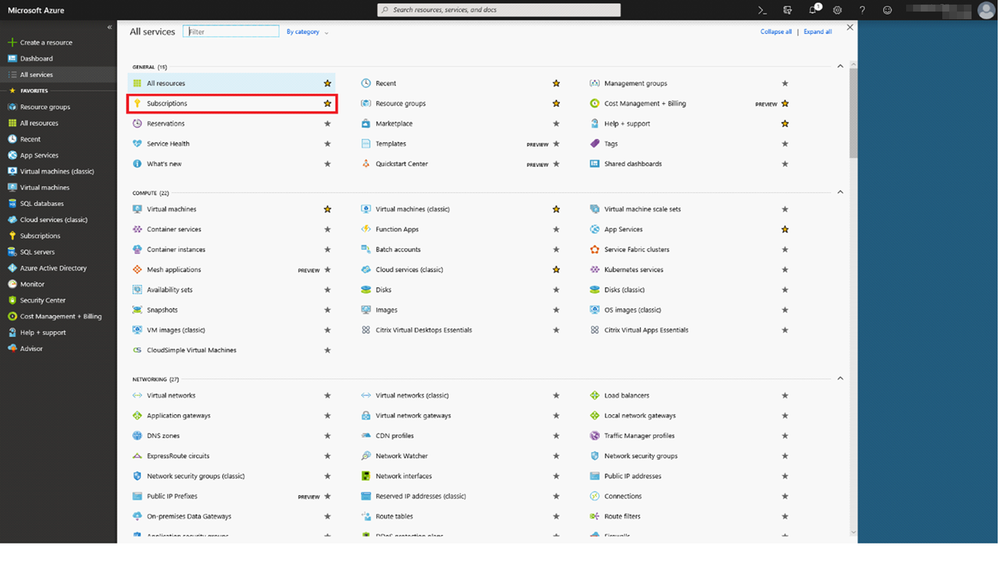

Select the Azure subscription that you used for publishing the model, and select **Access Control (IAM)**. Next select **Add role assignment**, then select the **Reader** role, and select the Power BI user. Select **Save** when you're done. The following image shows these selections.

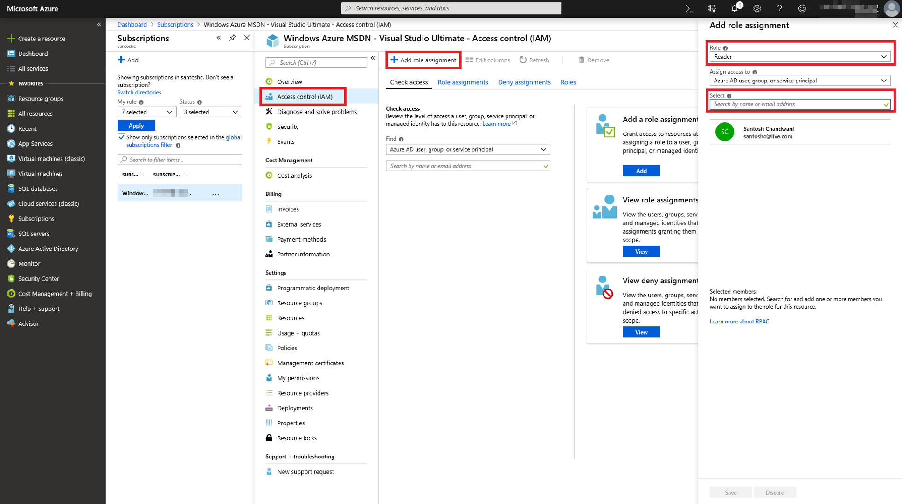

Then repeat the steps above to grant **Contributor** role access to the Power BI user for the specific Machine Learning web service to which the Azure ML model has been deployed.

## Create a dataflow

### Get data for creating the dataflow

Sign in to the Power BI service with the user credentials for whom you granted access to the Azure ML model in the previous step.

This step assumes you have the data you want to score with your Azure ML model in CSV format.  If you used the **Automobile Pricing Experiment** to create the model in the Machine Learning Studio (classic), the dataset for is shared in the following link:

* [Azure Learning Studio (classic) sample model](https://github.com/santoshc1/PowerBI-AI-samples/blob/master/Tutorial_MLStudio_model_integration/Automobile%20price%20data%20_Raw_.csv)

### Create a dataflow

To create the entities in your dataflow, sign in to the Power BI service and navigate to a workspace on your capacity that has the AI preview enabled.

If you don't already have a workspace, you can create one by selecting **Workspaces** in the left menu, and then select **Create workspace** in the panel at the bottom.  This opens a panel to enter the workspace details. Enter a workspace name, and then select **Save**.

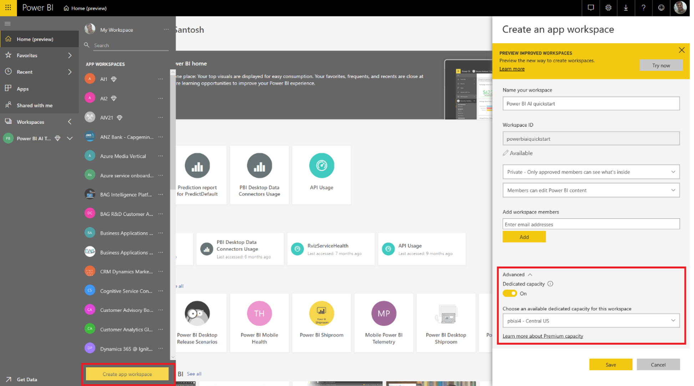

After the workspace has been created, you can select **Skip** in the bottom right of the Welcome screen.

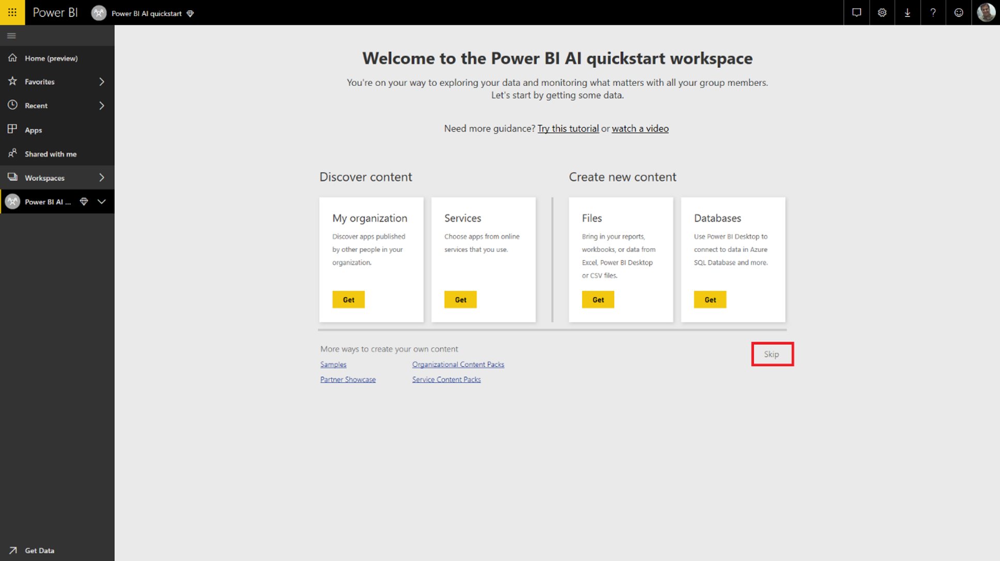

Select the **Dataflows (preview)** tab, and then select the **Create** button at the top right of the workspace, and then select **Dataflow**.

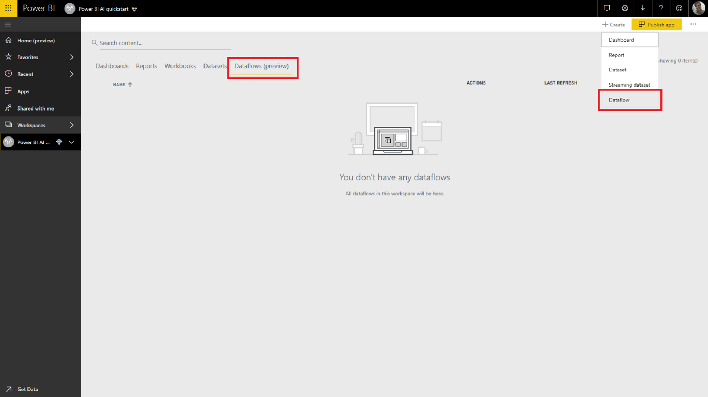

Select **Add new entities**, which launches **Power Query Editor** in the browser.

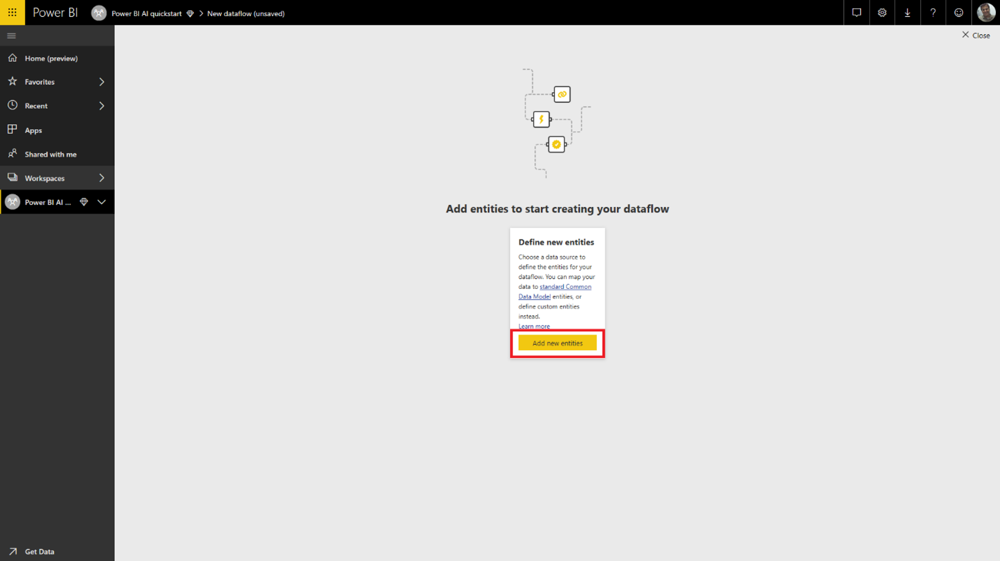

Select **Text/CSV File** as a data source.

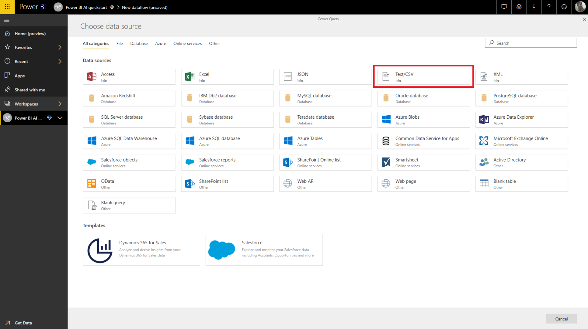

In the next screen, you're prompted to connect to a data source. Paste the link to the data you used to create your Azure ML model. If you used the _Automotive Pricing_ data, you can paste the following link into the **File path or URL** box and then **Next**.

`https://raw.githubusercontent.com/MicrosoftLearning/Principles-of-Machine-Learning-Python/master/Module7/Automobile%20price%20data%20_Raw_.csv`

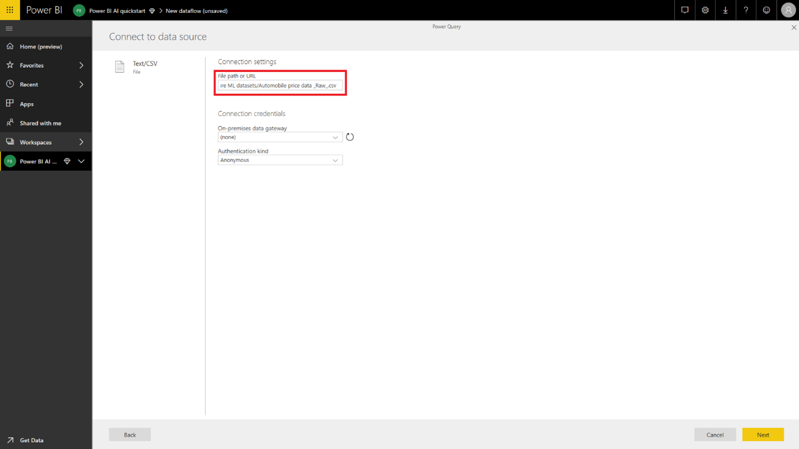

Power Query Editor shows a preview of the data from the CSV file. Select **Transform Table** from the command ribbon and then select **Use first row as headers**.  This adds the _Promoted headers_ query step into the **Applied steps** pane on the right. You can also rename the query to a friendlier name, such as _Automobile Pricing_ using the pane on the right.

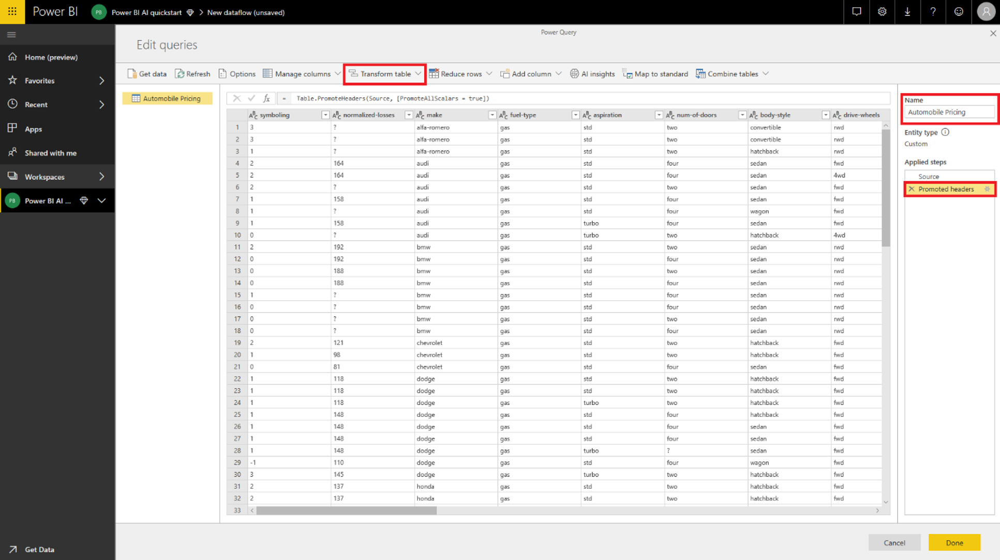

Our source dataset has unknown values set to '?'.  To clean this, we can replace '?' with '0' to avoid errors later for simplicity.  To do this, select the columns *normalized-losses*, *bore*, *stroke*, *compression-ratio*, *horsepower*, *peak-rpm* and *price* by clicking on their name in the column headers, then click on 'Transform columns' and select 'Replace values'.  Replace '?' with '0'.

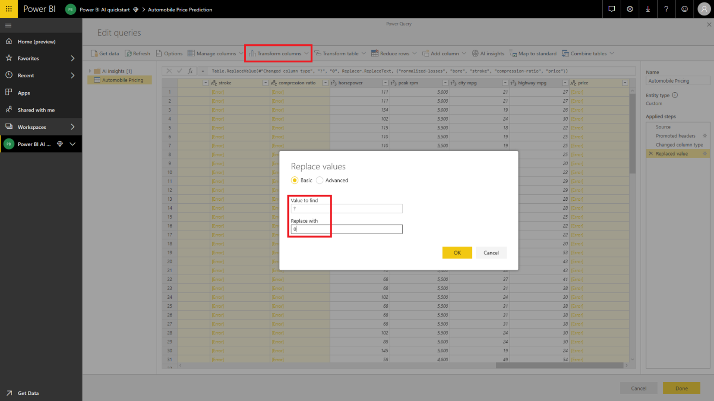

All the columns in the table from a Text/CSV source are treated as text columns.  Next, we need to change the numeric columns to their correct data types.  You can do this in Power Query by clicking on the data type symbol in the column header.  Change the columns to the below types:

- **Whole number**:  symboling, normalized-losses, curb-weight, engine-size, horsepower, peak-rpm, city-mpg, highway-mpg, price
- **Decimal number**:  wheel-base, length, width, height, bore, stroke, compression-ratio

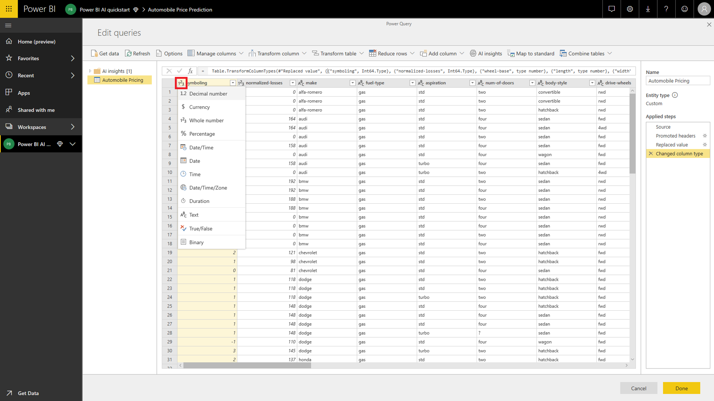

Select **Done** to close Power Query Editor. This will show the entities list with the _Automobile Pricing_ data we added. Select **Save** in the top right corner, provide a name for the dataflow, and then select **Save**.

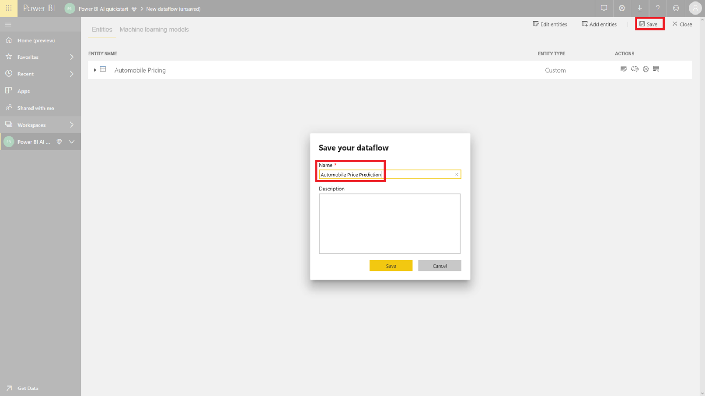

### Refresh the dataflow

Saving the dataflow displays a notification that your dataflow was saved. Select **Refresh now** to ingest data from the source into the dataflow.

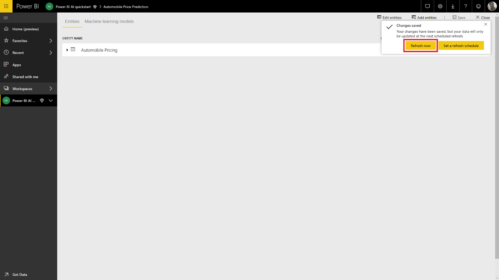

Select **Close** in the upper right corner and wait for the dataflow refresh to complete.

You can also refresh your dataflow using the **Actions** commands. The dataflow displays the timestamp when the refresh is completed.

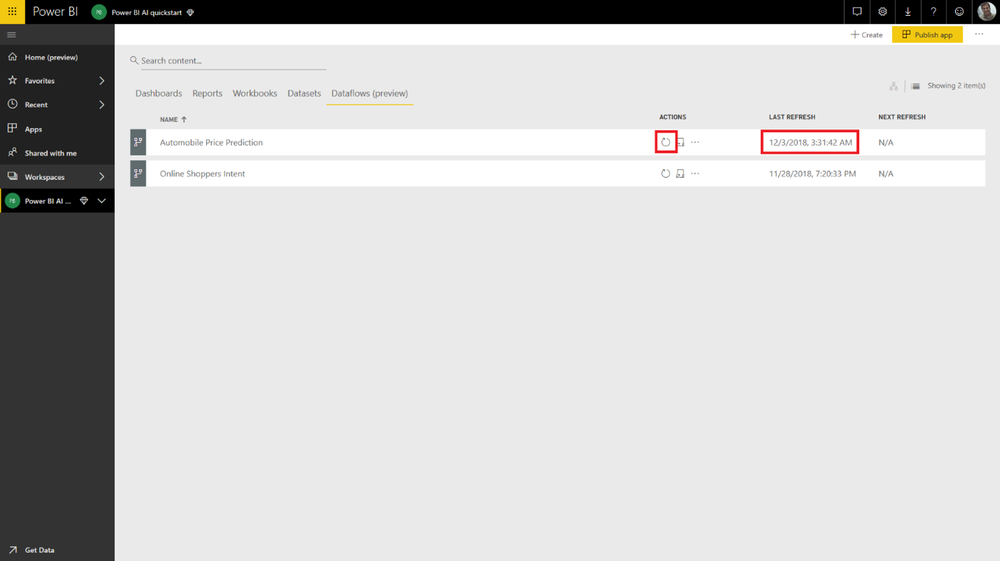

## Apply insights from your Azure ML model

To access the Azure ML model for _Automobile Price Prediction_, you can edit the _Automobile Pricing_ entity for which we want to add the predicted price.

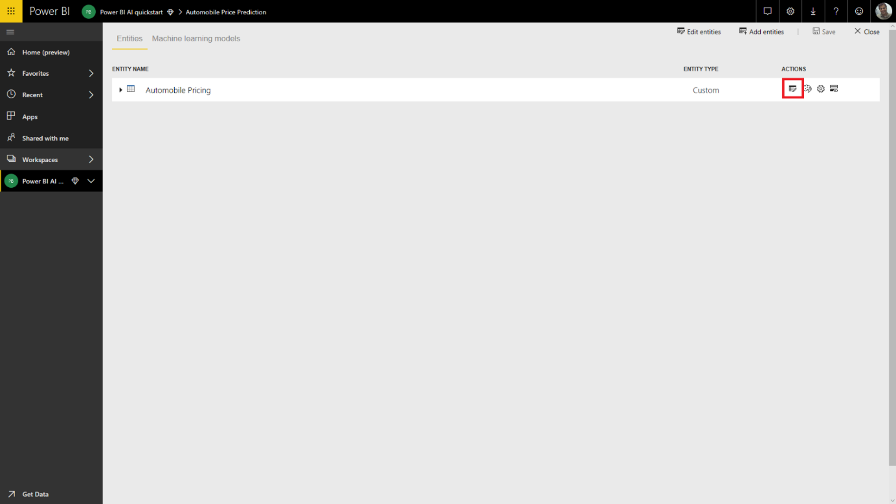

Selecting the **Edit** icon opens Power Query Editor for the entities in your dataflow.

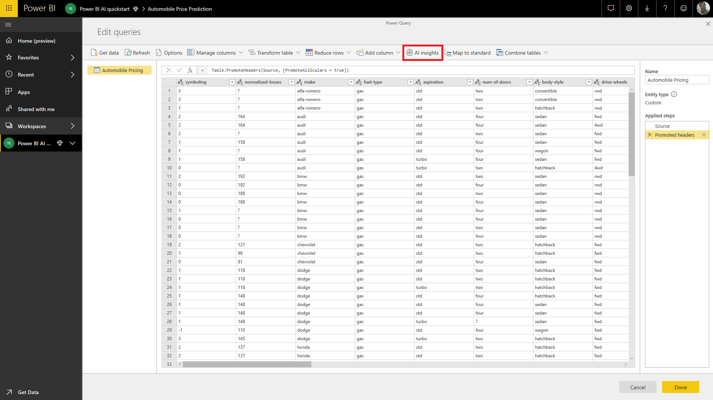

Select the **AI Insights** button in the ribbon, and then select the _Azure Machine Learning Models_ folder from the nav pane menu.

The Azure ML models to which you've been granted access are listed as Power Query functions with a prefix *AzureML.*  When you click on the function corresponding to the _AutomobilePricePrediction_ model, the parameters for the model's web service are listed as function parameters.

To invoke an Azure ML model, you can specify any of the selected entity's columns as an input from the drop-down. You can also specify a constant value to be used as an input by toggling the column icon to the left of the input dialog. When a column name that matches one of the function parameter names, then the column is automatically suggested as an input.  If the column name doesn't match, you can select it from the drop-down.

In the case of the _Automobile Pricing Prediction_ model, the input parameters are:

- make
- body-style
- wheel-base
- engine-size
- horsepower
- peak-rpm
- highway-mpg

In our case, since our table matches the original dataset used to train the model, all the parameters have the correct columns already selected.

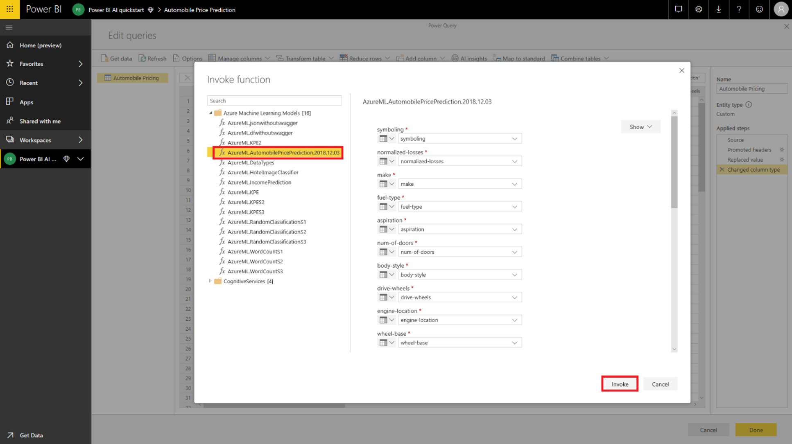

Select **Invoke** to view the preview of the Azure ML model's output as a new column in the entity table. You'll also see the model invocation as an applied step for the query.

The output of the model is shown as a record in the output column. You can expand the column to produce individual output parameters in separate columns. In our case, we're only interested in the _Scored Labels_ which contains the predicted price of the automobile.  So we deselect the rest, and select **OK**.

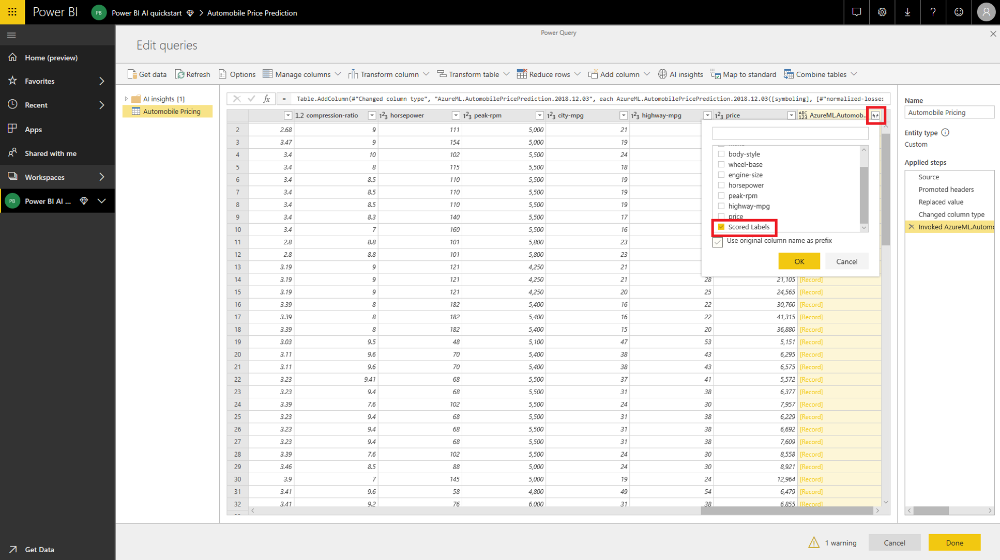

The resulting *Scored Labels* column has the price prediction from the Azure ML model.

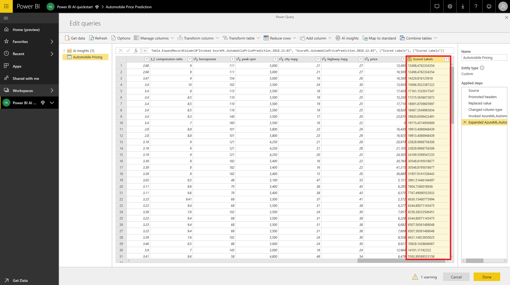

Once you save your dataflow, the Azure ML model will be automatically invoked when the dataflow is refreshed for any new or updated rows in the entity table.

## Clean up resources

If you no longer need the Azure resources you created using this article, delete them to avoid incurring any charges.  You can also delete the dataflows you created, if you no longer require them.

## Next steps

In this tutorial, you created a simple experiment using Azure Machine Learning Studio (classic) using a simple dataset using these steps:

- Create and publish an Azure Machine Learning model
- Grant access to a Power BI user to use the model
- Create a dataflow
- Apply insights from the Azure ML model to the dataflow

For more information about Azure Machine Learning integration in Power BI, see [Azure Machine Learning integration in Power BI (Preview)](../transform-model/service-machine-learning-integration.md).