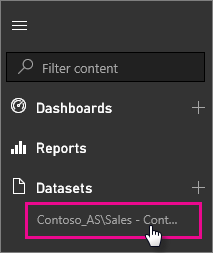

# SQL Server Analysis Services live data in Power BI

In Power BI, there are two ways you can connect to a live SQL Server Analysis Services server. In **Get data**, you can connect to a SQL Server Analysis Services server, or you can connect to a [Power BI Desktop file](service-desktop-files.md), or [Excel workbook](service-excel-workbook-files.md), that already connects to an Analysis Services server. As a best practice, Microsoft strongly recommends using Power BI Desktop because of the richness of the toolset and the ability to maintain a backup copy of the Power BI Desktop file locally.

>[!IMPORTANT]
> * In order to connect to a live Analysis Services server, an On-premises data gateway must be installed and configured by an administrator. For more information, see [On-premises data gateway](service-gateway-onprem.md).
> * When you use the gateway, your data remains on-premises.  The reports you create based on that data are saved in the Power BI service. 
> * [Q&A natural language querying](../create-reports/service-q-and-a-direct-query.md) is in preview for Analysis Services live connections.

## To connect to a model from Get data

1. In **My Workspace**, select **Get data**. You can also change to a group workspace, if one is available.

   

2. Select **Databases & More**.

   

3. Select **SQL Server Analysis Services** > **Connect**.

   

4. Select a server. If you don't see any servers listed here, it means either a gateway, and data source, are not configured, or your account is not listed in the **Users** tab of the data source, in the gateway. Check with your administrator.

5. Select the model you want to connect to. This could be either Tabular or Multidimensional.

After you connect to the model, it will appear in your Power BI site in **My Workspace/Datasets**. If you were switched to a group workspace, then the dataset will appear within the group.

## Dashboard tiles

If you pin visuals from a report to the dashboard, the pinned tiles are automatically refreshed every 10 minutes. If the data in your on-premises Analysis Services server is updated, the tiles will get auto-updated after 10 minutes.

## Common Issues

* Cannot load the model schema error - This error occurs when the user connecting to SSAS does not have access to the SSAS database, cube and model.

## Next steps

* [On-premises data gateway](service-gateway-onprem.md)  
* [Manage Analysis Services data sources](service-gateway-enterprise-manage-ssas.md)  
* [Troubleshooting the On-premises data gateway](service-gateway-onprem-tshoot.md)  

More questions? [Try the Power BI Community](https://community.powerbi.com/)