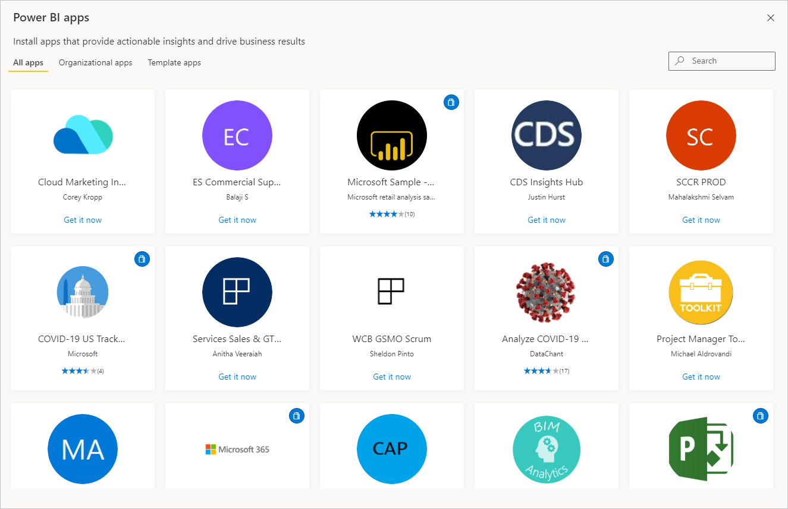

# Apps in Power BI

[!INCLUDE[consumer-appliesto-ynny](../includes/consumer-appliesto-ynny.md)]

[!INCLUDE [power-bi-service-new-look-include](../includes/power-bi-service-new-look-include.md)]

## What is a Power BI app?
An *app* is a Power BI content type that combines related dashboards and reports, all in one place. An app can have one or more dashboards and one or more reports, all bundled together. Apps are created by Power BI *designers* who distribute and share the apps with their colleagues. There are many different ways a *designer* can share an app. To learn more, see the **Get a new app** section, below. 

## App *designers* and app *users*
Depending on your role, you may be someone who creates apps (*designer*) for your own use or to share with colleagues. Or, you may be someone who receives and downloads apps (*business user*) created by others. This article is for *business users*.

Seeing and opening an app require certain permissions. The recipient must either have a Power BI Pro license or the app must be shared with the recipient in a special type of cloud storage called **Premium capacity**. To learn more about licenses and Premium capacity, see [Licensing for the Power BI service](end-user-license.md).

## Advantages of apps
Apps are an easy way for *designers* to share different types of content at one time. App *designers* create the dashboards and reports and bundle them together into an app. The *designers* then share or publish the app to a location where you, the *business user*, can access it. Because related dashboards and reports are bundled together, it's easier for you to find and install in both the Power BI service ([https://powerbi.com](https://powerbi.com)) and on your mobile device. After you install an app, you don't have to remember the names of a lot of different dashboards or reports because they're all together in one app, in your browser or on your mobile device.

With apps, whenever the app author releases updates, you either get a notification or you automatically see the changes. The author also controls how often the data is scheduled to refresh, so you don't need to worry about keeping it up to date. 

<!-- add conceptual art -->
## Get a new app
There are several different ways to get a new app. You can search, find, and install apps and app designers can share apps with you. 

### Find and install apps from the Power BI apps marketplace
One way to find apps is to select **Get app** from the Power BI **Apps** screen. 

Browse through the list of apps in the Power BI apps marketplace until you find one to install. Choose from **Organizational apps**, which are only available to people in your company, or **Template apps**, which are published by Microsoft and the community for any Power BI user to install. 

There are a few other ways to get apps. Some of these ways are listed below. But for detailed step-by-step instructions for getting and exploring an app, see [Open and interact with an app](end-user-app-view.md).

* The app designer can install the app automatically in your Power BI account, and the next time you open the Power BI service, you'll see the new app in your **Apps** content list. 
* The app designer can email you a direct link to an app. Selecting the link opens the app in the Power BI service.
* In Power BI on your mobile device, you can only install an app from a direct link, and not from the apps marketplace. If the app author installs the app automatically, you'll see it in your list of apps. 

Your apps are organized in the **Apps** content list. Just select **Apps** to display your apps. Hover over an app to see the last updated date and the owner. 

## Next steps
* [Open and interact with an app](end-user-app-view.md)
* [Other ways to share content](end-user-shared-with-me.md)

