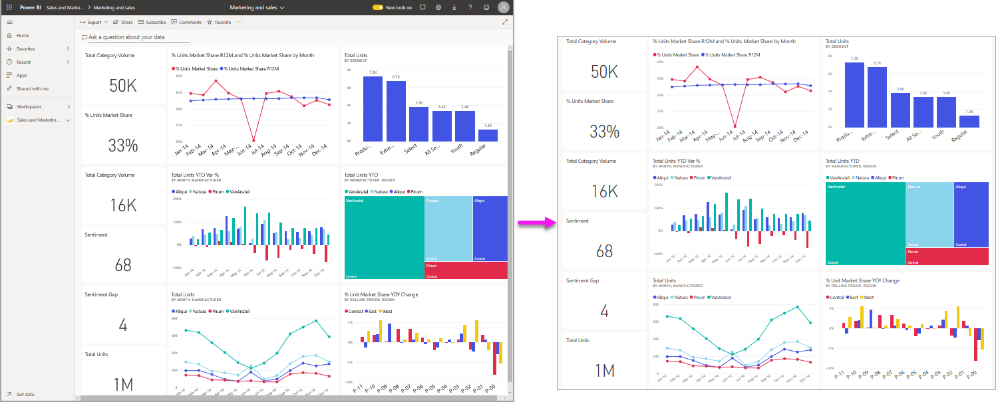
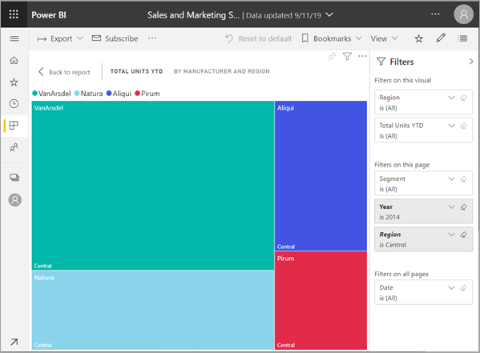

# Display content in more detail: focus mode and full screen mode

[!INCLUDE [power-bi-service-new-look-include](../includes/power-bi-service-new-look-include.md)]    

<iframe width="560" height="315" src="https://www.youtube.com/embed/dtdLul6otYE" frameborder="0" allowfullscreen></iframe>

Focus mode and full screen mode are two different ways to see more detail in your visuals, reports, and dashboards.  The main difference is that full screen removes all the panes surrounding your content while focus mode allows you to still interact with your visuals. Let's take a closer look at the similarities and differences.  

|Content    | Focus mode  |Full screen mode  |
|---------|---------|----------------------|
|Dashboard     |   Not possible     | yes |
|Report page   | Not possible  | yes|
|Report visual | yes    | yes |
|Dashboard tile | yes    | yes |
|Windows 10 mobile | Not possible | Yes |

## What is full screen mode

Display your Power BI service content (dashboards, report pages, tiles, and visuals) without the distraction of menus and navigation bars.  You get an unadulterated, full view of your content at a glance, all the time. This is sometimes referred to as TV mode.   

To open full screen mode, select the **full screen** icon  from the Power BI service menu bar above your dashboard, report, tile in focus mode, or visual in focus mode.  Your selected content fills the entire screen.
If you're using Power BI mobile, [full screen is available for Windows 10 mobile apps](./mobile/mobile-windows-10-app-presentation-mode.md). 

Some uses for full screen mode are:

* presenting your dashboard, tile, visual, or report at a meeting or conference
* displaying in an office on a dedicated large screen or projector
* viewing on a small screen
* reviewing in locked mode -- you can touch the screen or mouse over tiles without opening the underlying report or dashboard

## What is focus mode?

***Focus*** mode lets you expand (pop out) a visual or tile to see more detail.  Maybe you have a dashboard or report that is a little crowded and you want to zoom in on only one visual.  This is a perfect use of focus mode.  

While in focus mode, a Power BI *consumer* can interact with any filters that were applied when this visual was created.  In Power BI service, you can use focus mode on a dashboard tile or report visual.

## Working in full screen mode

To open either a dashboard or report page in full screen mode, select the full screen icon  from the top navigation bar. Once you're in full screen mode, moving  your mouse or cursor reveals a contextual menu. Because full screen is available for such a wide variety of content, the options in the contextual menu are each a little different but fairly self-explanatory.  Simply hover over an icon for a definition.

Menu for dashboards    
    

Menu for report pages    
    

  *     
  Use the **Back** button  to navigate to the previous page in your browser. If the previous page was a Power BI page, it too will display in full screen mode.  Full screen mode will persist until you exit out.

  *     
  Use this button to print your dashboard or report page in full screen mode.

  *     
    Use the **Fit to screen** button to display your dashboard at the largest size possible without resorting to scrollbars.  

    

  *        
    Sometimes you don't care about scrollbars, but want the dashboard to fill the entire width of the available space. Select the **Fit to width** button.    

    

  *        
    In full screen reports, use these arrows to move between the pages in the report.    
  *      
  To exit full screen mode, select the **Exit full screen** icon.

      

## Working in focus mode

There are two ways to open focus mode; one way for dashboard tiles and another way for report visuals.

### Focus mode in dashboards

1. Open a dashboard in Power BI service.

2. Hover over a dashboard tile or report visual, select the ellipsis (...) and choose **Open in focus mode**.

    .

2. The tile opens and fills the entire report canvas. Notice that you still have a **Filters** pane that you can use to interact with the visual. The **Filters** pane can be collapsed. 

   

4. Explore further by [modifying the filters](end-user-report-filter.md) and looking for interesting discoveries in your data.  

5. Leave focus mode and return to the dashboard by selecting **Exit focus mode** (in the upper left corner of the visual).

        

## Focus mode for report visuals

1. Open a report in Power BI service.  In this example, we'll demonstrate using the Sales and Marketing sample.

1. After the report opens, select the **YTD Category** tab.

2. Hover over the treemap in the upper left corner and select the **focus mode** icon .  

   
2. The visual opens and fills the entire canvas.

   

3. Optionally, use the **Filters** pane to interact with the filters applied to this visual. Dig into the data looking for new insights and answers to questions. As a *consumer*, you can't add new filters, change the fields being used in the visuals, or create new visuals.  However, any modifications you make to the existing filters are saved when you exit Power BI. If  you don't want Power BI to remember your modifications, select **Reset to default**.   

5. Leave focus mode and return to the report by selecting **Back to report** (in the upper left corner of the visual).

      

## Considerations and troubleshooting

* When using focus mode with a visual in a report, you'll be able to view and interact with all filters: Visual level, Page level, Drillthrough, and Report level.    
* When using focus mode with a visual on a dashboard, you'll be able to view and interact with only the Visual level filter.

## Next steps

[View settings for reports](end-user-report-view.md)