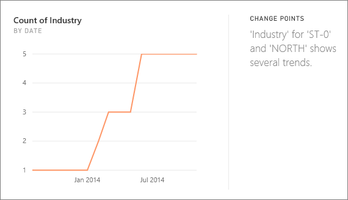
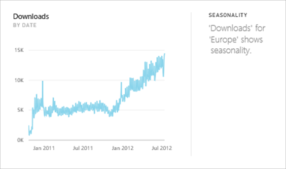

# Types of insights supported by Power BI

The Power BI service can automatically look for insights in your dashboards or reports.

## How does Insights work?
Power BI quickly searches different subsets of your dataset. As it searches, Power BI applies a set of sophisticated algorithms to discover potentially interesting insights. Power BI scans as much of a dataset as possible in an allotted amount of time.

You can run insights against a dataset or dashboard tile.   

## What types of insights can we find?
These are some of the algorithms we use:

## Category outliers (top/bottom)
Highlights cases where, for a measure in the model, one or two members of a dimension have much larger values than other members of the dimension.  

## Change points in a time series
Highlights when there are significant changes in trends in a time series of data.

## Correlation
Detects cases where multiple measures show a correlation between each other when plotted against a dimension in the dataset.

## Low Variance
Detects cases where data points aren't far from the mean.

## Majority (Major factors)
Finds cases where a majority of a total value can be attributed to a single factor when broken down by another dimension.  

## Overall trends in time series
Detects upward or downward trends in time series data.

## Seasonality in time series
Finds periodic patterns in time series data, such as weekly, monthly, or yearly seasonality.

## Steady share
Highlights cases where there is a parent-child correlation between the share of a child value in relation to the overall value of the parent across a continuous variable.

## Time series outliers
For data across a time series, detects when there are specific dates or times with values significantly different than the other date/time values.

## Next steps
[Power BI insights](end-user-insights.md)

More questions? [Try the Power BI Community](http://community.powerbi.com/)

