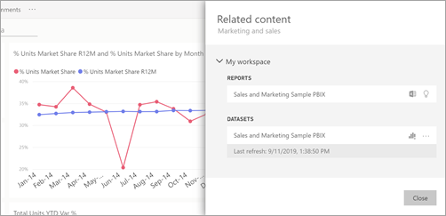
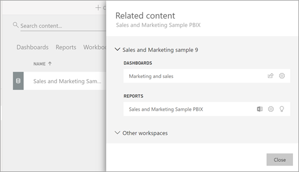

# View related content in the Power BI service

[!INCLUDE[consumer-appliesto-ynny](../includes/consumer-appliesto-ynny.md)]

[!INCLUDE [power-bi-service-new-look-include](../includes/power-bi-service-new-look-include.md)]

The **Related content** pane shows you how your Power BI service content -- dashboards, reports, and datasets -- are interconnected. The **Related content** pane is also a launching pad for taking action. From here you can do things like open a dashboard, open a report, generate insights, analyze the data in Excel, and more.  

In Power BI, reports are built on datasets, report visuals are pinned to dashboards, and dashboard visuals link back to reports. But how do you know which dashboards are hosting visuals from your Marketing report? And how do you locate those dashboards? Is your Procurement dashboard using visuals from more than one dataset? If so, what are they named and how can you open and edit them? Is your HR dataset being used in any reports or dashboards at all? Or, can it be moved without causing any broken links? Questions like these can all be answered on the **Related content** pane.  Not only does the pane display the related content, it also allows you to take action on the content and easily navigate between the related content.

> [!NOTE]
> The related content feature does not work for streaming datasets.
> 
> 

## View related content for a dashboard or report
Watch Will view related content for a dashboard. Then follow the step-by-step instructions below the video to try it out yourself with the Procurement Analysis sample dataset.

<iframe width="560" height="315" src="https://www.youtube.com/embed/B2vd4MQrz4M#t=3m05s" frameborder="0" allowfullscreen></iframe>

With a dashboard or report open, select **More options** (...) in the menu bar and choose **View related** from the dropdown.

The **Related content** pane opens. For a dashboard, it shows all the reports that have visualizations pinned to the dashboard and their associated datasets. For this dashboard, there are visualizations pinned from only one report and that report is based on only one dataset. 

From here, you can take direct action on the related content.  For example, select a report or dashboard name to open it.  For a listed report, select an icon to [analyze in Excel](../service-analyze-in-excel.md) or [get insights](end-user-insights.md). For a dataset, you can see the last refresh date and time, [analyze in Excel](../service-analyze-in-excel.md) and [get insights](end-user-insights.md).  

## View related content for a dataset
You'll need at least *view* permissions to a dataset to open the **Related content** pane. In this example, we're using the [Procurement Analysis sample](../sample-procurement.md).

From the nav pane, locate the **Workspaces** heading and select a workspace from the list. If you have content in a workspace, it will display in the canvas to the right. 

In a workspace, select the **Datasets** tab and locate the **View related** icon .

Select the icon to open the **Related content** pane.

From here, you can take direct action on the related content. For example, select a dashboard or report name to open it.  For any dashboard in the list, select an icon to [share the dashboard with others](../service-share-dashboards.md) or to open the **Settings** window for the dashboard. For a report, select an icon to [analyze in Excel](../service-analyze-in-excel.md), [rename](../service-rename.md), or [get insights](end-user-insights.md).  

## Limitations and troubleshooting
* If you don't see "View related", look for the icon instead . Select the icon to open the **Related content** pane.
* To open Related content for a report, you need to be in [Reading view](end-user-reading-view.md).
* The Related content feature doesn't work for streaming datasets.

## Next steps
* [Get started with Power BI service](../service-get-started.md)
* More questions? [Try the Power BI Community](https://community.powerbi.com/)

