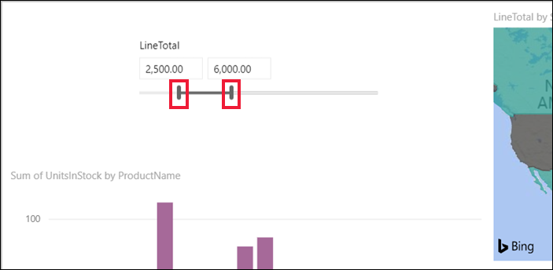
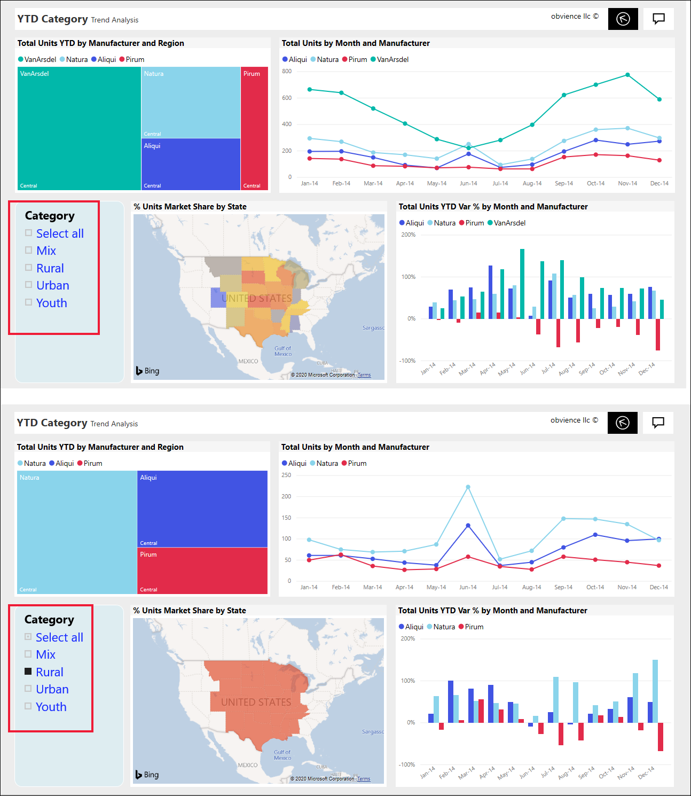
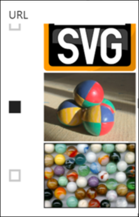
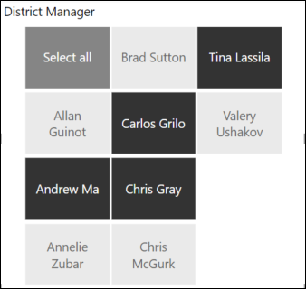
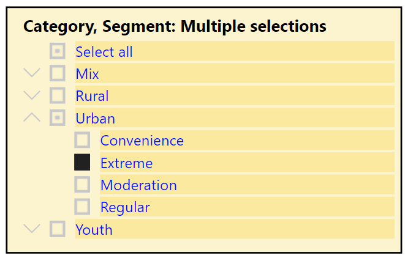
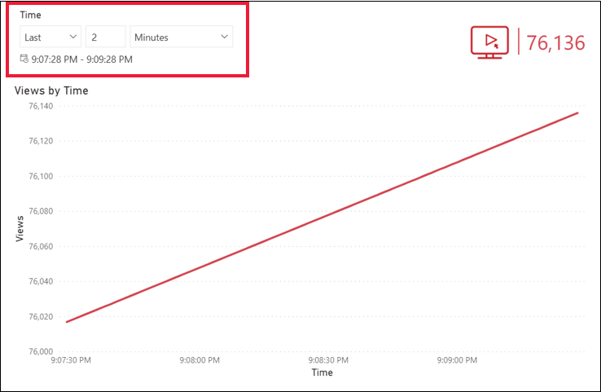
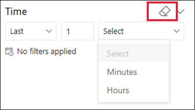

# Slicers in the Power BI service

[!INCLUDE[consumer-appliesto-ynnn](../includes/consumer-appliesto-yynn.md)]

A slicer is a type of visual that filters the other visuals on a report page. When using Power BI reports, you'll discover many types of slicers. The image, above, shows the same slicer but with different selections. Notice how each selection filters the other visuals on the page.  

## How to use slicers
When creating reports, *designers* add slicers to help tell a story and to give you tools to explore your data.

### Numeric range slicer
 The numeric range slicer, above, helps you explore the total sales by: geography, units in stock, and order date. Use the handles to select a range. 

### Basic vertical checkbox slicer

In a basic checkbox slicer, select one or more checkboxes to see the impact on the other visuals on the page. To select more than one, use CTRL-select. Sometimes, the report *designer* will set the slicer to only allow you to select one value at a time. 

### Image and shape slicers
When the slicer options are images or shapes, making your selections is similar to using checkboxes. You can choose one or more image or shape to apply the slicer to the other visuals on the page. 

    

    

### Hierarchy slicer

In a slicer with a hierarchy, use the chevrons to expand and collapse the hierarchy. The header updates to show your selections.

### Relative time slicer
With emerging fast refresh scenarios, the ability to filter to a smaller window of time can be very useful.
Using the relative time slicer, you can apply time-based filters to any date or time data in your report. For example, you can use the relative time slicer to show only video views within the last 2 days, hours, or even minutes. 

## Deactivate a slicer
To deactivate a slicer, select the eraser icon.

## Next steps
For more information, see the following articles:

[Visualization types in Power BI](end-user-visualizations.md)

