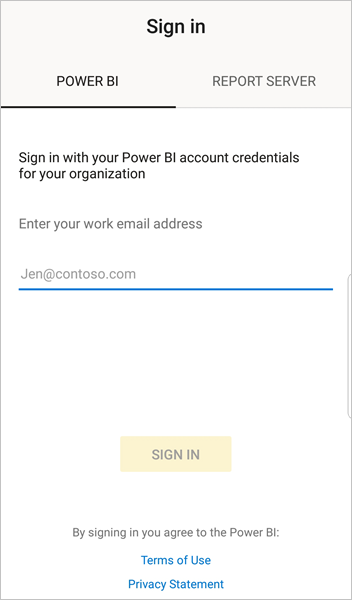
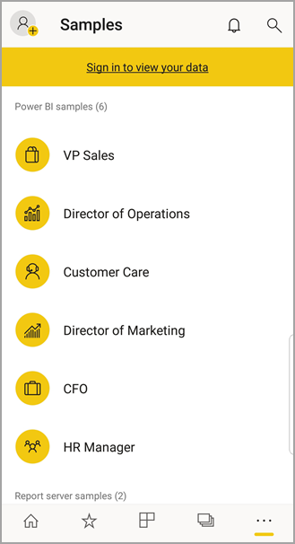

# Get started with the Power BI mobile app on Android devices
The Android app for Microsoft Power BI delivers the mobile BI experience for Power BI, Power BI Report Server, and Reporting Services. View and interact with your company dashboards on premises and in the cloud from anywhere, with live, touch-enabled mobile access. Explore the data in dashboards, and share with your colleagues in email or text messages. 

You create Power BI reports in Power BI Desktop, and publish them:

* [Publish them to the Power BI service](../../fundamentals/power-bi-overview.md), and create dashboards.
* [Publish them on premises to Power BI Report Server](../../report-server/quickstart-create-powerbi-report.md).

Then in the Power BI app for Android, you interact with your dashboards and reports, whether on premises or in the cloud.

Find out [what's new in the Power BI mobile apps](../../mobile-whats-new-in-the-mobile-apps.md).

## Prerequisites

### Get the app

[Download the Power BI for Android app](https://go.microsoft.com/fwlink/?LinkID=544867) from Google Play.
  
Power BI can run on a number of different Android devices, running the Android 5.0 operating system or later. To check on your device, go to **Settings** > **About device** > **Android version**. 

**Start when you open the app**    
Even without signing up or signing in, after you open the app you can flip through the sign-in pages for a quick overview of things you can do with the Power BI app on your Android device. Tap **Skip** to view and explore the samples, and get hands-on experience with the app. You can [go back to the samples](mobile-android-app-get-started.md#try-the-power-bi-and-reporting-services-samples) whenever you want from the dashboards home page.

Find out [what's new in the Power BI mobile apps](../../mobile-whats-new-in-the-mobile-apps.md).

## Sign up for the Power BI service on the web
If you haven't signed up yet, go to the [Power BI service](https://powerbi.com/) to sign up for your own account for creating and storing dashboards and reports, and bringing your data together. Then sign in to Power BI from your Android device to see your own dashboards from anywhere.

1. In the Power BI service, tap [Sign up](https://go.microsoft.com/fwlink/?LinkID=513879) to create a Power BI account.
2. Start [creating your own dashboards and reports](../../service-get-started.md).

## Get started with the Power BI app on your device
1. On your Android device, from the start screen open the Power BI for Android app.
   
   
2. To sign in to Power BI, tap the **Power BI** tab and fill in your sign-in details.

    If you get a message that Power BI can't sign you in, see ["Could not authenticate because your corporate SSL certificate is untrusted"](mobile-android-app-error-corporate-ssl-account-is-untrusted.md) for details on how to resolve the issue.

   To sign in to your Reporting Services mobile reports and KPIs, tap the **Report server** tab and fill in your sign-in details.
   
   

## Try the Power BI and Reporting Services samples
Even without signing up, you can view and interact with the Power BI and Reporting Services samples.

To access the samples, tap **More options** (...) on the navigation bar and choose **Samples**.

A number of Power BI samples are followed by several Report server samples.
   
   

   
   > [!NOTE]
   > Not all features are available in the samples. For example, you can't view the sample reports that underlie the dashboards, you can't share the samples with others, and you can't make them your favorites. 
   > 
   >

## Find your content in the Power BI mobile apps

Tap the magnifying glass in the header to start searching for your Power BI content.

## View your favorite dashboards and reports
Tap **Favorites** () on the navigation bar to view your Favorites page. 

Read more about [favorites in the Power BI mobile apps](mobile-apps-favorites.md).

## Enterprise support for the Power BI mobile apps
Organizations can use Microsoft Intune to manage devices and applications, including the Power BI mobile apps for Android and iOS.

Microsoft Intune lets organizations control items like requiring an access pin, controlling how data is handled by the application, and even encrypting application data when the app isn't in use.

> [!NOTE]
> If you use the Power BI mobile app on your Android device and your organization has configured Microsoft Intune MAM, then background data refresh is turned off. The next time you enter the app, Power BI refreshes the data from the Power BI service on the web.
> 
> 

Read more about [configuring Power BI mobile apps with Microsoft Intune](../../admin/service-admin-mobile-intune.md). 

## Next steps
Here are some other things you can do in the Android device app for Power BI with dashboards and reports in Power BI, and reports and KPIs in the Power BI Report Server or Reporting Services web portal.

### Power BI dashboards and reports
* View [your apps](../../collaborate-share/service-create-distribute-apps.md).
* View your [dashboards](../../mobile-apps-view-dashboard.md).
* Explore the [tiles on your dashboards](../../mobile-tiles-in-the-mobile-apps.md).
* Open [Power BI reports](../../mobile-reports-in-the-mobile-apps.md).
* View [your apps](../../collaborate-share/service-create-distribute-apps.md).
* [Annotate and share tiles](mobile-annotate-and-share-a-tile-from-the-mobile-apps.md).
* Share [dashboards](../../mobile-share-dashboard-from-the-mobile-apps.md).
* [Scan a Power BI QR code](../../mobile-apps-qr-code.md) with your Android phone to open a related dashboard tile or report. 
* View [notifications about updates to your Power BI account](../../mobile-apps-notification-center.md), such as dashboards that colleagues share with you.

### Reports and KPIs on the Power BI Report Server and Reporting Services web portals
* [View reports and KPIs on the web portal](mobile-app-ssrs-kpis-mobile-on-premises-reports.md) in the Power BI mobile app for Android devices.
* Create [KPIs on the web portal](https://docs.microsoft.com/sql/reporting-services/working-with-kpis-in-reporting-services).
* Create [reports in Power BI Desktop and publish them on the Power BI Report Server](../../report-server/quickstart-create-powerbi-report.md) web portal

### See also
* [Download the Android app](https://go.microsoft.com/fwlink/?LinkID=544867) from the Android app store.
* [What is Power BI?](../../fundamentals/power-bi-overview.md)
* Questions? [Try asking the Power BI Community](https://community.powerbi.com/)
