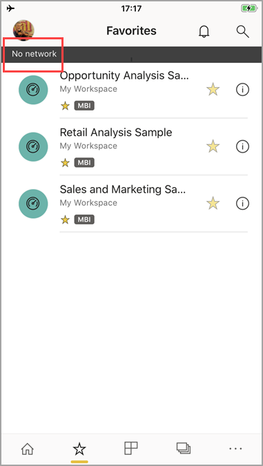

# View your data offline in the Power BI mobile apps
Applies to:

|  |  |  |  |  |
|:--- |:--- |:--- |:--- |:--- |
| iPhones |iPads |Android phones |Android tablets |Windows 10 devices |

>[!NOTE]
>Power BI mobile app support for **phones using Windows 10 Mobile** will be discontinued on March 16, 2021. [Learn more](https://go.microsoft.com/fwlink/?linkid=2121400)

One advantage of viewing Power BI in a mobile app rather than in a mobile browser is that you can see your data even when you're not connected to a network. 

By default, Power BI refreshes the data frequently so you get up-to-date answers to your business questions any time, even while commuting or roaming.

## Data access while you're offline
While you're offline, you can access and interact with dashboards you've accessed previously from the mobile app.

You also have read-only access to any Power BI reports you've accessed previously from the mobile app. You can see the full report, but not filter, cross-filter, sort, or use slicers on it.

## Background data refresh
Background refresh updates your favorite dashboards, plus dashboards and reports you've viewed in the last two weeks, with the data on the Power BI service (not the data source). If you're connected to wifi, background refresh updates every 2 hours. Otherwise, if you're on a 3G network, Power BI updates the content every 24 hours.

You can turn off background refresh, for example, to avoid network usage. Check the settings on your device.

> [!NOTE]
> If you use the Power BI mobile app on an iOS device and your organization has configured Microsoft Intune MAM, then background data refresh is turned off. The next time you enter the app, Power BI refreshes the data from the Power BI service on the web.
> 
> Read more about [configuring Power BI mobile apps with Microsoft Intune](../../service-admin-mobile-intune.md). 
> 
> 

## Offline indicators
Power BI provides clear indicators when you go in and out of offline mode, as well as indicators for missing dashboards, reports, and tiles that aren't available offline.

## Limitations
When you're offline with Power BI on your mobile device, you may encounter these limitations:

* Power BI can cache up to 250 MB of data offline.
* Some tile types require an active server connection, so they aren't available offline; for example, Bing map tiles and some custom tiles.
* Whole Excel workbooks in Power BI aren't available offline.
* You can see Reporting Services mobile reports and KPIs offline, if you have viewed them while connected. They don't refresh in the background. They refresh every time you open them.
* In the Power BI mobile apps, you can't see Power BI Desktop (.pbix) files saved to Power BI Report Server. 
* Paginated reports (RDL) are not available while the network is offline.

## Next steps
Your feedback helps us decide what to implement in the future, so don't forget to vote for other features you'd like to see in Power BI mobile apps. 

* [Power BI apps for mobile devices](mobile-apps-for-mobile-devices.md)
* Follow @MSPowerBI on Twitter
* Join the conversation at the [Power BI Community](https://community.powerbi.com/)
* [What is Power BI?](../../fundamentals/power-bi-overview.md)