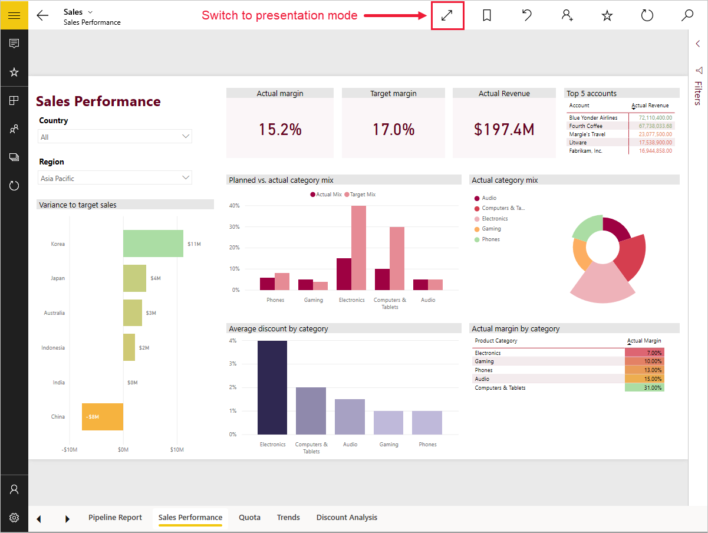

# View reports and dashboards in presentation mode on Surface Hub and Windows 10 devices
You can use presentation mode to display reports and dashboards in full-screen on Windows 10 devices and Surface Hub. 

Presentation mode is useful for displaying Power BI at a meeting or conference, or on a dedicated projector in an office, or even just for maximizing space on a small screen. 

In presentation mode in the Power BI mobile app for Windows 10, all the "chrome" such as the navigation and menu bars is removed to allow you and your team members focus on the data in your report. A toolbar with actions will become available for you and enable you to interact and collaborate with your data while in presentation mode.

You can also [display dashboards and reports in full-screen mode from the Power BI service](../end-user-focus.md) on the web.

> [!NOTE]
> Presentation mode is different from [focus mode for tiles](mobile-tiles-in-the-mobile-apps.md).

>[!NOTE]
>Power BI mobile app support for **phones using Windows 10 Mobile** will be discontinued on March 16, 2021. [Learn more](https://go.microsoft.com/fwlink/?linkid=2121400)

## Use presentation mode
In the Power BI mobile app, tap the **Full screen** icon to go to full-screen mode.

The app chrome will disappear and a toolbar will appear on the bottom of the screen or on the right and left sides (depends on your screen size).

From the toolbar you can top to perform the following actions:

1. **Go back**  to your previous page. A long tap on the icon will pop up the breadcrumbs windows, allowing you to navigate to the folder containing your report or dashboard.
2. **Choose ink color**  when you use your Surface pen to draw and annotate on your report page.
3. **Erase ink marks**  you might have made with the Surface pen to draw and annotate on your report page.  
4. **Switch pages**  to another page of the report in your presentation.
5. **Play the slideshow**  , hiding the action bar and starting the slideshow; the app will auto-rotate between the report pages. 
6. **Search**  for other artifacts in Power BI.
7. **Refresh**  the report.
8. **Exit**  presentation mode.
8. **Share**  an image of the presentation view with your colleagues. The image will include any annotations you have made with the Surface pen during the presentation.

You can undock the toolbar and drag it to locate it anywhere on the screen. This is useful for large screens, when you want to focus on a specific area in your report and want to have the tools available next to it. Just place your finger on the toolbar and swipe it into the report canvas.

## Next steps
* [Display dashboards and reports in full-screen mode from the Power BI service](../end-user-focus.md)
* Questions? [Try asking the Power BI Community](https://community.powerbi.com/)

