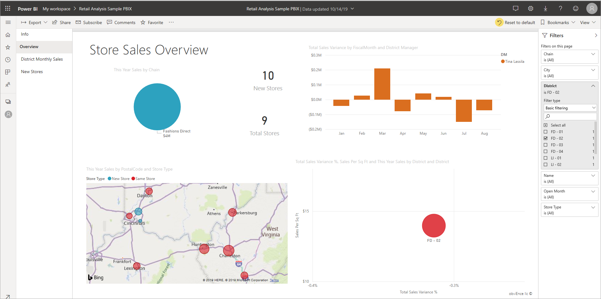
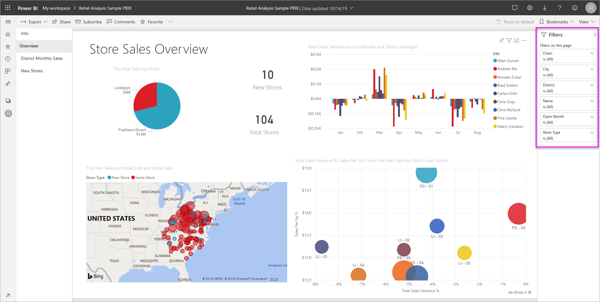
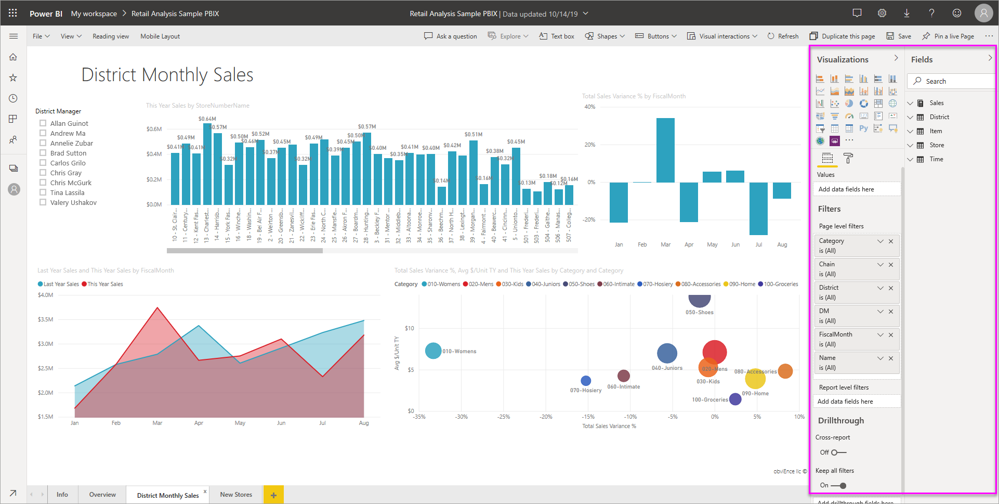
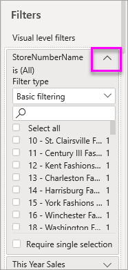
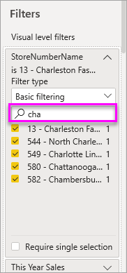
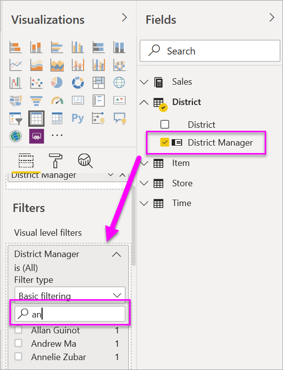
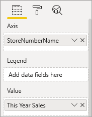
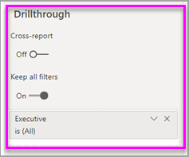
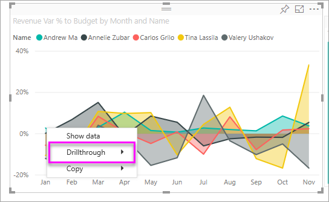
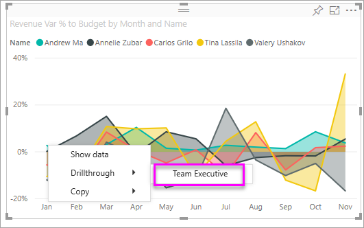

# Add a filter to a report in Power BI

[!INCLUDE [power-bi-service-new-look-include](../includes/power-bi-service-new-look-include.md)]

This article explains how to add a page filter, visualization filter, report filter, or drillthrough filter to a report in Power BI. The examples in this article are in the Power BI service. The steps are almost identical in Power BI Desktop.

**Did you know?** Power BI has a new filter experience. Read more about [the new filter experience in Power BI reports](power-bi-report-filter.md).

Power BI offers a number of different kinds of filters, from the manual and automatic to the drill-through and pass-through. Read about the [different kinds of filters](power-bi-report-filter-types.md).

## Filters in Editing view or Reading view
You can interact with reports in two different views: Reading view and Editing view. The filtering capabilities available to you depend on which view you're in. Read all [about filters and highlighting in Power BI reports](power-bi-reports-filters-and-highlighting.md) for details.

This article describes how to create filters in report **Editing view**.  For more information on filters in Reading view, see [interacting with filters in report Reading view](../consumer/end-user-report-filter.md).

Because filters *persist*, when you navigate away from the report Power BI retains the filter, slicer, and other data view changes that you've made. So you can pick up where you left off when you return to the report. If you don't want your filter changes to persist, select **Reset to default** from the top menubar.

## Levels of filters in the Filters pane
Whether you're using Desktop or Power BI service, the Filters pane displays along the right side of the report canvas. If you don't see the Filters pane, select the ">" icon from the upper-right corner to expand it.

You can set filters at three different levels for the report: visual-level, page-level, and report-level filters. You can also set drillthrough filters. This article explains the different levels.

## Add a filter to a visual
You can add a visual-level filter to a specific visual in two different ways. 

* Filter a field that is already being used by the visualization.
* Identify a field that is not already being used by the visualization, and add that field directly to the **Visual level filters** bucket.

By the way, this procedure uses the Retail Analysis sample, if you'd like to download it and follow along. Download the [Retail Analysis sample](sample-retail-analysis.md#get-the-content-pack-for-this-sample) content pack.

### Filter the fields in the visual

1. Select **More options (...)** > **Edit report** to open your report in Editing view.
   
   

2. Open the Visualizations and Filters pane and the Fields pane (if they're not already open).
   
   
3. Select a visual to make it active. All the fields being used by the visual are in the **Fields** pane and also listed in the **Filters** pane, under the **Visual level filters** heading.
   
   
4. At this point, we'll add a filter to a field already being used by the visualization. 
   
    Scroll down to the **Visual level filters** area and select the arrow to expand the field you'd like to filter. In this example, we'll filter **StoreNumberName**.
     
     
    
    Set either **Basic**, **Advanced**, or **Top N** filtering controls. In this example, we'll search in Basic filtering for **cha** and select those five stores.
     
     
   
    The visual changes to reflect the new filter. If you save your report with the filter, report readers will see the visual filtered to begin with, and can interact with the filter in Reading view, selecting or clearing values.
     
    
    
    When you use the filter on a field used in the visual where the field is aggregated (for example a sum, average, or count), you're filtering on the *aggregated* value in each data point. So, asking to filter the visual above where **This Year Sales > 500000** means you would see only the **13 - Charleston Fashion Direct** data point in the result. Filters on [model measures](../transform-model/desktop-measures.md) always apply to the aggregated value of the data point.

### Filter with a field that's not in the visual

Now let's add a new field to our visualization as a visual-level filter.
   
1. From the Fields pane, select the field you want to add as a new visual-level filter, and drag it into the **Visual level filters area**.  In this example, we'll drag **District Manager** into the **Visual level filters** bucket, search for **an**, and select those three managers.
     
    

    Notice **District Manager** is *not* added to the visualization itself. The visualization is still composed of **StoreNumberName** as the Axis and **This Year Sales** as the Value.  
     
    

    And the visualization itself is now filtered to show only those managers' sales this year for the specified stores.
     
    

    If you save your report with this filter, report readers can interact with the **District Manager** filter in Reading view, selecting or clearing values.
    
    If you drag a *numeric column* to the filter pane to create a visual-level filter, the filter is applied to the *underlying rows of data*. For example, adding a filter on the **UnitCost** field and setting it where **UnitCost** > 20 would only show data for the Product rows where the Unit Cost was greater than 20, regardless of the total Unit Cost for the data points shown in the visual.

## Add a filter to an entire page

You can also add a page-level filter to filter an entire page.

1. In the Power BI service, open the Retail Analysis report, then go to the **District Monthly Sales** page. 

2. Select **...** > **Edit report** to open your report in Editing view.
   
   
2. Open the Visualizations and Filters pane and the Fields pane (if they're not already open).
3. From the Fields pane, select the field you want to add as a new page-level filter, and drag it into the **Page level filters** area.  
4. Select the values you want to filter and set either  **Basic** or **Advanced** filtering controls.
   
   All the visualizations on the page are redrawn to reflect the change.
   
   

    If you save your report with the filter, report readers can interact with the filter in Reading view, selecting or clearing values.

## Add a drillthrough filter
With drillthrough in Power BI service and Power BI Desktop, you can create a *destination* report page that focuses on a specific entity - such as a supplier, or customer, or manufacturer. Now, from the other report pages, users can right-click on a data point for that entity and drillthrough to the focused page.

### Create a drillthrough filter
To follow along, download the [Customer Profitability sample](sample-customer-profitability.md#get-the-content-pack-for-this-sample). Let's say that you want a page that focuses on Executive business areas.

1. In the Power BI service, open the Retail Analysis report, then go to the **District Monthly Sales** page.

2. Select **More options (...)** > **Edit report** to open your report in Editing view.
   
   

1. Add a new page to the report and name it **Team Executive**. This page will be the drillthrough *destination*.
2. Add visualizations that track key metrics for the team executives' business areas.    
3. From the **Executives** table, drag **Executive** to the Drillthrough filters well.    
   
    
   
    Notice that Power BI adds a back arrow to the report page.  Selecting the back arrow returns users to the *originating* report page -- the page they were on when they opted to drillthrough. In Editing view, hold down the Ctrl key to select the back arrow
   
     

### Use the drillthrough filter
Let's see how the drillthrough filter works.

1. Start on the **Team Scorecard** report page.    
2. Let's say you're Andrew Ma and you want to see the Team Executive report page filtered to just your data.  From the top-left area chart, right-click any green data point to open the Drillthrough menu option.
   
    
3. Select **Drillthrough > Team Executive** to drillthrough to the report page named **Team Executive**. The page is filtered to show information about the data point from which you right-clicked; in this case Andrew Ma. Any filters on the originating page are applied to the drillthrough report page.  
   
    

## Add a report-level filter to filter an entire report

1. Select **Edit report** to open the report in Editing view.
   
   

2. Open the Visualizations and Filters pane and the Fields pane, if they're not already open.
3. From the Fields pane, select the field you want to add as a new report-level filter, and drag it into the **Report level filters** area.  
4. Select the values you want to filter.

    The visuals on the active page, and on all pages in the report, change to reflect the new filter. If you save your report with the filter, report readers can interact with the filter in Reading view, selecting or clearing values.

1. Select the back arrow to return to the previous report page.

## Considerations and troubleshooting

- If you do not see the Fields pane, make sure you're in report [Editing view](service-interact-with-a-report-in-editing-view.md)    
- If you've made lots of changes to the filters and want to return to the report author default settings, select **Reset to default** from the top menubar.

## Next steps
[Take a tour of the report Filters pane](../consumer/end-user-report-filter.md)

[Filters and highlighting in reports](power-bi-reports-filters-and-highlighting.md)

[Different kinds of filters in Power BI](power-bi-report-filter-types.md)

More questions? [Try the Power BI Community](https://community.powerbi.com/)
