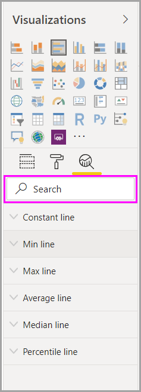
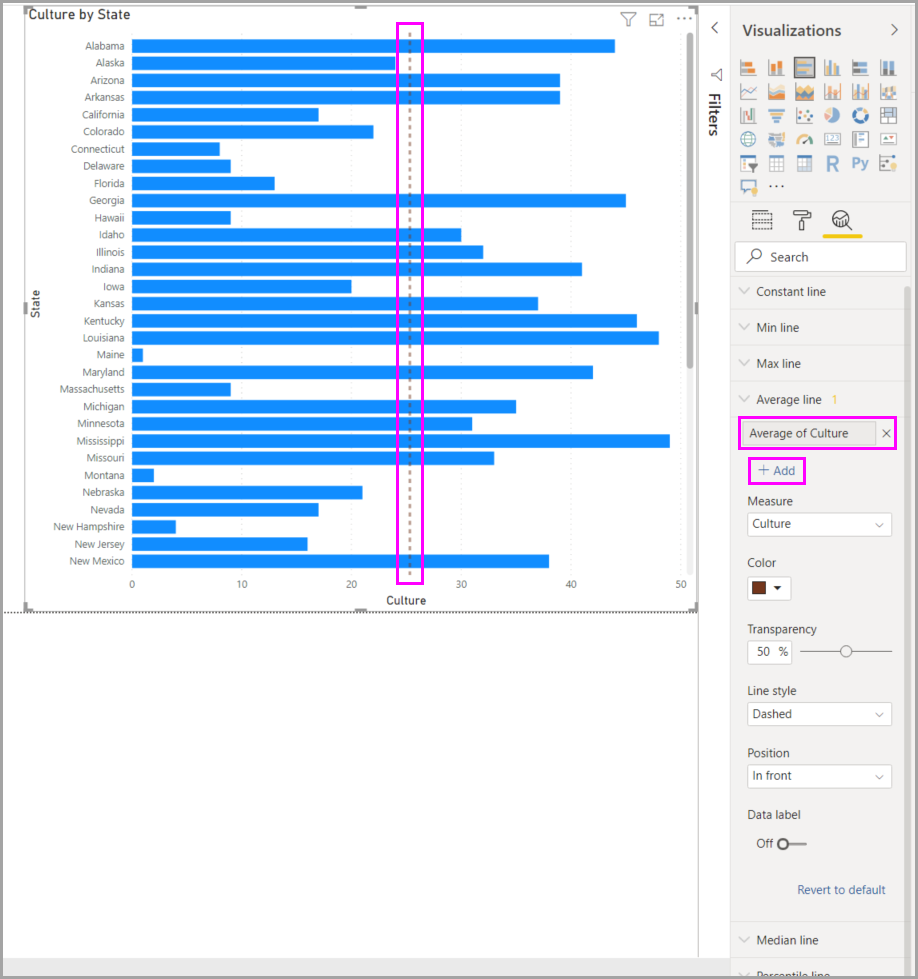
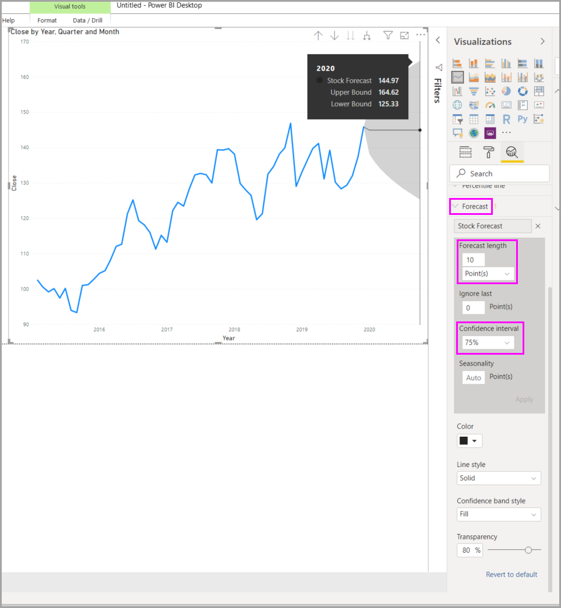

# Using the Analytics pane in Power BI Desktop
With the **Analytics** pane in **Power BI Desktop**, you can add dynamic *reference lines* to visuals, and provide focus for important trends or insights. The **Analytics** pane is found in the **Visualizations** area of Power BI Desktop.

> [!NOTE]
> The **Analytics** pane only appears when you select a visual on the Power BI Desktop canvas.

## Search within the Analytics pane
Beginning with the February 2018 release of **Power BI Desktop** (version 2.55.5010.201 or later), you can search within the **Analytics** pane, which is a sub-section of the **Visualizations** pane. As shown in the image below, search box appears when the **Analytics** pane is selected.

## Using the Analytics pane
With the **Analytics** pane, you can create the following types of dynamic reference lines (not all lines are available for all visual types):

* X-Axis constant line
* Y-Axis constant line
* Min line
* Max line
* Average line
* Median line
* Percentile line

The following sections show how you can use the **Analytics** pane and dynamic reference lines in your visualizations.

To view the available dynamic reference lines for a visual, follow these steps:

1. Select or create a visual, then select the **Analytics** icon from the **Visualizations** section.
   
   
2. Select the down arrow for the type of line you want to create to expand its options. In this case, we'll select **Average Line**.
   
   
3. To create a new line, select **+ Add**. You can then specify a name for the line by double-clicking the text box, then typing in your name.
   
   You have all sorts of options for your line, such as selecting its *color*, *transparency*, *style* and *position* (relative to the visual's data elements), and whether to include the label. And importantly, you can select which **Measure** in the visual you want your line to be based upon by selecting the **Measure** drop-down, which is automatically populated with data elements from the visual. In this case, we'll select *Weather* as the measure, label it *Average Weather*, and customize a few of the other options as shown below.
   
   
4. If you want to have a data label appear, move the **Data label** slider on. When you do so, you get a whole host of additional options for your data label, as shown in the following image.
   
   
5. Notice the number that appears next to the **Average line** item in the **Analytics** pane. That tells you how many dynamic lines you currently have on your visual, and of which type. If we add a **Max line** for *Cost of Living*, you can see that the **Analytics** pane shows that we now also have a **Max line** dynamic reference line applied to this visual.
   
   

If the visual you've selected can't have dynamic reference lines applied to it (in this case, a **Map** visual), you'll see the following when you select the **Analytics** pane.

There are all sorts of interesting insights you can highlight by creating dynamic reference lines with the **Analytics** pane.

We're planning more features and capabilities, including expanding which visuals can have dynamic reference lines applied to them, so check back often for what's new.

## Apply Forecasting
You can use the **Forecast** feature by selecting a visual, then expanding the **Forecast** section of the **Analytics** pane. You can specify many inputs to modify the forecast, such as the *Forecast length*, the *Confidence interval*, and others. The following image shows a basic line visual with forecasting applied, but you can use your imagination (and play around with the *forecasting* feature) to see how it can apply to your models.

## Limitations
The ability to use dynamic reference lines is based on the type of visual being used. The following list shows which dynamic lines are currently available for which visuals:

Full use of dynamic lines are available on the following visuals:

* Area chart
* Line chart
* Scatter chart
* Clustered Bar chart

The following visuals can use only a *constant line* from the **Analytics** pane:

* Stacked Area
* Stacked Bar
* Stacked Column
* 100% Stacked Bar
* 100% Stacked Column

For the following visuals, a *trend line* is currently the only option:

* Non-stacked Line
* Clustered Column chart

Lastly, non-Cartesian visuals cannot currently apply dynamic lines from the **Analytics** pane, such as:

* Matrix
* Pie chart
* Donut
* Table

The percentile line is only available when using imported data in **Power BI Desktop** or when connected live to a model on a server running **Analysis Service 2016** or later, **Azure Analysis Services**, or a dataset on the Power BI service. 

## Next steps
There are all sorts of things you can do with Power BI Desktop. For more information on its capabilities, check out the following resources:

* [What's New in Power BI Desktop](desktop-latest-update.md)
* [Download Power BI Desktop](desktop-get-the-desktop.md)
* [What is Power BI Desktop?](desktop-what-is-desktop.md)
* [Query Overview with Power BI Desktop](desktop-query-overview.md)
* [Data Types in Power BI Desktop](desktop-data-types.md)
* [Shape and Combine Data with Power BI Desktop](desktop-shape-and-combine-data.md)
* [Common Query Tasks in Power BI Desktop](desktop-common-query-tasks.md)    

