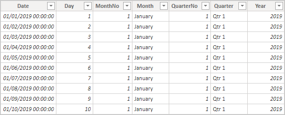
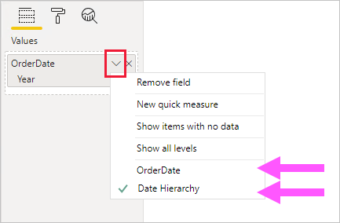
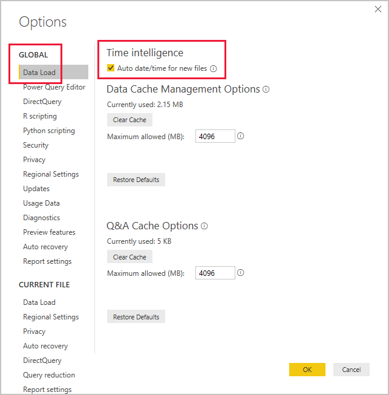

# Apply auto date/time in Power BI Desktop

This article targets data modelers developing Import or Composite models in Power BI Desktop. It introduces and describes the _Auto date/time_ option.

The Auto date/time is a data load option in Power BI Desktop. The purpose of this option is to support convenient time intelligence reporting based on date columns loaded into a model. Specifically, it allows report authors using your data model to filter, group, and drill down by using calendar time periods (years, quarters, months, and days). What's important is that you don't need to explicitly develop these time intelligence capabilities.

When the option is enabled, Power BI Desktop creates a hidden auto date/time table for each date column, providing all of the following conditions are true:

- The table storage mode is Import
- The column isn't a calculated column
- The column data type is date or date/time
- The column isn't the "many" side of a model relationship

## How it works

Each auto date/time table is in fact a [calculated table](desktop-calculated-tables.md) that generates rows of data by using the DAX [CALENDAR](/dax/calendar-function-dax) function. Each table also includes six calculated columns: **Day**, **MonthNo**, **Month**, **QuarterNo**, **Quarter**, and **Year**.

> [!NOTE]
> Power BI translates and formats column names and values according to the [model language](supported-languages-countries-regions.md#choose-the-language-for-the-model-in-power-bi-desktop). For example, if the model was created by using English, it will still show month names, and so on, in English, even if viewed with a Korean client.

Power BI Desktop also creates a relationship between the auto date/time table's **Date** column and the model date column.

The auto date/time table contains full calendar years encompassing all date values stored in the model date column. For example, if the earliest value in a date column is March 20, 2016 and the latest value is October 23, 2019, the table will contain 1,461 rows. It represents one row for each date in the four calendar years 2016 to 2019. When Power BI refreshes the model, each auto date/time table is also refreshed. This way, the model always contains dates that encompass the date column values.

If it were possible to see the rows of an auto date/time table, they would look like this:



> [!NOTE]
> Auto date/time tables are permanently hidden, even from modelers. They cannot be seen in the **Fields** pane or the Model view diagram, and its rows cannot be seen in Data view. Also, the table and its column cannot be directly referenced by DAX expressions.
>
> Further, it's not possible to work with them when using [Analyze in Excel](service-analyze-in-excel.md), or connecting to the model using non-Power BI report designers.

The table also defines a hierarchy, providing visuals with a drill down path through year, quarter, month, and day levels.

If it were possible to see an auto date/time table in the Model view diagram, it would look like this (related columns are highlighted):


## Work with auto date/time

When an auto date/time table exists for a date column (and that column is visible), report authors won't find that column as a field in the **Fields** pane. Instead, they find an expandable object that has the name of the date column. You can easily identify it because it's adorned with a calendar icon. When report authors expand the calendar object, they find a hierarchy named **Date Hierarchy**. After they expand the hierarchy, they find four levels: **Year**, **Quarter**, **Month**, and **Day**.


The auto date/time generated hierarchy can be used to configure a visual in exactly the same way that regular hierarchies can be used. Visuals can be configured by using the entire **Date Hierarchy** hierarchy, or specific levels of the hierarchy.

There is, however, one added capability not supported by regular hierarchies. When the auto date/time hierarchy—or a level from the hierarch—is added to a visual well, report authors can toggle between using the hierarchy or the date column. This approach makes sense for some visuals, when all they require is the date column, not the hierarchy and its levels. They start by configuring the visual field (right-click the visual field, or click the down-arrow), and then using the context menu to switch between the date column or the date hierarchy.



Lastly, model calculations, written in DAX, can reference a date column _directly_, or the hidden auto date/time table columns _indirectly_.

Formula written in Power BI Desktop can reference a date column in the usual way. The auto date/time table columns, however, must be referenced by using a special extended syntax. You start by first referencing the date column, and then following it by a period (.). The formula bar auto complete will then allow you to select a column from the auto date/time table.

![Example of entering a DAX measure expression in the formula bar. The formula so far reads Date Count = COUNT(Sales[OrderDate]. and an auto complete list presents all seven columns from the hidden auto date/time table. These columns are: Date, Day, Month, MonthNo, Quarter, QuarterNo, and Year.](media/desktop-auto-date-time/auto-date-time-dax-auto-complete.png)

In Power BI Desktop, a valid measure expression could read:

```dax
Date Count = COUNT(Sales[OrderDate].[Date])
```

> [!NOTE]
> While this measure expression is valid in Power BI Desktop, it's not correct DAX syntax. Internally, Power BI Desktop transposes your expression to reference the true (hidden) auto date/time table column.

## Configure auto date/time option

Auto date/time can be configured _globally_ or for the _current file_. The global option applies to new Power BI Desktop files, and it can be turned on or off at any time. For a new installation of Power BI Desktop, both options default to on.

The current file option, too, can also be turned on or off at any time. When turned on, auto date/time tables are created. When turned off, any auto date/time tables are removed from the model.

> [!CAUTION]
> Take care when you turn the current file option off, as this will remove the auto date/time tables. Be sure to fix any broken report filters or visuals that had been configured to use them.

In Power BI Desktop, you select _File > Options and settings > Options_, and then select either the **Global** or **Current File** page. On either page, the option exists in the **Time intelligence** section.



## Next steps

For more information related to this article, check out the following resources:

- [Auto date/time guidance in Power BI Desktop](guidance/auto-date-time.md)
- [Set and use date tables in Power BI Desktop](desktop-date-tables.md)
- Questions? [Try asking the Power BI Community](https://community.powerbi.com/)
- Suggestions? [Contribute ideas to improve Power BI](https://ideas.powerbi.com/)
