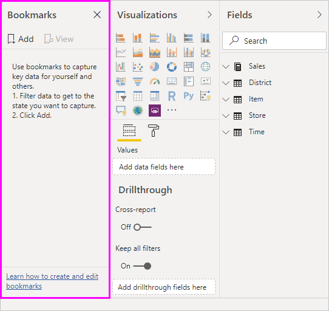
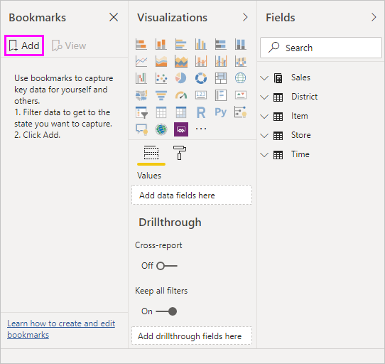
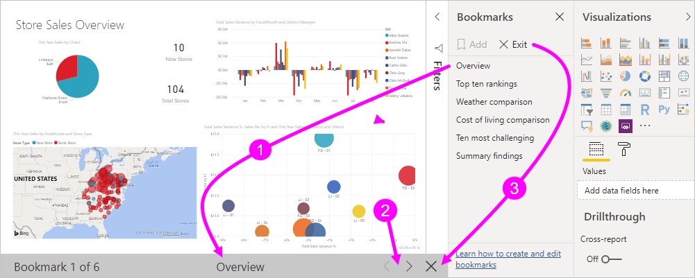
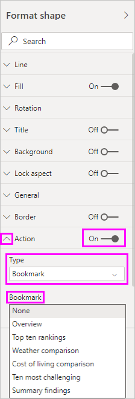
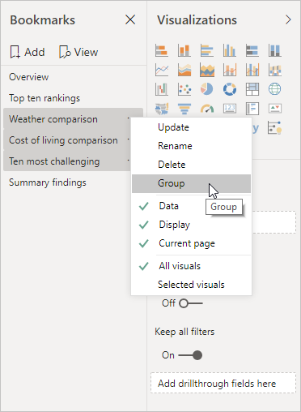
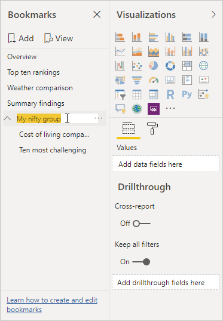

# Create bookmarks in Power BI Desktop to share insights and build stories
With *bookmarks* in Power BI Desktop, you capture the currently configured view of a report page, including filtering and the state of visuals. Later, you can go back to that state by selecting the saved bookmark. 

You can also create a collection of bookmarks, arrange them in the order you want, and later step through each bookmark in a presentation to highlight a series of insights, or the story you want to tell with your visuals and reports. 

There are many uses for bookmarking. For example, you can use bookmarks to keep track of your own progress in creating reports (bookmarks are easy to add, delete, and rename) and you can create bookmarks to build a PowerPoint-like presentation that steps through bookmarks in order, thereby telling a story with your report. 

> [!TIP]
> For information about using personal bookmarks in the Power BI service, see [Announcing personal bookmarks in the Power BI Service](https://powerbi.microsoft.com/blog/announcing-personal-bookmarks-in-the-power-bi-service/). 

## Using bookmarks
To use bookmarks, select the **View** tab from the Power BI Desktop ribbon, then select **Bookmarks Pane**. 

When you create a bookmark, the following elements are saved with the bookmark:

* The current page
* Filters
* Slicers, including slicer type (for example, dropdown or list) and slicer state
* Visual selection state (such as cross-highlight filters)
* Sort order
* Drill location
* Visibility of an object (by using the **Selection** pane)
* The focus or **Spotlight** modes of any visible object

Configure a report page as you want it to appear in the bookmark. After your report page and visuals are arranged how you want them, select **Add** from the **Bookmarks** pane to add a bookmark. 

Power BI Desktop creates a bookmark and gives it a generic name. You can easily **Rename**, **Delete**, or **Update** a bookmark by selecting the ellipsis next to the bookmark's name, then selecting an action from the menu that appears.

After you've created a bookmark, display it by selecting it in the **Bookmarks** pane. 

You can also select whether each bookmark will apply **Data** properties, such as filters and slicers; **Display** properties, such as spotlight and its visibility; and **Current page** changes, which present the page that was visible when the bookmark was added. These capabilities are useful when you use bookmarks to switch between report views or selections of visuals, in which case you'd likely want to turn off data properties, so that filters aren't reset when users switch views by selecting a bookmark. 

To make such changes, select the ellipsis next to the bookmark's name, then select or unselect the checkmarks next to **Data**, **Display**, and other controls. 

## Arranging bookmarks
As you create bookmarks, you might find that the order in which you create them is different from the order you'd like to present to your audience. No problem, you can easily rearrange the order of bookmarks.

- In the **Bookmarks** pane, drag-and-drop bookmarks to change their order. 

   The yellow bar between bookmarks designates where the dragged bookmark will be placed.

   

The order of your bookmarks can be important when you use the **View** feature of bookmarks, as described in the next section.

## Bookmarks as a slide show
When you have a collection of bookmarks you would like to present, in order, you can select **View** from the **Bookmarks** pane to begin a slideshow.

When in **View** mode, there are some features to notice.

   

1. The name of the bookmark appears in the bookmark title bar, which appears at the bottom of the canvas.

2. The bookmark title bar has arrows that let you move to the next or previous bookmark.

3. You can exit **View** mode by selecting **Exit** from the **Bookmarks** pane or by selecting the **X** on the bookmark title bar. 

When you're in **View** mode, you can close the **Bookmarks** pane, by selecting the **X** on that pane, to provide more space for your presentation. All visuals are interactive when they're in **View** mode and available for cross-highlighting, just as they would be when you interact directly with them. 

## Visibility: Using the Selection pane
Related to the **Bookmarks** pane, the **Selection** pane provides a list of all objects on the current page and allows you to select an object and specify whether it's visible. 

In the **Selection** pane, you select an object and toggle whether the object is currently visible by selecting the eye icon to the right of the object. 

When you add a bookmark, the visibility status of each object is also saved, based on its setting in the **Selection** pane. 

It's important to note that slicers continue to filter a report page, regardless of whether they're visible. As such, you can create many different bookmarks, with different slicer settings, and make a single report page appear different (and highlight different insights) in various bookmarks.

## Bookmarks for shapes and images
You can also link shapes and images to bookmarks. With this feature, when you select an object, it shows the bookmark associated with that object. This feature can be especially useful when you work with buttons. For more information, see [Using buttons in Power BI](desktop-buttons.md). 

To assign a bookmark to an object: 

1. Select the object in the report canvas. Then, from the **Format Shape** pane that appears, turn the **Action** slider to **On**.

2. Expand the **Action** section. Under **Type**, select **Bookmark**.

3. Under **Bookmarks**, select a bookmark.

   

There are all sorts of interesting things you can do with object-linked bookmarking. You can create a visual table of contents on your report page, or you can provide different views (such as visual types) of the same information.

When you're in editing mode, press **Ctrl** and select the link to follow it. When you're not in editing mode, select the object to follow the link. 

## Bookmark groups

Beginning with the August 2018 release of Power BI Desktop, you can create and use bookmark groups. A bookmark group is a collection of bookmarks that you specify, which can be shown and organized as a group. 

To create a bookmark group: 
1. Press **Ctrl** and select the bookmarks you want to include in the group. 

2. Select the ellipsis next to your selected bookmarks, and then select **Group** from the menu that appears.

   

Power BI Desktop automatically names the group *Group 1*. You can select the ellipsis next to this name, select **Rename**, and rename it to whatever you want.

As with any bookmark group, expanding the bookmark group's name only expands or collapses the group of bookmarks, and doesn't represent a bookmark by itself. 

When you use the **View** feature of bookmarks, the following details apply:

* If the selected bookmark is in a group when you select **View** from bookmarks, only the bookmarks *in that group* are shown in the viewing session. 

* If the selected bookmark isn't in a group, or is on the top level (such as the name of a bookmark group), then all bookmarks for the entire report are played, including bookmarks in any group. 

To ungroup bookmarks: 
1. Select any bookmark in a group and select the ellipsis. 

2. Select **Ungroup** from the menu that appears.

   

   Selecting **Ungroup** for any bookmark from a group removes all bookmarks from the group; it deletes the group, but not the bookmarks themselves. 

To remove a single bookmark from a group: 
1. **Ungroup** any member from that group, which deletes the entire grouping. 

2. Select the members you want in the new group by pressing **Ctrl** and selecting each bookmark, then and select **Group** again. 

## Using spotlight
Another feature released with bookmarks is *spotlight*. With spotlight, you can draw attention to a specific chart, for example, when presenting your bookmarks in **View** mode.

Let's compare spotlight to focus mode to see how they differ:

1. With focus mode, you select the **Focus mode** icon of a visual, which causes the visual to fill the entire canvas.

2. With spotlight, you select **Spotlight** from the ellipsis of a visual to highlight one visual in its original size, which causes all other visuals on the page to fade to near transparency. 

When you select the **Focus mode** icon of the visual in the previous image, the page appears as follows:

In contrast, when **Spotlight** is selected from the visual's ellipsis menu, the page appears as follows:

If either the focus or spotlight mode is selected when you add a bookmark, that mode is retained in the bookmark.

## Bookmarks in the Power BI service
When you publish a report to the Power BI service with at least one bookmark, you can view and interact with those bookmarks in the Power BI service. When bookmarks are available in a report, you display the **Selection** and **Bookmarks** panes by selecting **View** > **Selection pane** or **View** > **Bookmarks pane**. 

In the Power BI service, the **Bookmarks** pane operates just as it does in Power BI Desktop, including the ability to select **View** to show your bookmarks in order, like a slide show.

Use the gray bookmark title bar, instead of the black arrows, to navigate through the bookmarks. (The black arrows move you through report pages, not bookmarks.)

## Enable the bookmarks preview (versions prior to March 2018)
Beginning with the March 2018 version of Power BI Desktop, bookmarks are generally available. 

We always suggest you upgrade to the most recent release. But, if your version of Power BI Desktop is earlier than that release, you can try the bookmarks feature beginning with the October 2017 release of Power BI Desktop, and for bookmark-enabled reports, in the Power BI service as well. 

To enable the preview bookmarks feature: 

1. Select **File** > **Options and Settings** > **Options** > **Preview Features**, then select **Bookmarks**. 

   

2. Restart Power BI Desktop to enable the preview version of bookmarks.

## Limitations and considerations
In this release of the bookmarks features, there are a few limitations and considerations to keep in mind.

* Most Power BI visuals should work well with bookmarking. However, if you encounter problems with bookmarking and a custom visual, contact the creator of that custom visual and ask them to add support for bookmarks to their visual. 
* If you add a visual on a report page after creating a bookmark, the visual is displayed in its default state. That is, if you introduce a slicer into a page where you previously created bookmarks, the slicer behaves in its default state.
* Moving a visual after a bookmark has been created is automatically reflected in the bookmark. 

## Next steps
For more information about features that are similar or interact with bookmarks, see the following articles:

* [Use drillthrough in Power BI Desktop](desktop-drillthrough.md)
* [Display a dashboard tile or report visual in focus mode](consumer/end-user-focus.md)

