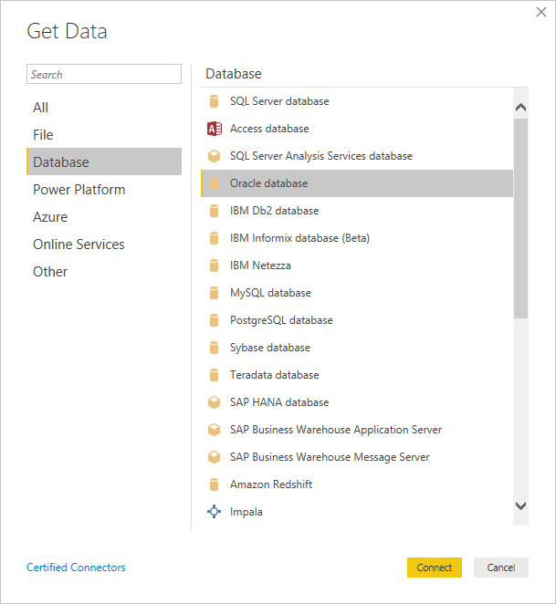

# Connect to an Oracle database
To connect to an Oracle database with Power BI Desktop, the correct Oracle client software must be installed on the computer running Power BI Desktop. The Oracle client software you use depends on which version of Power BI Desktop you've installed: 32-bit or 64-bit.

Supported Oracle versions: 
- Oracle 9 and later
- Oracle client software 8.1.7 and later

> [!NOTE]
> If you're configuring and Oracle database for Power BI Report Server, consult the information in the [Oracle Connection Type](https://docs.microsoft.com/sql/reporting-services/report-data/oracle-connection-type-ssrs?view=sql-server-ver15) article. 

## Determining which version of Power BI Desktop is installed
To determine which version of Power BI Desktop is installed, select **File** > **Help** > **About**, then check the **Version** line. In the following image, a 64-bit version of Power BI Desktop is installed:

## Installing the Oracle client
- For the 32-bit version of Power BI Desktop, [download and install the 32-bit Oracle client](https://www.oracle.com/technetwork/topics/dotnet/utilsoft-086879.html).

- For the 64-bit version of Power BI Desktop, [download and install the 64-bit Oracle client](https://www.oracle.com/technetwork/database/windows/downloads/index-090165.html).

## Connect to an Oracle database
After you install the matching Oracle client driver, you can connect to an Oracle database. To make the connection, take the following steps:

1. From the **Home** tab, select **Get Data**. 

2. From the **Get Data** window that appears, select **More** (if necessary), select **Database** > **Oracle database**, and then select **Connect**.
   
   
2. In the **Oracle database** dialog that appears, provide the name of the **Server**, and select **OK**. If a SID is required, specify it by using the format: *ServerName/SID*, where *SID* is the unique name of the database. If the *ServerName/SID* format doesn't work, use *ServerName/ServiceName*, where *ServiceName* is the alias you use to connect.

   

   > [!TIP]
   > If you're having trouble connecting in this step, try using the following format in the **Server** field: *(DESCRIPTION=(ADDRESS=(PROTOCOL=TCP)(HOST=host_name)(PORT=port_num))(CONNECT_DATA=(SERVICE_NAME=service_name)))*
   
3. If you want to import data by using a native database query, put your query in the **SQL statement** box, which appears when you expand the **Advanced options** section of the **Oracle database** dialog.
   
   
4. After you've entered your Oracle database information in the **Oracle database** dialog (including any optional information such as a SID or a native database query), select **OK** to connect.
5. If the Oracle database requires database user credentials, input those credentials in the dialog when prompted.

## Troubleshooting

If you downloaded Power BI Desktop from the Microsoft Store, you might be unable to connect to Oracle databases because of an Oracle driver issue. If you encounter this issue, the error message returned is: *Object reference not set*. To address the issue, do one of these steps:

* Download Power BI Desktop from the [Download Center](https://www.microsoft.com/download/details.aspx?id=58494) instead of Microsoft Store.

* If you want to use the version from Microsoft Store: on your local computer, copy oraons.dll from _12.X.X\client_X_ to _12.X.X\client_X\bin_, where _X_ represents version and directory numbers.

If you see the error message, *Object reference not set*, in the Power BI Gateway when you connect to an Oracle database, follow the instructions in [Manage your data source - Oracle](service-gateway-onprem-manage-oracle.md).

If you're using Power BI Report Server, consult the guidance in the [Oracle Connection Type](https://docs.microsoft.com/sql/reporting-services/report-data/oracle-connection-type-ssrs?view=sql-server-ver15) article.