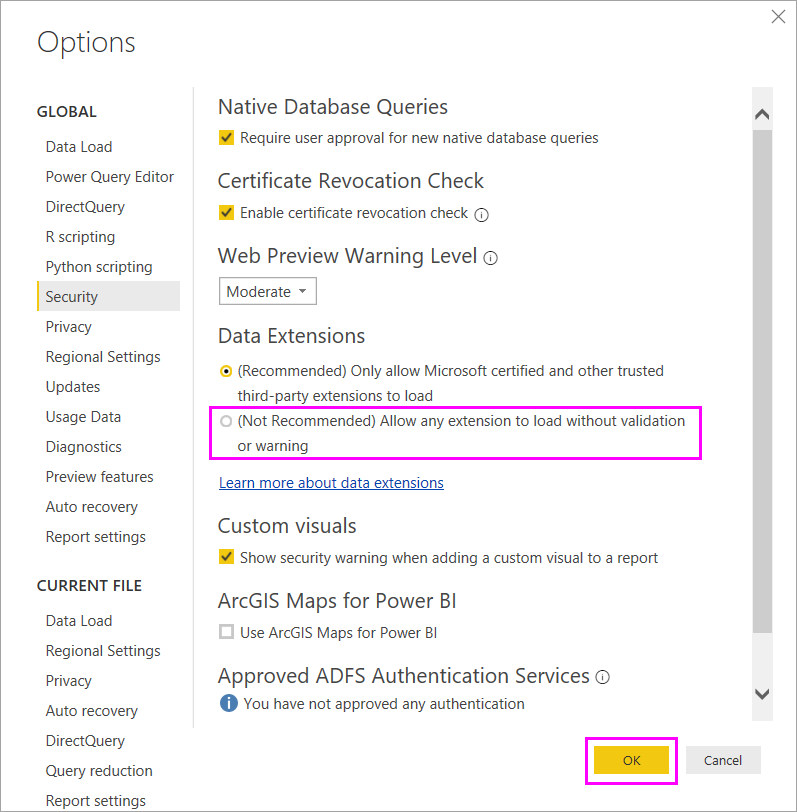

# Connector extensibility in Power BI

In Power BI, customers and developers can extend the data sources to which they connect in many ways. They use existing connectors and generic data sources (such as ODBC, OData, Oledb, Web, CSV, XML, JSON). Or, developers create data extensions, referred to as **Custom Connectors**, and make them **Certified Connectors**.

Currently, you enable **Custom Connectors** using a menu that lets you securely control the level of custom code you want to let run on your system. You can choose all custom connectors or only connectors certified and distributed by Microsoft in the **Get Data** dialogue.

## Custom connectors

**Custom Connectors** can include a wide range of possibilities, ranging from small APIs critical to your business, to large industry-specific services that Microsoft hasn't released a connector for. Many connectors are distributed by the vendor. If you have a need for a specific data connector, you should contact a vendor.

To use a **Custom Connector**, put it in the *\[Documents]\\Power BI Desktop\\Custom Connectors* folder, and adjust the security settings as described in the following section.

You don't need to adjust security settings to use **Certified Connectors**.

## Data extension security

To change data extension security settings, in **Power BI Desktop** select **File > Options and settings > Options > Security**.

Under **Data Extensions** you can select from two levels of security:

* (Recommended) Only allow certified extensions to load
* (Not Recommended) Allow any extension to load without warning

If you plan on using **Custom Connectors** or connectors that you or a third party have developed, you must select **"(Not Recommended) Allow any extension to load without warning"**. We don't recommend this security setting unless you absolutely trust your Custom Connectors. Because, the code in there can handle credentials, including sending them over HTTP, and ignore privacy levels.

At the **"(Recommended)"** security setting, if there are custom connectors on your system, you will get the error "The following connector has not been certified, and we are unable to verify that is secure to use" followed by a list of connectors that can't securely load.

To resolve the error without changing security, remove the unsigned connectors from your 'Custom Connectors' folder.

To resolve the error and use those connectors, change your security settings to the **"(Not Recommended) Allow any extension to load without warning"** setting as described earlier. Then, restart **Power BI Desktop**.

## Certified connectors

A limited subset of data extensions is considered **Certified**. Access the certified connectors in the **Get Data** dialogue. But, the third-party developer who created the connector is responsible for its maintenance and support. While Microsoft distributes the connectors, it's not responsible for their performance or continued function.

If you would like a custom connector to be certified, have your vendor contact dataconnectors@microsoft.com.
