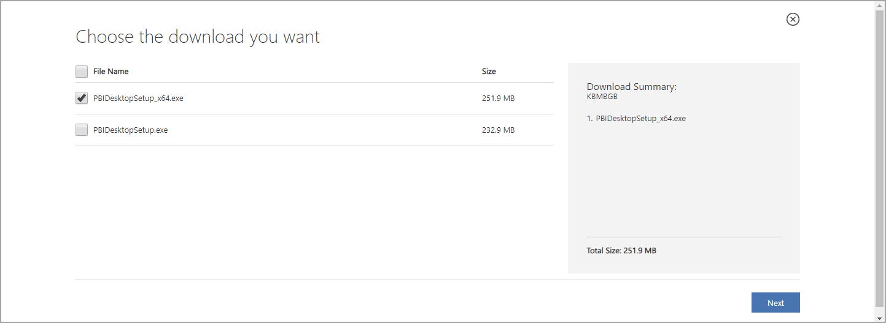
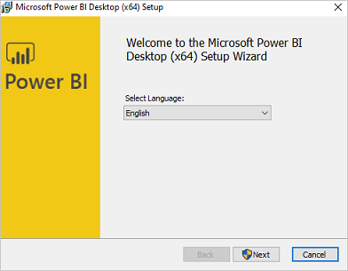

# Get Power BI Desktop
**Power BI Desktop** lets you build advanced queries, models, and reports that visualize data. With **Power BI Desktop**, you can build data models, create reports, and share your work by publishing to the Power BI service.  **Power BI Desktop** is a free download.

You can get **Power BI Desktop** in two ways, each of which is described in the following sections:

* **Download** directly (a package you download and install on your computer)
* Install as an app from the **Microsoft Store**

Either approach will get the latest version of **Power BI Desktop** onto your computer, but there are a few differences worth noting, which are described in the following sections.

## Download Power BI Desktop
To download the most recent version of **Power BI Desktop**, you can select the download icon from the upper right corner of the Power BI service, and select **Power BI Desktop**.


You can also download the latest version of Power BI Desktop from the following download page:

* [**Power BI Desktop download** (both 32-bit and 64-bit versions)](https://powerbi.microsoft.com/desktop).
  
  [](https://powerbi.microsoft.com/desktop)

Regardless of which way you choose to download, once **Power BI Desktop** is downloaded you're prompted to run the installation file:



Beginning with the July 2019 release, **Power BI Desktop** shipped as a single .exe installation package that contains all supported languages. There are separate .exe files for 32-bit and 64-bit versions. The .msi packages were discontinued beginning with the September 2019 release, requiring the .exe executable for installation. This approach makes distribution, updates, and installation (especially for administrators) much easier and more convenient. You can also use command-line parameters to customize the installation process, as described in the [using command-line options during installation](#using-command-line-options-during-installation) section later in this article.

Once you launch the installation package, **Power BI Desktop** is installed as an application and runs on your desktop.



> [!NOTE]
> Installing the downloaded (MSI) version, and the **Microsoft Store** version of **Power BI Desktop** on the same computer (sometimes referred to as a *side-by-side* installation) is not supported.
> 
> 

## Install as an app from the Microsoft Store
You can also get **Power BI Desktop** from the Microsoft Store, using the following link:

* [Install **Power BI Desktop** from the **Microsoft Store**](https://aka.ms/pbidesktopstore)

  

There are a few advantages to getting **Power BI Desktop** from the Microsoft Store:

* **Automatic updates** - Windows downloads the latest version automatically in the background as soon as it's available, so your version will always be up-to-date.
* **Smaller downloads** - The **Microsoft Store** ensures only components that have changed in each update are downloaded to your machine, resulting in smaller downloads for each update.
* **Admin privilege is not required** - when you download the package directly and install, you must be an administrator for the installation to complete successfully. When you get **Power BI Desktop** from the Microsoft Store, admin privilege is *not* required.
* **IT roll-out enabled** - the **Microsoft Store** version can more easily be deployed, or *rolled-out*, to everyone in your organization, and can make **Power BI Desktop** available through the **Microsoft Store for Business**.
* **Language detection** - the **Microsoft Store** version includes all supported languages, and checks which language is being used on the computer each time it is launched. This also affects the localization of models created in **Power BI Desktop**; for example, built-in date hierarchies will match the language that **Power BI Desktop** was using when the .pbix file was created.

There are a few consideration and limitations for installing **Power BI Desktop** from the Microsoft Store, which include the following:

* If you use the SAP connector, you may need to move your SAP driver files to the *Windows\System32* folder.
* Installing **Power BI Desktop** from the Microsoft Store doesn't copy user settings from the .exe version. You might have to reconnect to your recent datasources and re-enter your data source credentials. 

> [!NOTE]
> Installing the downloaded (MSI) version, and the **Microsoft Store** version of **Power BI Desktop** on the same computer (sometimes referred to as a *side-by-side* installation) is not supported. You should manually uninstall **Power BI Desktop** before downloading it from the **Microsoft Store**
> 
> [!NOTE]
> The Power BI Report Server version of **Power BI Desktop** is a separate and different installation from the versions discussed in this article. For information about the Report Server version of **Power BI Desktop**, see [Create a Power BI report for Power BI Report Server](report-server/quickstart-create-powerbi-report.md).
> 
> 

## Using Power BI Desktop
When you launch **Power BI Desktop**, a *Welcome* screen is displayed.


If this is your first time using **Power BI Desktop** (if the installation is not an upgrade), you'll be prompted to fill out a form and answer a few questions, or sign in to the **Power BI service** before you'll be able to proceed.

From there, you can begin creating data models or reports, then share them with others on the Power BI service. Check out the **More information** links at the end of this article for links to guides that can help you get started using **Power BI Desktop**.

## Minimum requirements
The following list provides the minimum requirements to run **Power BI Desktop**:

* Windows 7 / Windows Server 2008 R2, or later
* .NET 4.5
* Internet Explorer 10 or later
* **Memory (RAM):** At least 1 GB available, 1.5 GB or more recommended.
* **Display:** At least 1440x900 or 1600x900 (16:9) recommended. Lower resolutions such as 1024x768 or 1280x800 are not recommended, as certain controls (such as closing the startup screen) display beyond those resolutions.
* **Windows Display settings:** If your display settings are set to change the size of text, apps, and other items to more than 100%, you may not be able to see certain dialogs that must be closed or responded to in order to proceed using **Power BI Desktop**. If you encounter this issue, check your **Display settings** by going to **Settings > System > Display** in Windows, and use the slider to return display settings to 100%.
* **CPU:** 1 gigahertz (GHz) or faster x86- or x64-bit processor recommended.

## Considerations and Limitations

We always want your experience with Power BI Desktop to be great. There may be occasions when you run into an issue with Power BI Desktop, so this section contains solutions or suggestions to address issues that might arise. 

### Using command-line options during installation 

When installing Power BI Desktop, you can set properties and options with command-line switches. This is especially useful for administrators who manage or facilitate the installation of Power BI Desktop across organizations. These options apply to .msi and .exe installations. 


|Command-line option  |Behavior  |
|---------|---------|
|-q, -quiet, -s, -silent     |silent install         |
|-passive     |only show the progress bar during installation         |
|-norestart     |suppress the computer restart requirement         |
|-forcerestart     |restart the computer after installation without a prompt         |
|-promptrestart     |prompt the user if computer restart is required (default)         |
|-l<>, -log<>     |log the installation to a specific file, with the file specified in <>         |
|-uninstall     |uninstall Power BI Desktop         |
|-repair     |repair the installation (or install if it's not currently installed)         |
|-package, -update     |install Power BI Desktop (default, as long as -uninstall or -repair aren't specified)         |

You can also use the following **syntax parameters**, which are specified with a "PROPERTY=VALUE" syntax:

|Parameter  |Meaning  |
|---------|---------|
|ACCEPT_EULA     |Requires a value of 1 to automatically accept the EULA         |
|ENABLECXP     |Value of 1 enrolls in the customer experience program that captures telemetry on usage of the product         |
|INSTALLDESKTOPSHORTCUT     |Value of 1 adds a shortcut to the Desktop         |
|INSTALLLOCATION     |File path to where you want it installed         |
|LANGUAGE     |Locale code, for example en-US, de-DE, pr-BR, to force the default language of the application. If no language is specified, Power BI Desktop displays the Windows OS language. This can be changed by the user in the Options dialog.         |
|REG_SHOWLEADGENDIALOG     |Value of 0 disables showing the dialog that appears before you have signed in to Power BI Desktop         |

For example, you could run it with the following syntax to install without any user interface, using the German language: 

```“-quiet LANG=de-DE ACCEPT_EULA=1”```

### Installing Power BI Desktop on remote machines

If you’re deploying Power BI Desktop to your users with a tool that requires a Windows installer file (.msi file) you can extract the .msi file from the Power BI Desktop installer .exe file. You can use third-party tools such as the WiX Toolset to accomplish this.

> [!NOTE]
> As a third-party product, WiX Toolset options might change without notice. Please check their documentation for the most up to date information, and contact their user mailing list for help.

* On the computer where you downloaded the Power BI Desktop installer, download and install the latest version of the WiX Toolset from the WiX website at https://wixtoolset.org/.
* Open a command line windows as an administrator and navigate to the folder where you installed WiX Toolset.
* Run the following command: 
    
    ```Dark.exe <path to Power BI Desktop installer> -x <output folder>```

    For example, run:

    ``` Dark.exe C:\PBIDesktop_x64.exe -x C:\output```

* The output folder will contain a folder named *AttachedContainer* that includes the .msi files.


### Issues when using previous releases of Power BI Desktop

Some users encounter an error similar to the following when using an outdated version of **Power BI Desktop**: 

    "We weren't able to restore the saved database to the model" 

Updating to the current version of Power BI Desktop usually solves this issue.

### Disabling notifications
We recommend updating to the most recent version of Power BI Desktop to take advantage of advances in features, performance, stability, and other improvements. Some organizations may not want users to update to each new version. You can disable notifications by modifying the registry with the following steps:

1. Using the Registry Editor, navigate to *HKEY_LOCAL_MACHINE\SOFTWARE\Microsoft\Microsoft Power BI Desktop*
2. Create a new entry there with the following settings: *REG_DWORD : DisableUpdateNotification*
3. Set the value of that new entry to **1**.

You'll need to restart your computer for the change to take effect.

### Power BI Desktop loads with a partial screen

In certain circumstances, including certain screen resolution configurations, some users may see Power BI Desktop render content with large black areas. This is generally a result of recent operating system updates that affect how items are rendered, rather than a direct result of how Power BI Desktop presents content. Regardless, large black areas are not as compelling as great visuals, so to address this issue, take the following steps:

1. Press the Start key and type the world *blurry* into the search bar that appears.
2. In the dialog that appears, select the option: *Let Windows fix apps that are blurry.*
3. Restart Power BI Desktop.

This issue may resolve after subsequent Windows updates are released. 
 

## Next steps
Once you get **Power BI Desktop** installed, the following content can help you get up and running quickly:

* [What is Power BI Desktop?](desktop-what-is-desktop.md)
* [Query Overview with Power BI Desktop](desktop-query-overview.md)
* [Data Sources in Power BI Desktop](desktop-data-sources.md)
* [Connect to Data in Power BI Desktop](desktop-connect-to-data.md)
* [Shape and Combine Data with Power BI Desktop](desktop-shape-and-combine-data.md)
* [Common Query Tasks in Power BI Desktop](desktop-common-query-tasks.md)   

