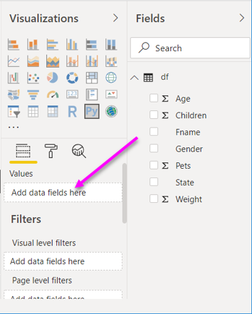
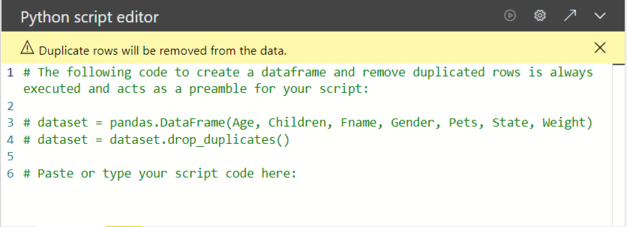
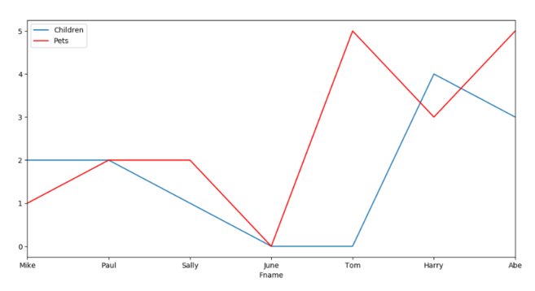
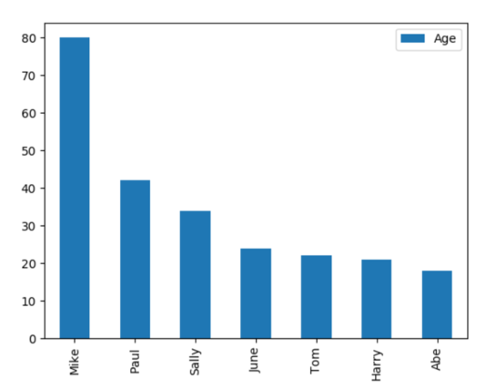

# Create Power BI visuals by using Python

With *Power BI Desktop*, you can use Python to visualize your data.

## Prerequisites

Work through the [Run Python scripts in Power BI Desktop](desktop-python-scripts.md) tutorial using the following Python script:

```python
import pandas as pd 
df = pd.DataFrame({ 
    'Fname':['Harry','Sally','Paul','Abe','June','Mike','Tom'], 
    'Age':[21,34,42,18,24,80,22], 
    'Weight': [180, 130, 200, 140, 176, 142, 210], 
    'Gender':['M','F','M','M','F','M','M'], 
    'State':['Washington','Oregon','California','Washington','Nevada','Texas','Nevada'],
    'Children':[4,1,2,3,0,2,0],
    'Pets':[3,2,2,5,0,1,5] 
}) 
print (df) 
```

The [Run Python scripts in Power BI Desktop](desktop-python-scripts.md) article shows you how to install Python on your local machine and enable it for Python scripting in Power BI Desktop. This tutorial uses data from the above script to illustrate creating Python visuals.

## Create Python visuals in Power BI Desktop

1. Select the **Python visual** icon in the **Visualizations** pane.

   

1. In the **Enable script visuals** dialog box that appears, select **Enable**.

    When you add a Python visual to a report, Power BI Desktop takes the following actions:

    - A placeholder Python visual image appears on the report canvas.

    - The **Python script editor** appears along the bottom of the center pane.

    

1. Next, drag the **Age**, **Children**, **Fname**, **Gender**, **Pets**, **State**, and **Weight** fields to the **Values** section where it says **Add data fields here**.

    

   Your Python script can only use fields added to the **Values** section. You can add or remove fields from the **Values** section while working on your Python script. Power BI Desktop automatically detects field changes.

   > [!NOTE]
   > The default aggregation type for Python visuals is *do not summarize*.
   > 
   > 

1. Now you can use the data you selected to create a plot.

    As you select or remove fields, supporting code in the Python script editor is automatically generated or removed. 

    Based on your selections, the Python script editor generates the following binding code.

    - The editor created a *dataset* dataframe, with the fields you added.
    - The default aggregation is: *do not summarize*.
    - Similar to table visuals, fields are grouped and duplicate rows appear only once.

    

     > [!TIP]
     > In certain cases, you might not want automatic grouping to occur, or you'll want all rows to appear, including duplicates. If so, you can add an index field to your dataset that causes all rows to be considered unique and which prevents grouping.

   You can access columns in the dataset using their respective names. For example, you can code `dataset["Age"]` in your Python script to access the age field.

1. With the dataframe automatically generated by the fields you selected, you're ready to write a Python script that results in plotting to the Python default device. When the script is complete, select **Run** from the **Python script editor** title bar.

   Power BI Desktop replots the visual if any of the following events occur:

   - When you select **Run** from the **Python script editor** title bar
   - Whenever a data change occurs, due to data refresh, filtering, or highlighting

   When you run a Python script that results in an error, the Python visual isn't plotted and a canvas error message appears. For error details, select **See details** from the message.

   To get a larger view of the visualizations, you can minimize the **Python script editor**.

Ok, let's create some visuals.

## Create a scatter plot

Let's create a scatter plot to see if there's a correlation between age and weight.

1. Under **Paste or type your script code here**, enter this code:

   ```python
   import matplotlib.pyplot as plt 
   dataset.plot(kind='scatter', x='Age', y='Weight', color='red')
   plt.show() 
   ```  

   Your Python script editor pane should now look like this:

   

   The **matplotlib** library is imported to plot and create our visuals.

1. When you select the **Run** script button, the following scatter plot generates in the placeholder Python visual image.

   

## Create a line plot with multiple columns

 Let's create a line plot for each person showing their number of children and pets. Remove or comment the code under **Paste or type your script code here** and enter this Python code:

 ```python
 import matplotlib.pyplot as plt 
ax = plt.gca() 
dataset.plot(kind='line',x='Fname',y='Children',ax=ax) 
dataset.plot(kind='line',x='Fname',y='Pets', color='red', ax=ax) 
plt.show() 
```

When you select the **Run** script button, the following line plot with multiple columns generates.



## Create a bar plot

Let's create a bar plot for each person's age. Remove or comment the code under **Paste or type your script code here** and enter this Python code:

```python
import matplotlib.pyplot as plt 
dataset.plot(kind='bar',x='Fname',y='Age') 
plt.show() 
```

When you select the **Run** script button, the following bar plot generates:

 

## Security

> [!IMPORTANT] 
> **Python scripts security:** Python visuals are created from Python scripts, which could contain code with security or privacy risks. When attempting to view or interact with an Python visual for the first time, a user is presented with a security warning message. Only enable Python visuals if you trust the author and source, or after you review and understand the Python script.
>  

## More information about plotting with Matplotlib, Pandas, and Python

This tutorial is designed to help you get started creating visuals with Python in Power BI Desktop. It barely scratches the surface about the many options and capabilities for creating visual reports using Python, Pandas, and the Matplotlib library. There's a lot more information out there, and here are a few links to get you started.

- Documentation at the [Matplotlib](https://matplotlib.org/) website. 
- [Matplotlib Tutorial : A Basic Guide to Use Matplotlib with Python](https://www.datasciencelearner.com/matplotlib-tutorial-complete-guide-to-use-matplotlib-with-python/) 
- [Matplotlib Tutorial – Python Matplotlib Library with Examples](https://www.edureka.co/blog/python-matplotlib-tutorial/) 
- [Pandas API Reference](https://pandas.pydata.org/pandas-docs/stable/reference/index.html) 
- [Python visualizations in Power BI Service](https://powerbi.microsoft.com/blog/python-visualizations-in-power-bi-service/) 
- [Using Python Visuals in Power BI ](https://www.absentdata.com/how-to-user-python-and-power-bi/)

## Known limitations

Python visuals in Power BI Desktop have a few limitations:

- Data size limitations. Data used by the Python visual for plotting is limited to 150,000 rows. If more than 150,000 rows are selected, only the top 150,000 rows are used and a message is displayed on the image. Additionally, the input data has a limit of 250 MB. 
- Resolution. All Python visuals are displayed at 72 DPI.
- Calculation time limitation. If a Python visual calculation exceeds five minutes the execution times out which results in an error.
- Relationships. As with other Power BI Desktop visuals, if data fields from different tables with no defined relationship between them are selected, an error occurs.
- Python visuals are refreshed upon data updates, filtering, and highlighting. However, the image itself isn't interactive and can't be the source of cross-filtering.
- Python visuals respond to highlighting other visuals, but you can't click on elements in the Python visual to cross filter other elements.
- Only plots that are plotted to the Python default display device are displayed correctly on the canvas. Avoid explicitly using a different Python display device.
- Python visuals do not support renaming input columns. Columns will be referred to by their original name during script execution.

## Next steps

Take a look at the following additional information about Python in Power BI.

- [Run Python Scripts in Power BI Desktop](desktop-python-scripts.md)
- [Use an external Python IDE with Power BI](desktop-python-ide.md)

