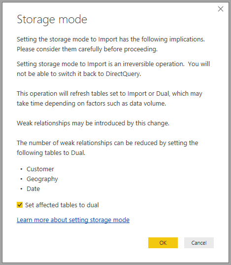
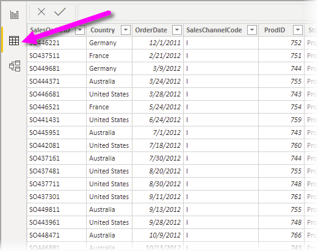

# Manage storage mode in Power BI Desktop

In Microsoft Power BI Desktop, you can specify the storage mode of a table. The storage mode lets you control whether Power BI Desktop caches table data in-memory for reports. 

Setting the storage mode provides many advantages. You can set the storage mode for each table individually in your model. This action enables a single dataset, which provides the following benefits:

* **Query performance**: As users interact with visuals in Power BI reports, Data Analysis Expressions (DAX) queries are submitted to the dataset. Caching data into memory by properly setting the storage mode can boost the query performance and interactivity of your reports.

* **Large datasets**: Tables that aren't cached don't consume memory for caching purposes. You can enable interactive analysis over large datasets that are too large or expensive to completely cache into memory. You can choose which tables are worth caching, and which aren't.

* **Data refresh optimization**: You don't need to refresh tables that aren't cached. You can reduce refresh times by caching only the data that's necessary to meet your service level agreements and your business requirements.

* **Near-real time requirements**: Tables with near-real time requirements might benefit from not being cached, to reduce data latency.

* **Writeback**: Writeback enables business users to explore what-if scenarios by changing cell values. Custom applications can apply changes to the data source. Tables that aren't cached can display changes immediately, which allows instant analysis of the effects.

The storage mode setting in Power BI Desktop is one of three related features:

* **Composite models**: Allows a report to have two or more data connections, including DirectQuery connections or Import, in any combination. For more information, see [Use composite models in Power BI Desktop](desktop-composite-models.md).

* **Many-to-many relationships**: With composite models, you can establish *many-to-many relationships* between tables. In a many-to-many relationship, requirements are removed for unique values in tables. It also removes prior workarounds, such as introducing new tables only to establish relationships. For more information, see [Many-to-many relationships in Power BI Desktop](desktop-many-to-many-relationships.md).

* **Storage mode**: With storage mode, you can now specify which visuals require a query to back-end data sources. Visuals that don't require a query are imported even if they're based on DirectQuery. This feature helps improve performance and reduce back-end load. Previously, even simple visuals, such as slicers, initiated queries that were sent to back-end sources. 

## Use the Storage mode property

The **Storage mode** property is a property that you can set on each table in your model and controls how Power BI caches the table data.

To set the **Storage mode** property, or view its current setting: 

1. in **Model** view, select the table whose properties you want to view or set. 
2. In the **Properties** pane, expand the **Advanced** section, and expand the **Storage mode** drop-down.

   

You set the **Storage mode** property to one of these three values:

* **Import**: Imported tables with this setting are cached. Queries submitted to the Power BI dataset that return data from Import tables can be fulfilled only from cached data.

* **DirectQuery**: Tables with this setting aren't cached. Queries that you submit to the Power BI dataset&mdash;for example, DAX queries&mdash;and that return data from DirectQuery tables can be fulfilled only by executing on-demand queries to the data source. Queries that you submit to the data source use the query language for that data source, for example, SQL.

* **Dual**: Tables with this setting can act as either cached or not cached, depending on the context of the query that's submitted to the Power BI dataset. In some cases, you fulfill queries from cached data. In other cases, you fulfill queries by executing an on-demand query to the data source.

Changing the **Storage mode** of a table to **Import** is an *irreversible* operation. Once set, this property can't later be changed to either **DirectQuery** or **Dual**.

> [!NOTE]
> You can use **Dual** storage mode in both Power BI Desktop and the Power BI service.

## Constraints on DirectQuery and Dual tables

Dual tables have the same functional constraints as DirectQuery tables. These constraints include limited M transformations and restricted DAX functions in calculated columns. For more information, see [Implications of using DirectQuery](desktop-directquery-about.md#implications-of-using-directquery).

## Propagation of the Dual setting
Consider the following simple model, where all the tables are from a single source that supports Import and DirectQuery.

Let’s say all tables in this model are initially set to **DirectQuery**. If you then change the **Storage mode** of the **SurveyResponse** table to **Import**, the following warning window is displayed:

You can set the dimension tables (**Customer**, **Geography**, and **Date**) to **Dual** to reduce the number of weak relationships in the dataset, and improve performance. Weak relationships normally involve at least one DirectQuery table where join logic can't be pushed to the source systems. Because Dual tables can act as either DirectQuery or Import tables, this situation is avoided.

The propagation logic is designed to help with models that contain many tables. Suppose you have a model with 50 tables and only certain fact (transactional) tables need to be cached. The logic in Power BI Desktop calculates the minimum set of dimension tables that must be set to **Dual**, so you don’t have to.

The propagation logic traverses only to the one side of one-to-many relationships.

## Storage mode usage example
Let's continue with the example from the previous section, and imagine applying the following storage mode property settings:

| Table                   | Storage mode         |
| ----------------------- |----------------------| 
| Sales                 | DirectQuery          | 
| SurveyResponse        | Import               | 
| Date                  | Dual                 | 
| Customer              | Dual                 | 
| Geography             | Dual                 | 

Setting these storage mode properties results in the following behaviors, assuming that the **Sales** table has significant data volume:
* Power BI Desktop caches dimension tables, **Date**, **Customer**, and **Geography**, so load times of initial reports are fast when they retrieve slicer values to display.
* Power BI Desktop doesn't cache the **Sales** table. By not caching this table, Power BI Desktop provides the following results:
    * Data-refresh times are improved, and memory consumption is reduced.
    * Report queries that are based on the **Sales** table run in **DirectQuery** mode. These queries might take longer but are closer to real time because no caching latency is introduced.

* Report queries that are based on the **SurveyResponse** table are returned from the in-memory cache, and are therefore relatively fast.

## Queries that hit or miss the cache

If you connect SQL Profiler to the diagnostics port for Power BI Desktop, you can see which queries hit or miss the in-memory cache by performing a trace that's based on the following events:

* Queries Events\Query Begin
* Query Processing\Vertipaq SE Query Begin
* Query Processing\DirectQuery Begin

For each *Query Begin* event, check other events with the same *ActivityID*. For example, if there isn't a *DirectQuery Begin* event, but there's a *Vertipaq SE Query Begin* event, the query is answered from the cache.

Queries that refer to Dual tables return data from the cache, if possible; otherwise, they revert to DirectQuery.

Continuing the previous example, the following query refers only to a column from the **Date** table, which is in **Dual** mode. Therefore, the query should hit the cache:

The following query refers only to a column from the **Sales** table, which is in **DirectQuery** mode. Therefore, it should *not* hit the cache:

The following query is interesting because it combines both columns. This query doesn't hit the cache. You might initially expect it to retrieve **CalendarYear** values from the cache and **SalesAmount** values from the source and then combine the results, but this approach is less efficient than submitting the SUM/GROUP BY operation to the source system. If the operation is pushed down to the source, the number of rows returned will likely be far less: 

> [!NOTE]
> This behavior is different from [many-to-many relationships](desktop-many-to-many-relationships.md) in Power BI Desktop when cached and non-cached tables are combined.

## Caches should be kept in sync

The queries displayed in the previous section show that Dual tables sometimes hit the cache and sometimes don't. As a result, if the cache is out of date, different values can be returned. Query execution won't attempt to mask data issues by, for example, filtering DirectQuery results to match cached values. It's your responsibility to know your data flows, and you should design accordingly. There are established techniques to handle such cases at the source, if necessary.

The **Dual** storage mode is a performance optimization. It should be used only in ways that don't compromise the ability to meet business requirements. For alternative behavior, consider using the techniques described in the [Many-to-many relationships in Power BI Desktop](desktop-many-to-many-relationships.md).

## Data view
If at least one table in the dataset has its storage mode set to either **Import** or **Dual**, the **Data** view tab is displayable.

When you select Dual and Import tables in **Data** view, they show cached data. DirectQuery tables don't show data, and a message is displayed that states that DirectQuery tables can't be shown.

## Limitations and considerations

There are a few limitations for this release of storage mode and its correlation with composite models.

The following live connection (multi-dimensional) sources can't be used with composite models:

* SAP HANA
* SAP Business Warehouse
* SQL Server Analysis Services
* Power BI datasets
* Azure Analysis Services

When you connect to those multi-dimensional sources by using DirectQuery, you can can't connect to another DirectQuery source or combine it with imported data.

The existing limitations of using DirectQuery still apply when you use composite models. Many of those limitations are now per table, depending upon the storage mode of the table. For example, a calculated column on an imported table can refer to other tables, but a calculated column on a DirectQuery table is still restricted to refer only to columns on the same table. Other limitations apply to the model as a whole, if any of the tables within the model are DirectQuery. For example, the QuickInsights and Q&A features aren't available on a model if any of the tables within it has a storage mode of DirectQuery. 

## Next steps

For more information about composite models and DirectQuery, see the following articles:
* [Composite models in Power BI Desktop](desktop-composite-models.md)
* [Many-to-many relationships in Power BI Desktop](desktop-many-to-many-relationships.md)
* [Use DirectQuery in Power BI](desktop-directquery-about.md)
* [Data sources supported by DirectQuery in Power BI](desktop-directquery-data-sources.md)
