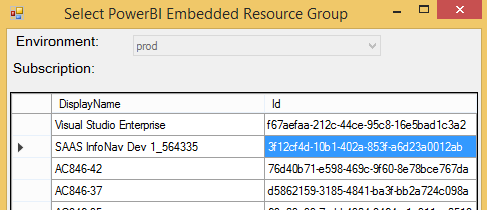
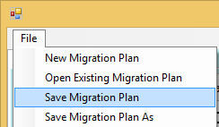
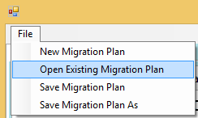
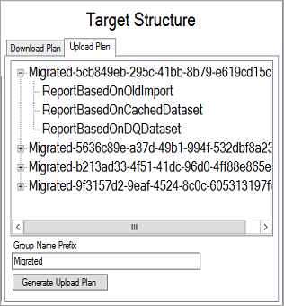
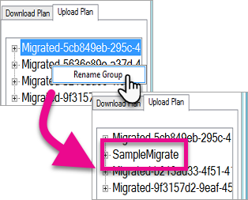
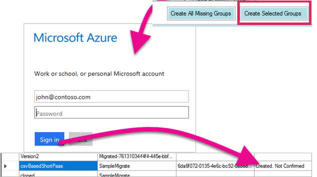
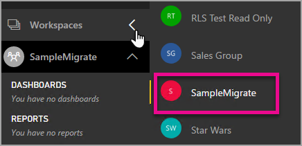
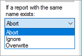
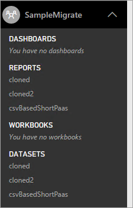

# Power BI Embedded migration tool

This migration tool can be used to copy your reports from the Power BI Embedded Azure service (PaaS) to the Power BI service (SaaS).

Migrating your content from your workspace collections to the Power BI service can be done in parallel to your current solution and doesn't require any downtime.

## Limitations

* Pushed datasets cannot be downloaded and will need to be recreated using the Power BI REST APIs for the Power BI service.
* PBIX files imported before November 26, 2016 will not be downloadable.

## Download

You can download the migration tool sample from [GitHub](https://github.com/Microsoft/powerbi-migration-sample). You can either download a zip of the repository, or you can clone it locally. Once downloaded, you can open *powerbi-migration-sample.sln* within Visual Studio to build and run the migration tool.

## Migration Plans

Your migration plan is just metadata that catalogs the content within Power BI Embedded and how you want to publish them to the Power BI service.

### Start with a new migration plan

A migration plan is the metadata of the items available in Power BI Embedded that you then want to move over to the Power BI service. The migration plan is stored as an XML file.

You will want to start by creating a new migration plan. To create a new migration plan, do the following.

1. Select **File** > **New Migration Plan**.

    

2. In the **Select Power BI Embedded Resource Group**  dialog, you will want to select the Environment dropdown and select prod.

3. You will be prompted to sign in. You will use your Azure subscription login.

   > [!IMPORTANT]
   > This is **not** your Office 365 organization account that you sign into Power BI with.

4. Select the Azure subscription which stores your Power BI Embedded workspace collections.

    
5. Below the subscription list, select the **Resource Group** that contains your workspace collections and select **Select**.

    

6. Select **Analyze**. This will get an inventory of the items within your Azure subscription for you to begin your plan.

    

   > [!NOTE]
   > The analyze process could take several minutes depending on the number of Workspace collections and how much content exists in the workspace collection.

7. When **Analyze** is complete, it will prompt you to save your migration plan.

At this point, you have connected your migration plan to your Azure subscription. Read below to understand the flow of how to work with your migration plan. This includes Analyze & Plan Migration, Download, Create Groups and Upload.

### Save your migration plan

You can save your migration plan for use later. This will create an XML file that contained all the information in your migration plan.

To save your migration plan, do the following.

1. Select **File** > **Save Migration Plan**.

    

2. Give your file a name or use the generated file name and select **Save**.

### Open an existing migration plan

You can open a saved migration plan to continue working on your migration.

To open your existing migration plan, do the following.

1. Select **File** > **Open Existing Migration Plan**.

    

2. Select your migration file and select **Open**.

## Step 1: Analyze & Plan Migration

The **Analyze & Plan Migration** tab gives you a view of what is currently in your Azure subscription's resource group.


We will look at the *SampleResourceGroup* as an example.

### PaaS Topology

This is a listing of your *Resource Group > Workspace collections > Workspaces*. The resource group and workspace collections will show a friendly name. The workspaces will show a GUID.

The items in the list will also display a color and a number in the format of (#/#). This indicates the number of reports that can be downloaded.
A black color means that all reports can be downloaded.

A red color means that some reports cannot be downloaded. The left number will indicate the total number of reports that can be downloaded. The number on the right indicates the total number of reports within the grouping.

You can select an item within the PaaS topology to display the reports in the reports section.

### Reports

The reports section will list out the reports available and indicates whether it can be downloaded or not.


### Target structure

The **Target structure** is where you tell the tool where things will be downloaded to and how to upload them.

#### Download Plan

A path will automatically be created for you. You can change this path if you wish. If you do change the path, you will need to select **Update paths**.

> [!NOTE]
> This does not actually perform the download. This is only specifying the structure of where the reports will be downloaded to.

#### Upload Plan

Here you can specify a prefix to be used for the workspaces that will be created within the Power BI service. After the prefix will be the GUID for the workspace that existed in Azure.



> [!NOTE]
> This does not actually create the groups within the Power BI service. This only defines the naming structure for the groups.

If you change the prefix, you will need to select **Generate Upload Plan**.

You can right click on a group and choose to rename the group within the Upload plan directly, if desired.



> [!NOTE]
> The name of the *group* must not contain spaces or invalid characters.

## Step 2: Download

On the **Download** tab, you will see the list of reports and associated metadata. You can see what the export status is along with the previous export status.


You have two options.

* Select specific reports and select **Download Selected**
* Select **Download All**.


For a successful download, you will see a status of *Done* and it will reflect that the PBIX file exists.

After the download is completed, select the **Create Groups** tab.

## Step 3: Create Groups

After you have downloaded the reports that are available, you can go to the **Create Groups** tab. This tab will create the workspaces within the Power BI service based on the migration plan that you created. It will create the workspace with the name you provided on the **Upload** tab within **Analyze & Plan Migration**.


To create the workspaces, you can select either **Create Selected Groups** or **Create All Missing Groups**.

When you select either of these options, you will be prompted to sign in. *You will want to use your credentials for the Power BI service that you want to create the workspaces on.*



This will create the workspace within the Power BI service. This does not upload the reports to the workspace.

You can verify that the workspace was created by signing into Power BI and validating that the workspace exists. You will notice that nothing is in the workspace.



After the workspace is created, you can move onto the **Upload** tab.

## Step 4: Upload

On the **Upload** tab, this will upload the reports to the Power BI service. You will see a list of the reports that we downloaded on the Download tab along with the target group name based on your migration plan.


You can upload selected reports, or you could upload all the reports. You can also reset the upload status to re-upload items.

You also have the option of selecting what to do if a report with the same name exists. You can choose between **Abort**, **Ignore** and **Overwrite**.




### Duplicate report names

If you have a report that has the same name, but you know it is a different report, you will need to change the **TargetName** of the report. You can change the name by manually editing the migration plan XML.

You will need to close the migration tool to make the change and then re-open the tool and the migration plan.

In the above example, one of the cloned reports failed indicating a report with the same name existed. If we go look at the migration plan XML, we will see the following.

```xml
<ReportMigrationData>
    <PaaSWorkspaceCollectionName>SampleWorkspaceCollection</PaaSWorkspaceCollectionName>
    <PaaSWorkspaceId>4c04147b-d8fc-478b-8dcb-bcf687149823</PaaSWorkspaceId>
    <PaaSReportId>525a8328-b8cc-4f0d-b2cb-c3a9b4ba2efe</PaaSReportId>
    <PaaSReportLastImportTime>1/3/2017 2:10:19 PM</PaaSReportLastImportTime>
    <PaaSReportName>cloned</PaaSReportName>
    <IsPushDataset>false</IsPushDataset>
    <IsBoundToOldDataset>false</IsBoundToOldDataset>
    <PbixPath>C:\MigrationData\SampleResourceGroup\SampleWorkspaceCollection\4c04147b-d8fc-478b-8dcb-bcf687149823\cloned-525a8328-b8cc-4f0d-b2cb-c3a9b4ba2efe.pbix</PbixPath>
    <ExportState>Done</ExportState>
    <LastExportStatus>OK</LastExportStatus>
    <SaaSTargetGroupName>SampleMigrate</SaaSTargetGroupName>
    <SaaSTargetGroupId>6da6f072-0135-4e6c-bc92-0886d8aeb79d</SaaSTargetGroupId>
    <SaaSTargetReportName>cloned</SaaSTargetReportName>
    <SaaSImportState>Failed</SaaSImportState>
    <SaaSImportError>Report with the same name already exists</SaaSImportError>
</ReportMigrationData>
```

For the failed item, we can change the name of the SaaSTargetReportName.

```xml
<SaaSTargetReportName>cloned2</SaaSTargetReportName>
```

We can then re-open the plan, in the migration tool, and upload the failed report.

Going back to Power BI, we can see that the reports and datasets have been uploaded in the workspace.



<a name="upload-local-file"></a>

### Upload a local PBIX file

You can upload a local version of a Power BI Desktop file. You will have to close the tool, edit the XML and put the full path to your local PBIX in the **PbixPath** property.

```xml
<PbixPath>[Full Path to PBIX file]</PbixPath>
```

After you have edited the xml, re-open the plan within the migration tool and upload the report.

<a name="directquery-reports"></a>

### DirectQuery reports

You will need to update to update the connection string for DirectQuery reports. This can be done within *powerbi.com*, or you can programmatically query the connection string from Power BI Embedded (PaaS). For an example, see [Extract DirectQuery connection string from PaaS report](migrate-code-snippets.md#extract-directquery-connection-string-from-paas-report).

You can then update the connection string for the dataset within the Power BI service (SaaS) and set the credentials for the data source. You can look at the following examples to see how to do this.

* [Update DirectQuery connection string is SaaS workspace](migrate-code-snippets.md#update-directquery-connection-string-is-saas-workspace)
* [Set DirectQuery credentials in SaaS workspace](migrate-code-snippets.md#set-directquery-credentials-in-saas-workspace)

## Embedding

Now that your reports have been migrated from the Power BI Embedded Azure service to the Power BI service, you can now update your application and begin embedding the reports in this workspace.

For more information, see [How to migrate Power BI Embedded workspace collection content to Power BI](migrate-from-powerbi-embedded.md).

## Next steps

[Embedding with Power BI](embedding.md)  
[How to migrate Power BI Embedded workspace collection content to Power BI](migrate-from-powerbi-embedded.md)  
[Power BI Premium - what is it?](../../service-premium-what-is.md)  
[JavaScript API Git repo](https://github.com/Microsoft/PowerBI-JavaScript)  
[Power BI C# Git repo](https://github.com/Microsoft/PowerBI-CSharp)  
[JavaScript embed sample](https://microsoft.github.io/PowerBI-JavaScript/demo/)  
[Power BI Premium whitepaper](https://aka.ms/pbipremiumwhitepaper)  

More questions? [Try asking the Power BI Community](https://community.powerbi.com/)