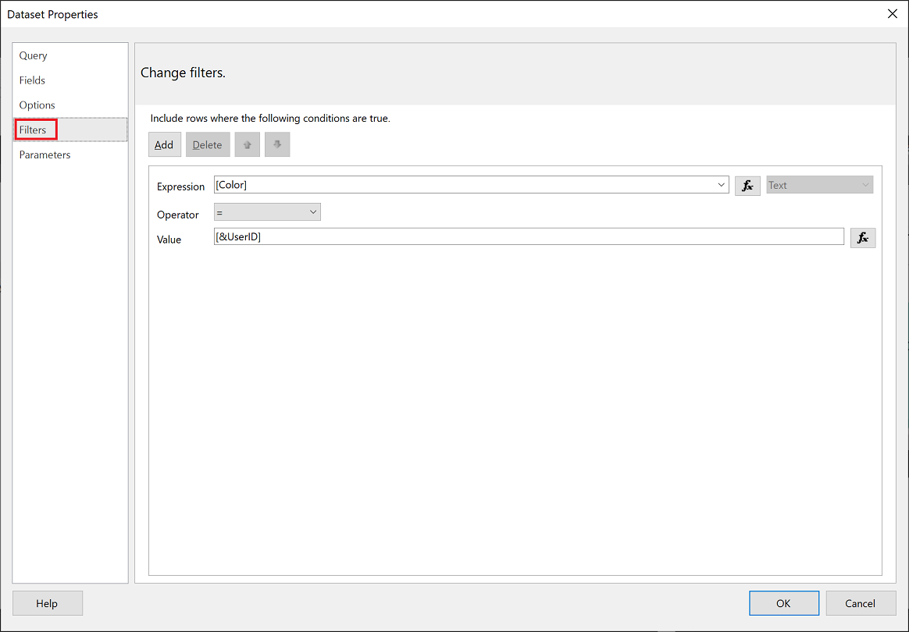
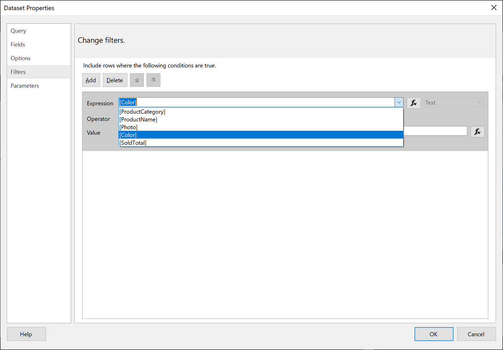
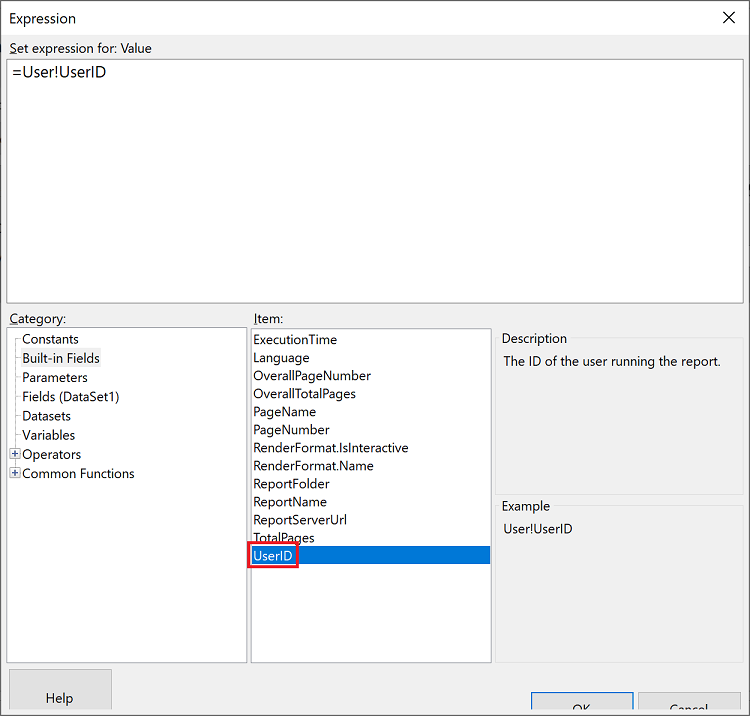
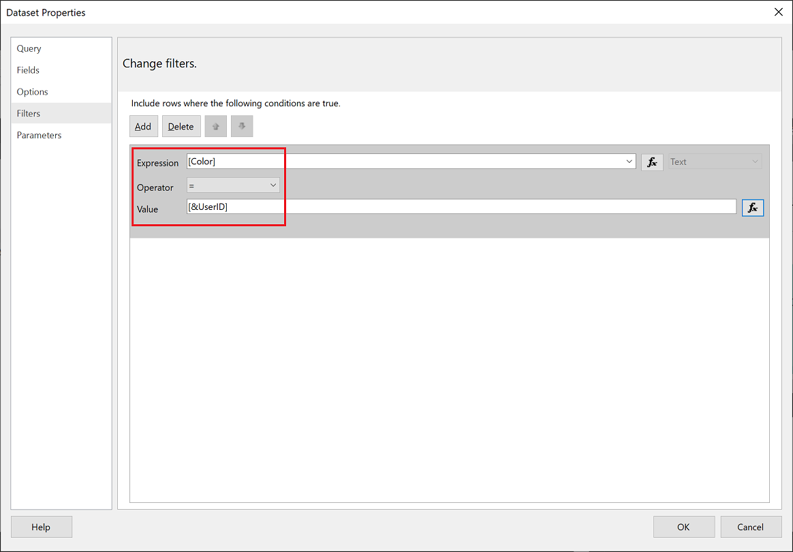
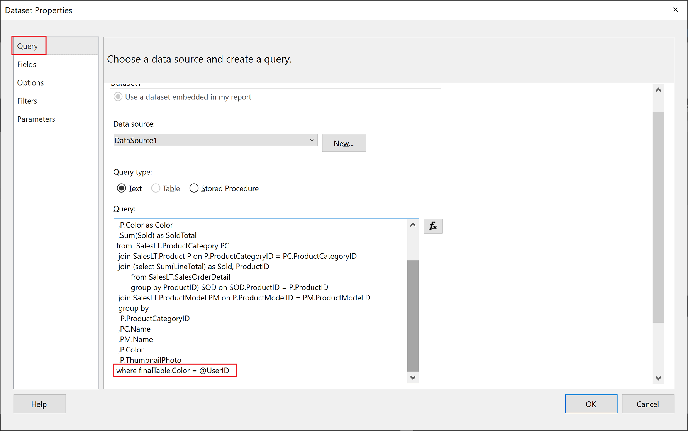

# Implementing row-level security in embedded paginated reports

When you embed a paginated report, you can control which data is displayed. This allows tailoring the displayed information per user. For example, if you have a Power BI paginated report that includes global sale results, you can embed it so that only the sale results from a certain region are available.

This feature provides a secure way of displaying a subset of the data, in a way that doesn't compromise the rest of data. It resembles the [Row Level Security (RLS)](embedded-row-level-security.md) feature, which provides a secure way of displaying data in Power BI reports (that are not paginated), dashboards, tiles, and datasets.  

> [!NOTE]
> This feature works with embedding paginated reports for customers.

## Configuring a parameter to filter the dataset

When applying row-level security to a Power BI paginated report, you need to assign a [parameter](../../paginated-reports/report-builder-parameters.md) to the **UserID** attribute. This parameter will restrict the data pulled from the dataset, before the report is embedded.

After assigning the parameter to **UserID**, use the [Reports GenerateTokenInGroup](/rest/api/power-bi/embedtoken/reports_generatetokeningroup) API to get the embed token.

## Use UserID as a filter at report or query level

You can use **UserId** as a *filter* or in a *query* to the datasource in [Power BI Report Builder](../../paginated-reports/report-builder-power-bi.md).

### Using the filter

1. In the **Dataset Properties** window, from the left pane, select **Filter**.

    

2. From the **Expression** dropdown menu, select the parameter you want to use for filtering the data.

     

3. Click the **Value** function button. 

    

4. In the **Expression** window, from the **Category** list, select **Built-in Fields**.

    

5. From the **Item** list, select **UserID** and click **OK**.

    

6. In the **Dataset Properties** window, verify that the expression is *your selected parameter = UserID*, and click **OK**.

    

### Using a query

1. In the **Dataset Properties** window, from the left pane, select **Parameters** and click **Add**.

    

2. In the **Parameter Name** enter **\@UserID**, and in the **Parameter Value** add **[&UserID]**.

     

3. From the left pane, select  **Query**, in the Query add the **UserID** parameter as part of your query, and click **OK**.
    > [!NOTE]
    > In the screenshot below the color parameter is used as an example (whereFinalTable.Color = @UserID). If needed, it is possible to create a more complex query.

    

## Passing the configured parameter using the embed token

When embedding a paginated report for your customers, the [Reports GenerateTokenInGroup](/rest/api/power-bi/embedtoken/reports_generatetokeningroup) API is used to get the embed token. This token can also be used to filter some of the data that is pulled out of the paginated report.

To expose only some of the data, assign the `username` field with the information you want to be displayed. For example, in a paginated report that has a color parameter, if you enter *green* in the `username` field, the embed token will restrict the embedded data to display only the data that has the *green* value in the color column.

```JSON
{
    "accessLevel": "View",
    "reportId": "cfafbeb1-8037-4d0c-896e-a46fb27ff229",
    "identities": [
            {
                    // Replace the 'username' with a paginated report parameter
                    "username":     "...",
                    "reports: [
                        "cfafbeb1-8037-4d0c-896e-a46fb27ff229"
                    ]
            }
    ]
}
```