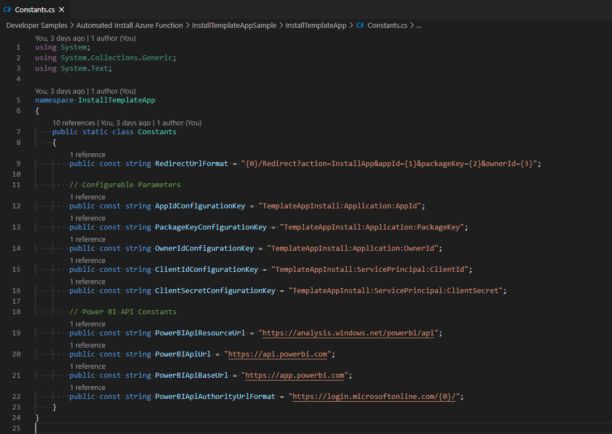
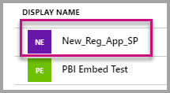

# Tutorial: Automate configuration of template app installation using an Azure function

## Introduction

In this tutorial you will use an automated install Azure Function sample that we've created to preconfigure and install your template app. This sample has deliberately been kept simple for demonstration purposes. It encapsulates the setup of an Azure function to leverage Power BI APIs for installing a template App and configuring it for your users automatically.

For more information about the general automation flow, and the APIs that it uses, see [Automate configuration of a template app installation](template-apps-auto-install.md)

Our simple application uses an Azure function. For more information about Azure Functions, see the [Azure Function documentation](https://docs.microsoft.com/azure/azure-functions/).

## Basic flow

The following is the basic flow of what the application does when the customer launches it by clicking the link on your portal.

1. The user logs in to the ISV's portal and clicks the supplied link. This initiates the flow. The ISV's portal prepares the user specific configuration at this stage.

2. The ISV acquires an **App-only** token based on a [service principal (app-only token)](../embedded/embed-service-principal.md), that is registered in the ISV's tenant.

3. Using [Power BI REST APIs](https://docs.microsoft.com/rest/api/power-bi/), the ISV creates an **Install Ticket** which contains the user specific parameter configuration as prepared by the ISV.

4. The ISV redirects the user to Power BI using a ```POST``` redirection method, containing the install ticket.

5. The user is redirected to their Power BI account with the install ticket and is prompted to install the template app. When the user clicks install, the template app is installed for them.

>[!Note]
>While parameter values are configured by the ISV when creating the install ticket, data source related credentials are only supplied by the user in the final stages of the installation. This prevents them from being exposed to a third party, thus ensuring a secure connection between the user and the template app data sources.

## Prerequisites

Before getting started, you need to have:

* Your own Azure Active Directory tenant setup. See [Create an Azure Active Directory tenant](https://docs.microsoft.com/power-bi/developer/embedded/create-an-azure-active-directory-tenant) for instructions how to set one up.

* A [service principal (app-only token)](https://docs.microsoft.com/power-bi/developer/embedded/embed-service-principal) registered in the above tenant.

* A parameterized [template app](https://docs.microsoft.com/power-bi/connect-data/service-template-apps-overview) that is ready for installation. The template app must be created in the same tenant in which you register your application in Azure Active Directory (Azure AD). See [template app tips](https://docs.microsoft.com/power-bi/connect-data/service-template-apps-tips.md) or [Create a template app in Power BI](https://docs.microsoft.com/power-bi/connect-data/service-template-apps-create) for more information.

* A **Power BI Pro license**. If you're not signed up for Power BI Pro, [sign up for a free trial](https://powerbi.microsoft.com/pricing/) before you begin.

## Set up your template apps automation development environment

Before you continue setting up your application, follow the instructions in [Quickstart: Create an Azure Functions app with Azure App Configuration](https://docs.microsoft.com/azure/azure-app-configuration/quickstart-azure-functions-csharp) to develop an Azure Function along with an Azure App Configuration. Create your App Configuration as described in the article.

### Register an application in Azure Active Directory (Azure AD)

Create a service principal as described in [Embed Power BI content with service principal and an application secret](https://docs.microsoft.com/power-bi/developer/embedded/embed-service-principal).

Make sure to register the application as a **server-side web application** app. You register a server-side web application to create an application secret.

Save the *Application ID* (Client ID) and *Application secret* (Client Secret) for later steps.

You can go through the [Embedding setup tool](https://aka.ms/embedsetup/AppOwnsData), to quickly get started creating an app registration. If you're using the [Power BI App Registration Tool](https://app.powerbi.com/embedsetup), select the *Embed for your customers* option.

## Template app preparation

Once you've created your template app and it's ready for installation, save the following information for the next steps:

* *App ID*, *Package Key*, *Owner ID* as they appear in the installation URL at then end of the [Define the properties of the template app](../../connect-data/service-template-apps-create.md#define-the-properties-of-the-template-app) process when the app was created.

    You can also get the same link by clicking **Get link** in the template app's [Release Management](../../connect-data/service-template-apps-create.md#manage-the-template-app-release).

* *Parameter Names* as they are defined in the template app's dataset. Parameter names are case-sensitive strings and can also be retrieved from the **Parameter Settings** tab when you [Define the properties of the template app](../../connect-data/service-template-apps-create.md#define-the-properties-of-the-template-app) or from the dataset settings in Power BI.

>[!NOTE]
    >You can test your preconfigured install application on your template app if the template app is ready for installation, even if it isn't publicly available on AppSource yet. However, for users outside your tenant to be able to use the automated install application to install your template app, the template app must be publicly available in the [Power BI Apps marketplace](https://app.powerbi.com/getdata/services). So before distributing your template app using the automated install application you're creating, be sure to publish it to the [Partner Center](https://docs.microsoft.com/azure/marketplace/partner-center-portal/create-power-bi-app-offer).


## Install and configure your template app using our Azure Function sample

In this section you will use an automated install Azure Function sample that we have created to preconfigure and install your template app. This sample has deliberately been kept simple for demonstration purposes. It allows you to leverage an [Azure Function](https://docs.microsoft.com/azure/azure-functions/functions-overview) and [Azure App Configuration](https://docs.microsoft.com/azure/azure-app-configuration/overview) to easily deploy and use the automated install API for you template apps.

### Download [Visual Studio](https://www.visualstudio.com/) (version 2017 or later)

Download [Visual Studio](https://www.visualstudio.com/) (version 2017 or later). Make sure to download the latest [NuGet package](https://www.nuget.org/profiles/powerbi).

### Download the Automated Install Azure Function sample

Download the [Automated Install Azure Function sample](https://github.com/microsoft/Template-apps-examples/tree/master/Developer%20Samples/Automated%20Install%20Azure%20Function) from GitHub to get started.


### Setup your Azure App Configuration

To run this sample, you need to setup your Azure App Configuration with the values & keys as described below. The keys are the **Application ID**, the **Application secret**, and your template app's **AppId**, **PackageKey**, and **OwnerId**. See the sections below for information about getting these values. 

The keys are also defined in the **Constants.cs** file.

| Configuration Key | Meaning           |
|---------------    |-------------------|
| TemplateAppInstall:Application:AppId | *AppId* from the  [install URL](#getting-the-template-app-properties) |
| TemplateAppInstall:Application:PackageKey | *PackageKey* from the [install URL](#getting-the-template-app-properties) |
| TemplateAppInstall:Application:OwnerId | *OwnerId* from the [install URL](#getting-the-template-app-properties) |
| TemplateAppInstall:ServicePrincipal:ClientId | Service Principal [Application ID](#getting-the-application-id) |
| TemplateAppInstall:ServicePrincipal:ClientSecret | Service Principal [Application secret](#getting-the-application-secret) |
|||


The **Constants.cs** file:



#### Getting the template app properties
Fill in all relevant Template app properties as they are defined when the app is created. These properties are the template app's **AppId**, **PakcageKey** & **OwnerId**.

To get the above values, follow these steps:

1. Sign into [Power BI](https://app.powerbi.com).

2. Go to the application's original workspace.

3. Open the Release management pane.

    

4. Select the app version and get its install link.

    

5. Copy the link to clipboard.

    

6. This install URL hold the 3 url parameters whose values you need. Use the **appId**, **packageKey** & **ownerId** values for the application. A sample URL will be similar to what is shown below.

    ```html
    https://app.powerbi.com/Redirect?action=InstallApp&appId=3c386...16bf71c67&packageKey=b2df4b...dLpHIUnum2pr6k&ownerId=72f9...1db47&buildVersion=5
    ```

#### Getting the Application ID

Fill in the **applicationId** information with the **Application ID** from **Azure**. The **applicationId** is used by the application to identify itself to the users from which you're requesting permissions.

To get the **applicationId**, follow these steps:

1. Sign into the [Azure portal](https://portal.azure.com).

2. In the left-hand nav pane, select **All Services**, and select **App Registrations**.

    

3. Select the application that needs the **applicationId**.

    

4. There's an **Application ID** that is listed as a GUID. Use this **Application ID** as the **applicationId** for the application.

    

#### Getting the Application secret

Fill in the **ApplicationSecret** information from the **Keys** section of your **App registrations** section in **Azure**.  This attribute works when using [service principal](../embedded/embed-service-principal.md).

To get the **ApplicationSecret**, follow these steps:

 1. Sign in to the [Azure portal](https://portal.azure.com).

 2. In the left-hand nav pane, select **All services** and then select **App registrations**.

    

3. Select the application that needs to use the **ApplicationSecret**.

    

4. Select **Certificates and secrets** under **Manage**.

5. Select **New client secrets**.

6. Enter a name in the **Description** box and select a duration. Then select **Save** to get the **Value** for your application. When you close the **Keys** pane after saving the key value, the value field shows only as hidden. At that point, you aren't able to retrieve the key value. If you lose the key value, create a new one in the Azure portal.

    

## Test your function locally

Follow the steps as described in [Run the function locally](https://docs.microsoft.com/azure/azure-functions/functions-create-your-first-function-visual-studio#run-the-function-locally) to run your function.

Configure your portal to issue a ```POST``` request to the url of the function (e.g. ```POST http://localhost:7071/api/install```). The request body should be a JSON object describing Key-Value pairs, where keys are *parameter names* (defined in Power BI Desktop) and values are the desired values to be set for each parameter in the template app.

>[!Note]
> In production, parameter values are deduced for each user by your portal's intended logic.

The desired flow should be:

1. Portal prepares the request, per user\session.
2. ```POST /api/install``` request is issued to your Azure function. The request body consists of key-value pairs, where the key is the parameter name and the value is the desired value to be set. 
3. If all is configured properly, the browser should automatically redirect to the customer's Power BI account and show the automated install flow.
4. Upon installation, parameter values are set as configured in steps 1 & 2.
 
## Next steps

Follow the [Azure function documentation](https://docs.microsoft.com/azure/azure-functions/functions-create-your-first-function-visual-studio#publish-the-project-to-azure) for instructions about how to publish your project to Azure so that you can integrate template app automated install APIs into your product and begin testing it in production environments.
