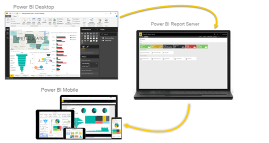

# What is Power BI?
**Power BI** is a collection of software services, apps, and connectors that work together to turn your unrelated sources of data into coherent, visually immersive, and interactive insights. Your data may be an Excel spreadsheet, or a collection of cloud-based and on-premises hybrid data warehouses. Power BI lets you easily connect to your data sources, visualize and discover what’s important, and share that with anyone or everyone you want.

## The parts of Power BI
Power BI consists of: 
- A Windows desktop application called **Power BI Desktop**.
- An online SaaS (*Software as a Service*) service called the **Power BI service**. 
- Power BI **mobile apps** for Windows, iOS, and Android devices.

These three elements&mdash;Power BI Desktop, the service, and the mobile apps&mdash;are designed to let you create, share, and consume business insights in the way that serves you and your role most effectively.

A fourth element, **Power BI Report Server**, allows you to publish Power BI reports to an on-premises report server, after creating them in Power BI Desktop. Read more about [Power BI Report Server](#on-premises-reporting-with-power-bi-report-server).

## How Power BI matches your role
How you use Power BI may depend on your role in a project or on a team. Other people, in other roles, might use Power BI differently.

For example, you might primarily use the **Power BI service** to view reports and dashboards. Your number-crunching, business-report-creating coworker might make extensive use of **Power BI Desktop** to create reports, then publish those reports to the Power BI service, where you view them. Another coworker, in sales, might mainly use their **Power BI phone app** to monitor progress on sales quotas, and to drill into new sales lead details.

If you're a developer, you might use Power BI APIs to push data into datasets or to embed dashboards and reports into your own custom applications. Have an idea for a new visual? Build it yourself and share it with others.  

You also might use each element of Power BI at different times, depending on what you’re trying to achieve or your role for a given project.

How you use Power BI can be based on which feature or service of Power BI is the best tool for your situation. For example, you can use Power BI Desktop to create reports for your own team about customer engagement statistics and you can view inventory and manufacturing progress in a real-time dashboard in the Power BI service. Each part of Power BI is available to you, which is why it’s so flexible and compelling.

Explore documents that pertain to your role:
- Power BI Desktop for [*designers*](../desktop-what-is-desktop.md)
- Power BI for [*consumers*](../consumer/end-user-consumer.md)
- Power BI for [*developers*](../developer/what-can-you-do.md)
- Power BI for [*administrators*](../service-admin-administering-power-bi-in-your-organization.md)

## The flow of work in Power BI
A common flow of work in Power BI begins by connecting to data sources and building a report in Power BI Desktop. You then publish that report from Power BI Desktop to the Power BI service, and share it so end users in the Power BI service and mobile devices can view and interact with the report.
This workflow is common, and shows how the three main Power BI elements complement one another.

Here's a detailed [comparison of Power BI Desktop and the Power BI service](../designer/service-service-vs-desktop.md).

## On-premises reporting with Power BI Report Server

But what if you're not ready to move to the cloud, and need to keep your reports behind a corporate firewall?  Read on.

You can create, deploy, and manage Power BI mobile and paginated reports on premises with the range of ready-to-use tools and services that Power BI Report Server provides.

Power BI Report Server is a solution that you deploy behind your firewall and then deliver your reports to the right users in different ways, whether that’s viewing them in a web browser, on a mobile device, or as an email. And because Power BI Report Server is compatible with Power BI in the cloud, you can move to the cloud when you're ready. 

Read more about [Power BI Report Server](../report-server/get-started.md).

## Next steps
- [Quickstart: Learn your way around the Power BI service](../service-the-new-power-bi-experience.md)   
- [Tutorial: Get started with the Power BI service](../service-get-started.md)
- [Quickstart: Connect to data in Power BI Desktop](../desktop-quickstart-connect-to-data.md)
