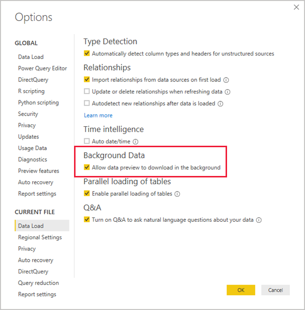

# Disable Power Query background refresh

This article targets Import data modelers working with Power BI Desktop.

By default, when Power Query imports data, it also caches up to 1000 rows of preview data for each query. Preview data helps to present you with a quick preview of source data, and of transformation results for each step of your queries. It's stored separately on-disk and not inside the Power BI Desktop file.

However, when your Power BI Desktop file contains many queries, retrieving and storing preview data can extend the time it takes to complete a refresh.

## Recommendation

You'll achieve a faster refresh by setting the Power BI Desktop file to update the preview cache _in the background_. In Power BI Desktop, you enable it by selecting _File > Options and settings > Options_, and then selecting the _Data Load_ page. You can then turn on the **Allow data preview to download in the background** option. Note this option can only be set for the current file.

Enabling background refresh can result in preview data becoming out of date. If it occurs, the Power Query Editor will notify you with the following warning:

It's always possible to update the preview cache. You can update it for a single query, or for all queries by using the **Refresh Preview** command. You'll find it on the **Home** ribbon of the Power Query Editor window.

## Next steps

For more information related to this article, check out the following resources:

- [Power Query Documentation](/power-query/)
- Questions? [Try asking the Power BI Community](https://community.powerbi.com/)
