# Many-to-many relationship guidance

This article targets you as a data modeler working with Power BI Desktop. It describes three different many-to-many modeling scenarios. It also provides you with guidance on how to successfully design for them in your models.

[!INCLUDE [relationships-prerequisite-reading](includes/relationships-prerequisite-reading.md)]

There are, in fact, three many-to-many scenarios. They can occur when you're required to:

- [Relate two dimension-type tables](#relate-many-to-many-dimensions)
- [Relate two fact-type tables](#relate-many-to-many-facts)
- [Relate higher grain fact-type tables](#relate-higher-grain-facts), when the fact-type table stores rows at a higher grain than the dimension-type table rows

## Relate many-to-many dimensions

Let's consider the first many-to-many scenario type with an example. The classic scenario relates two entities: bank customers and bank accounts. Consider that customers can have multiple accounts, and accounts can have multiple customers. When an account has multiple customers, they're commonly called _joint account holders_.

Modeling these entities is straight forward. One dimension-type table stores accounts, and another dimension-type table stores customers. As is characteristic of dimension-type tables, there's an ID column in each table. To model the relationship between the two tables, a third table is required. This table is commonly referred to as a _bridging table_. In this example, it's purpose is to store one row for each customer-account association. Interestingly, when this table only contains ID columns, it's called a [_factless fact table_](star-schema.md#factless-fact-tables).

Here's a simplistic model diagram of the three tables.


The first table is named **Account**, and it contains two columns: **AccountID** and **Account**. The second table is named **AccountCustomer**, and it contains two columns: **AccountID** and **CustomerID**. The third table is named **Customer**, and it contains two columns: **CustomerID** and **Customer**. Relationships don't exist between any of the tables.

Two one-to-many relationships are added to relate the tables. Here's an updated model diagram of the related tables. A fact-type table named **Transaction** has been added. It records account transactions. The bridging table and all ID columns have been hidden.

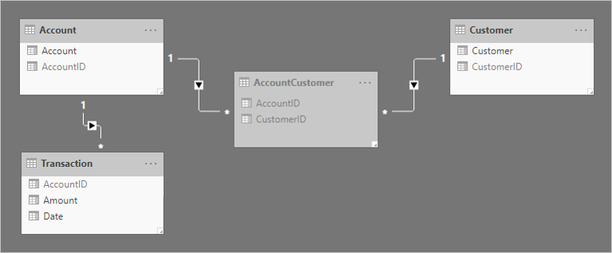

To help describe how the relationship filter propagation works, the model diagram has been modified to reveal the table rows.

> [!NOTE]
> It's not possible to display table rows in the Power BI Desktop model diagram. It's done in this article to support the discussion with clear examples.

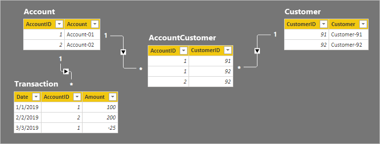

The row details for the four tables are described in the following bulleted list:

- The **Account** table has two rows:
  - **AccountID** 1 is for Account-01
  - **AccountID** 2 is for Account-02
- The **Customer** table has two rows:
  - **CustomerID** 91 is for Customer-91
  - **CustomerID** 92 is for Customer-92
- The **AccountCustomer** table has three rows:
  - **AccountID** 1 is associated with **CustomerID** 91
  - **AccountID** 1 is associated with **CustomerID** 92
  - **AccountID** 3 is associated with **CustomerID** 92
- The **Transaction** table has three rows:
  - **Date** January 1 2019, **AccountID** 1, **Amount** 100
  - **Date** February 2 2019, **AccountID** 2, **Amount** 200
  - **Date** March 3 2019, **AccountID** 1, **Amount** -25

Let's see what happens when the model is queried.

Below are two visuals that summarize the **Amount** column from the **Transaction** table. The first visual groups by account, and so the sum of the **Amount** columns represents the _account balance_. The second visual groups by customer, and so the sum of the **Amount** columns represents the _customer balance_.

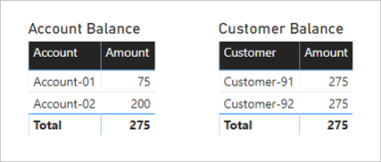

The first visual is titled **Account Balance**, and it has two columns: **Account** and **Amount**. It displays the following result:

- Account-01 balance amount is 75
- Account-02 balance amount is 200
- The total is 275

The second visual is titled **Customer Balance**, and it has two columns: **Customer** and **Amount**. It displays the following result:

- Customer-91 balance amount is 275
- Customer-92 balance amount is 275
- The total is 275

A quick glance at the table rows and the **Account Balance** visual reveals that the result is correct, for each account and the total amount. It's because each account grouping results in a filter propagation to the **Transaction** table for that account.

However, something doesn't appear correct with the **Customer Balance** visual. Each customer in the **Customer Balance** visual has the same balance as the total balance. This result could only be correct if every customer was a joint account holder of every account. That's not the case in this example. The issue is related to filter propagation. It's not flowing all the way to the **Transaction** table.

Follow the relationship filter directions from the **Customer** table to the **Transaction** table. It should be apparent that the relationship between the **Account** and **AccountCustomer** table is propagating in the wrong direction. The filter direction for this relationship must be set to **Both**.

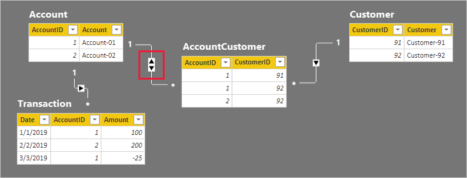


As expected, there has been no change to the **Account Balance** visual.

The **Customer Balance** visuals, however, now displays the following result:

- Customer-91 balance amount is 75
- Customer-92 balance amount is 275
- The total is 275

The **Customer Balance** visual now displays a correct result. Follow the filter directions for yourself, and see how the customer balances were calculated. Also, understand that the visual total means _all customers_.

Someone unfamiliar with the model relationships could conclude that the result is incorrect. They might ask: _Why isn't the total balance for **Customer-91** and **Customer-92** equal to 350 (75 + 275)?_

The answer to their question lies in understanding the many-to-many relationship. Each customer balance can represent the addition of multiple account balances, and so the customer balances are _non-additive_.

### Relate many-to-many dimensions guidance

When you have a many-to-many relationship between dimension-type tables, we provide the following guidance:

- Add each many-to-many related entity as a model table, ensuring it has a unique identifier (ID) column
- Add a bridging table to store associated entities
- Create one-to-many relationships between the three tables
- Configure **one** bi-directional relationship to allow filter propagation to continue to the fact-type tables
- When it isn't appropriate to have missing ID values, set the **Is Nullable** property of ID columns to FALSE—data refresh will then fail if missing values are sourced
- Hide the bridging table (unless it contains additional columns or measures required for reporting)
- Hide any ID columns that aren't suitable for reporting (for example, when IDs are surrogate keys)
- If it makes sense to leave an ID column visible, ensure that it's on the "one" slide of the relationship—always hide the "many" side column. It results in the best filter performance.
- To avoid confusion or misinterpretation, communicate explanations to your report users—you can add descriptions with text boxes or [visual header tooltips](report-page-tooltips.md)

We don't recommend you relate many-to-many dimension-type tables directly. This design approach requires configuring a relationship with a many-to-many cardinality. Conceptually it can be achieved, yet it implies that the related columns will contain duplicate values. It's a well-accepted design practice, however, that dimension-type tables have an ID column. Dimension-type tables should always use the ID column as the "one" side of a relationship.

## Relate many-to-many facts

The second many-to-many scenario type involves relating two fact-type tables. Two fact-type tables can be related directly. This design technique can be useful for quick and simple data exploration. However, and to be clear, we generally don't recommend this design approach. We'll explain why later in this section.

Let's consider an example that involves two fact-type tables: **Order** and **Fulfillment**. The **Order** table contains one row per order line, and the **Fulfillment** table can contains zero or more rows per order line. Rows in the **Order** table represent sales orders. Rows in the **Fulfillment** table represent order items that have been shipped. A many-to-many relationship relates the two **OrderID** columns, with filter propagation only from the **Order** table (**Order** filters **Fulfillment**).

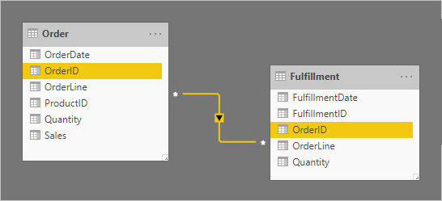

The relationship cardinality is set to many-to-many to support storing duplicate **OrderID** values in both tables. In the **Order** table, duplicate **OrderID** values can exist because an order can have multiple lines. In the **Fulfillment** table, duplicate **OrderID** values can exist because orders may have multiple lines, and order lines can be fulfilled by many shipments.

Let's now take a look at the table rows. In the **Fulfillment** table, notice that order lines can be fulfilled by multiple shipments. (The absence of an order line means the order is yet to be fulfilled.)

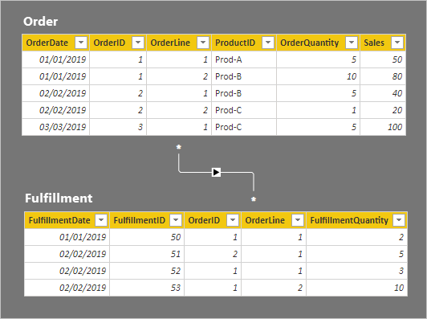

The row details for the two tables are described in the following bulleted list:

- The **Order** table has five rows:
  - **OrderDate** January 1 2019, **OrderID** 1, **OrderLine** 1, **ProductID** Prod-A, **OrderQuantity** 5, **Sales** 50
  - **OrderDate** January 1 2019, **OrderID** 1, **OrderLine** 2, **ProductID** Prod-B, **OrderQuantity** 10, **Sales** 80
  - **OrderDate** February 2 2019, **OrderID** 2, **OrderLine** 1, **ProductID** Prod-B, **OrderQuantity** 5, **Sales** 40
  - **OrderDate** February 2 2019, **OrderID** 2, **OrderLine** 2, **ProductID** Prod-C, **OrderQuantity** 1, **Sales** 20
  - **OrderDate** March 3 2019, **OrderID** 3, **OrderLine** 1, **ProductID** Prod-C, **OrderQuantity** 5, **Sales** 100
- The **Fulfillment** table has four rows:
  - **FulfillmentDate** January 1 2019, **FulfillmentID** 50, **OrderID** 1, **OrderLine** 1, **FulfillmentQuantity** 2
  - **FulfillmentDate** February 2 2019, **FulfillmentID** 51, **OrderID** 2, **OrderLine** 1, **FulfillmentQuantity** 5
  - **FulfillmentDate** February 2 2019, **FulfillmentID** 52, **OrderID** 1, **OrderLine** 1, **FulfillmentQuantity** 3
  - **FulfillmentDate** January 1 2019, **FulfillmentID** 53, **OrderID** 1, **OrderLine** 2, **FulfillmentQuantity** 10

Let's see what happens when the model is queried. Here's a table visual comparing order and fulfillment quantities by the **Order** table **OrderID** column.

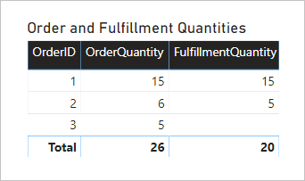

The visual presents an accurate result. However, the usefulness of the model is limited—you can only filter or group by the **Order** table **OrderID** column.

### Relate many-to-many facts guidance

Generally, we don't recommend relating two fact-type tables directly using many-to-many cardinality. The main reason is because the model won't provide flexibility in the ways you report visuals filter or group. In the example, it's only possible for visuals to filter or group by the **Order** table **OrderID** column. An additional reason relates to the quality of your data. If your data has integrity issues, it's possible some rows may be omitted during querying due to the nature of the _weak relationship_. For more information, see [Model relationships in Power BI Desktop (Relationship evaluation)](../desktop-relationships-understand.md#relationship-evaluation).

Instead of relating fact-type tables directly, we recommend you adopt [Star Schema](star-schema.md) design principles. You do it by adding dimension-type tables. The dimension-type tables then relate to the fact-type tables by using one-to-many relationships. This design approach is robust as it delivers flexible reporting options. It lets you filter or group using any of the dimension-type columns, and summarize any related fact-type table.

Let's consider a better solution.

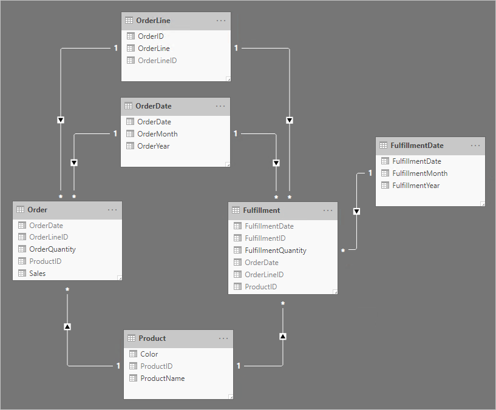

Notice the following design changes:

- The model now has four additional tables: **OrderLine**, **OrderDate**, **Product**, and **FulfillmentDate**
- The four additional tables are all dimension-type tables, and one-to-many relationships relate these tables to the fact-type tables
- The **OrderLine** table contains an **OrderLineID** column, which represents the **OrderID** value multiplied by 100, plus the **OrderLine** value—a unique identifier for each order line
- The **Order** and **Fulfillment** tables now contain an **OrderLineID** column, and they no longer contain the **OrderID** and **OrderLine** columns
- The **Fulfillment** table now contains **OrderDate** and **ProductID** columns
- The **FulfillmentDate** table relates only to the **Fulfillment** table
- All unique identifier columns are hidden

Taking the time to apply star schema design principles delivers the following benefits:

- Your report visuals can _filter or group_ by any visible column from the dimension-type tables
- Your report visuals can _summarize_ any visible column from the fact-type tables
- Filters applied to the **OrderLine**, **OrderDate**, or **Product** tables will propagate to both fact-type tables
- All relationships are one-to-many, and each relationship is a _strong relationship_. Data integrity issues won't be masked. For more information, see [Model relationships in Power BI Desktop (Relationship evaluation)](../desktop-relationships-understand.md#relationship-evaluation).

## Relate higher grain facts

This many-to-many scenario is very different from the other two already described in this article.

Let's consider an example involving four tables: **Date**, **Sales**, **Product**, and **Target**. The **Date** and **Product** are dimension-type tables, and one-to-many relationships relate each to the **Sales** fact-type table. So far, it represents a good star schema design. The **Target** table, however, is yet to be related to the other tables.

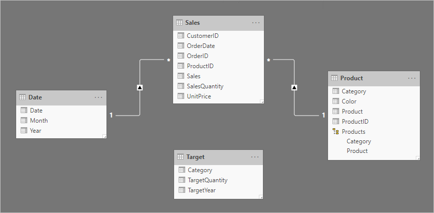

The **Target** table contains three columns: **Category**, **TargetQuantity**, and **TargetYear**. The table rows reveal a granularity of year and product category. In other words, targets—used to measure sales performance—are set each year for each product category.

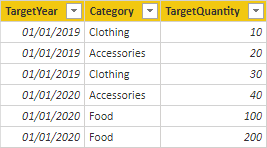

Because the **Target** table stores data at a higher level than the dimension-type tables, a one-to-many relationship cannot be created. Well, it's true for just one of the relationships. Let's explore how the **Target** table can be related to the dimension-type tables.

### Relate higher grain time periods

A relationship between the **Date** and **Target** tables should be a one-to-many relationship. It's because the **TargetYear** column values are dates. In this example, each **TargetYear** column value is the first date of the target year.

> [!TIP]
> When storing facts at a higher time granularity than day, set the column data type to **Date** (or **Whole number** if you're using date keys). In the column, store a value representing the first day of the time period. For example, a year period is recorded as January 1 of the year, and a month period is recorded as the first day of that month.

Care must be taken, however, to ensure that month or date level filters produce a meaningful result. Without any special calculation logic, report visuals may report that target dates are literally the first day of each year. All other days—and all months except January—will summarize the target quantity as BLANK.

The following matrix visual shows what happens when the report user drills from a year into its months. The visual is summarizing the **TargetQuantity** column. (The [Show items with no data](../desktop-show-items-no-data.md) option has been enabled for the matrix rows.)

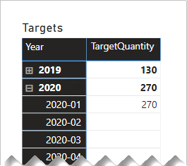

To avoid this behavior, we recommend you control the summarization of your fact data by using measures. One way to control the summarization is to return BLANK when lower-level time periods are queried. Another way—defined with some sophisticated DAX—is to apportion values across lower-level time periods.

Consider the following measure definition that uses the [ISFILTERED](/dax/isfiltered-function-dax) DAX function. It only returns a value when the **Date** or **Month** columns aren't filtered.

```dax
Target Quantity =
IF(
    NOT ISFILTERED('Date'[Date])
        && NOT ISFILTERED('Date'[Month]),
    SUM(Target[TargetQuantity])
)
```

The following matrix visual now uses the **Target Quantity** measure. It shows that all monthly target quantities are BLANK.

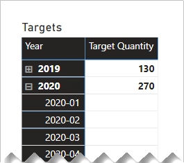

### Relate higher grain (non-date)

A different design approach is required when relating a non-date column from a dimension-type table to a fact-type table (and it's at a higher grain than the dimension-type table).

The **Category** columns (from both the **Product** and **Target** tables) contains duplicate values. So, there's no "one" for a one-to-many relationship. In this case, you'll need to create a many-to-many relationship. The relationship should propagate filters in a single direction, from the dimension-type table to the fact-type table.

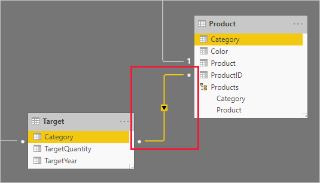

Let's now take a look at the table rows.

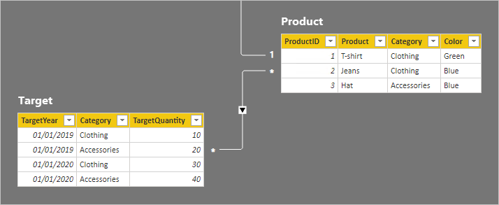

In the **Target** table, there are four rows: two rows for each target year (2019 and 2020), and two categories (Clothing and Accessories). In the **Product** table, there are three products. Two belong to the clothing category, and one belongs to the accessories category. One of the clothing colors is green, and the remaining two are blue.

A table visual grouping by the **Category** column from the **Product** table produces the following result.

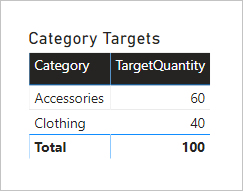

This visual produces the correct result. Let's now consider what happens when the **Color** column from the **Product** table is used to group target quantity.

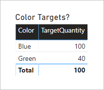

The visual produces a misrepresentation of the data. What is happening here?

A filter on the **Color** column from the **Product** table results in two rows. One of the rows is for the Clothing category, and the other is for the Accessories category. These two category values are propagated as filters to the **Target** table. In other words, because the color blue is used by products from two categories, _those categories_ are used to filter the targets.

To avoid this behavior, as described earlier, we recommend you control the summarization of your fact data by using measures.

Consider the following measure definition. Notice that all **Product** table columns that are beneath the category level are tested for filters.

```dax
Target Quantity =
IF(
    NOT ISFILTERED('Product'[ProductID])
        && NOT ISFILTERED('Product'[Product])
        && NOT ISFILTERED('Product'[Color]),
    SUM(Target[TargetQuantity])
)
```

The following table visual now uses the **Target Quantity** measure. It shows that all color target quantities are BLANK.

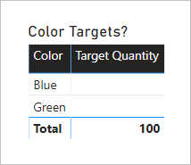

The final model design looks like the following.

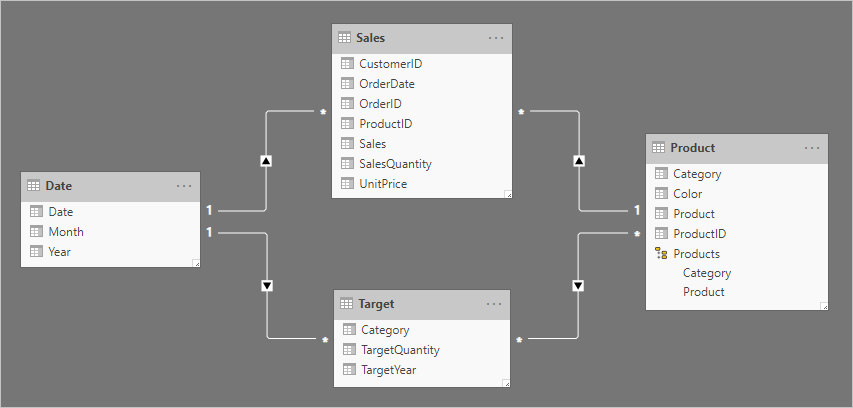

### Relate higher grain facts guidance

When you need to relate a dimension-type table to a fact-type table, and the fact-type table stores rows at a higher grain than the dimension-type table rows, we provide the following guidance:

- For higher grain fact dates:
  - In the fact-type table, store the first date of the time period
  - Create a one-to-many relationship between the date table and the fact-type table
- For other higher grain facts:
  - Create a many-to-many relationship between the dimension-type table and the fact-type table
- For both types:
  - Control summarization with measure logic—return BLANK when lower-level dimension-type columns are used to filter or group
  - Hide summarizable fact-type table columns—this way, only measures can be used to summarize the fact-type table

## Next steps

For more information related to this article, check out the following resources:

- [Model relationships in Power BI Desktop](../desktop-relationships-understand.md)
- [Understand star schema and the importance for Power BI](star-schema.md)
- [Relationship troubleshooting guidance](relationships-troubleshoot.md)
- Questions? [Try asking the Power BI Community](https://community.powerbi.com/)
- Suggestions? [Contribute ideas to improve Power BI](https://ideas.powerbi.com/)
