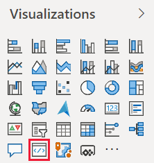
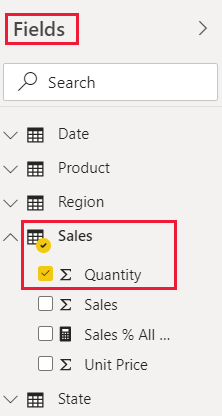
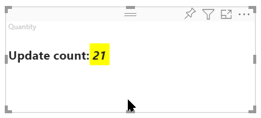

To test the visual in Power BI service, we'll use the **US Sales Analysis** report. You can [download](https://microsoft.github.io/PowerBI-visuals/docs/step-by-step-lab/images/US_Sales_Analysis.pbix) this report and upload it to Power BI service.

You can also use your own report to test the visual.

>[!NOTE]
>Before you continue, verify that you [enabled the visuals developer settings](environment-setup.md#set-up-power-bi-service-for-developing-a-visual).

1. Sign in to [PowerBI.com](https://powerbi.microsoft.com/) and open the **US Sales Analysis** report.

2. Select **More options** > **Edit**.

    >[!div class="mx-imgBorder"]
    >

3. Create a new page for testing, by clicking on the **New page** button at the bottom of the Power BI service interface.

    >[!div class="mx-imgBorder"]
    >

4. From the **Visualizations** pane, select the **Developer Visual**.

    >[!div class="mx-imgBorder"]
    >

    This visual represents the custom visual that you're running on your computer. It's only available when the [custom visual debugging](environment-setup.md#set-up-power-bi-service-for-developing-a-visual) setting is enabled.

5. Verify that a visual was added to the report canvas.

    >[!div class="mx-imgBorder"]
    >

    This is a simple visual that displays the number of times its update method has been called. At this stage, the visual does not retrieve any data.

    >[!NOTE]
    >If the visual displays a connection error message, open a new tab in your browser, navigate to `https://localhost:8080/assets/status`, and authorize your browser to use this address.
    >
    >

6. While the new visual is selected, go to the **Fields** pane, expand **Sales**, and select **Quantity**.

    >[!div class="mx-imgBorder"]
    >

7. To test how the visual is responding, resize it and notice that the *Update count* value increments every time you resize the visual.

    >[!div class="mx-imgBorder"]
    >