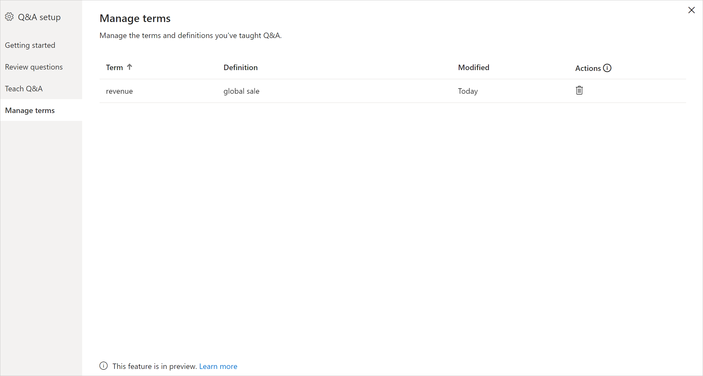

# Intro to Q&A tooling to train Power BI Q&A (preview)

With Power BI Q&A *tooling*, you can improve the natural language experience for your users. As a designer or administrator, you interact with the natural language engine and make improvements in three areas: 

- Review questions your users have asked.
- Teach Q&A to understand questions.
- Manage terms you've taught Q&A.

In addition to these dedicated tooling capabilities, the **Modeling** tab in Power BI Desktop offers more options:  

- Synonyms
- Row labels
- Hide from Q&A
- Configuring of the linguistic schema (advanced)

## Get started with Q&A tooling

Q&A tooling is only available in Power BI Desktop, and currently only supports import mode.

1. Open Power BI Desktop and use Q&A to create a visual. 
2. From the corner of the visual, select the gear icon. 

    

    The Getting started page opens.  

    

### Review questions

Select **Review questions** to see a list of datasets being used in the Power BI service for your tenant. The **Review questions** page also displays the dataset owner, workspace, and last refreshed date. From here you can select a dataset and see what questions users have been asking. The data also shows words that were not recognized. All data shown here is for the last 28 days.

### Teach Q&A

The **Teach Q&A** section allows you to train Q&A to recognize words. To begin, type a question that contains a word or words that Q&A doesn't recognize. Q&A prompts you for the definition of that term. Enter either a filter or a field name that corresponds to what that word represents. Q&A then reinterprets the original question. If you're happy with the results, you can save your input. To learn more, see [Teach Q&A](q-and-a-tooling-teach-q-and-a.md)

### Manage terms

Anything you've saved from the Teach Q&A section shows up here, so you can review or delete terms you've defined. Currently you can't edit an existing definition, so to redefine a term you must delete and recreate that term.

### Suggest questions

Without doing any setup, the Q&A visual will suggest several questions to get started with. These questions are automatically generated based on your data model. In **Suggest questions**, you can overwrite the auto-generated questions with your own questions. 

To start, type the question you want to add in the text box. In the preview section, you see what the result will look like in the Q&A visual. 

:::image type="content" source="media/q-and-a-tooling-intro/power-bi-qna-suggest-questions.png" alt-text="Suggest Q&A questions":::
 
Select the **Add** button to add this question to **Your suggested questions**. Every additional question is added to the end of this list. The questions will show up in the Q&A visual in the same order as they do in this list. 

:::image type="content" source="media/q-and-a-tooling-intro/power-bi-qna-save-suggest-questions.png" alt-text="Save suggested questions":::
 
Make sure to select **Save** to show your list of suggested questions in the Q&A visual. 

## Other Q&A settings

### Bulk synonyms

The Power BI Desktop **Modeling** tab has more options for improving the Q&A experience. 

1. In Power BI Desktop, select Modeling view.

2. Select a field or table to display the **Properties** pane.  This pane displays on the right side of the canvas and lists several Q&A actions. One option is **Synonyms**. In the **Synonyms** box, you can quickly define alternatives for the table or field you select. You can also define synonyms the **Teach Q&A** section of the Tooling dialog box, but it's often faster to define synonyms here for lots of fields in a table.

    

3. To define multiple synonyms for a single field, use commas to denote the next synonym.

### Hide from Q&A

You can also hide fields and tables, so they don't appear in Q&A results. 

1. In Power BI Desktop, select Modeling view.

2. Select a field or table to display the **Properties** pane, and turn **Is hidden** **On**.

    Q&A respects that setting and ensures that field isn't recognized by Q&A. For example, you might want to hide ID fields and foreign keys to avoid unnecessary duplicate fields with the same name. Even if you hide the field, you can still use it in Power BI Desktop in visuals outside of Q&A.

### Set a row label

A row label allows you to define which column (or *field*) best identifies a single row in a table. For example, for a table called 'Customer', the row label is usually 'Display Name'. Providing this extra metadata allows Q&A to plot a more helpful visual when users type in 'Show me sales by customer'. Instead of treating 'customer' as a table, it can instead use 'Display Name' and display a bar chart showing each customer's sales. You can only set the row label Modeling view. 

1. In Power BI Desktop, select Modeling view.

2. Select a table to display the **Properties** pane.

3. In the **Row label** box, select a field.

## Configure the linguistic schema (advanced)

In Power BI, you can completely train and enhance the natural language engine inside Q&A, including changing the scoring and weighting of the underlying natural language results. To learn how, see [Edit Q&A linguistic schema and add phrasings](q-and-a-tooling-advanced.md).

## Next steps

There are a number of best practices for improving the natural language engine. For more information, [Q&A best practices](q-and-a-best-practices.md).
