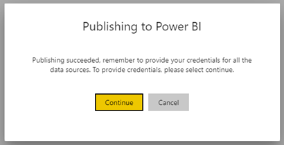
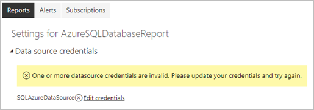
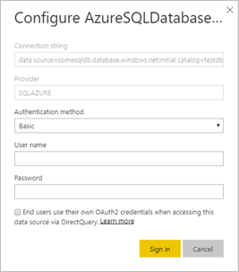

# Supported data sources for Power BI paginated reports

[!INCLUDE [applies-to](../includes/applies-to.md)] [!INCLUDE [yes-service](../includes/yes-service.md)] [!INCLUDE [yes-paginated](../includes/yes-paginated.md)] [!INCLUDE [yes-premium](../includes/yes-premium.md)] [!INCLUDE [no-desktop](../includes/no-desktop.md)] 

This article spells out supported data sources for paginated reports in the Power BI service, and how to connect to Azure SQL Database data sources. Some data sources are supported natively. You can connect to others by way of data gateways.

## Natively supported data sources

Paginated reports natively support the following list of data sources:

| Data Source | Authentication | Notes |
| --- | --- | --- |
| Azure SQL Database  Azure SQL Data Warehouse | Basic, single sign-on (SSO), OAuth2 | You may use an Enterprise Gateway with Azure SQL DB. However, you may not use SSO or oAuth2 to authenticate in those scenarios.   |
| Azure SQL Managed Instance | Basic | via Public or Private Endpoint (Private Endpoint needs to be routed through Enterprise Gateway)  |
| Azure Analysis Services | SSO, OAuth2 | The AAS firewall must be disabled or configured to allow all IP ranges in the BlackForest region. This applies only in the BlackForest region.  SSO from external tenant is not supported. |
| Power BI dataset | SSO | Premium and non-Premium Power BI datasets. Requires Read permission. Only Import mode and DirectQuery Power BI datasets are supported. |
| Premium Power BI dataset (XMLA) | SSO | Power BI datasets aren't supported as a data source for embedded paginated reports in "app owns data" scenarios.  To ensure proper connectivity in Power BI Report Builder, ensure that the "Do not use credentials" option is selected when setting your data source.   |
| Enter Data | N/A | Data is embedded in the report. |

Except for Azure SQL Database, all data sources are ready to use after you have uploaded the report to the Power BI service. The data sources default to using single sign-on (SSO), where applicable. For Azure Analysis Services, you can change the authentication type to OAuth2. However, once the authentication type for a given data source is changed to OAuth2, it can't revert back to use SSO.  In addition, this change applies to all the reports that use that data source across all workspaces for a given tenant.  Row-level security in paginated reports won't work unless users choose SSO for authentication type.

For Azure SQL Database data sources, you need to supply more information, as described in the [Azure SQL Database Authentication](#azure-sql-database-authentication) section.

## Other data sources

In addition to the natively supported data sources above, the following data sources can be accessed via a [Power BI data gateway](../connect-data/service-gateway-onprem.md):

- SQL Server
- SQL Server Analysis Services
- Oracle
- Teradata

For paginated reports, Azure SQL Database and Azure Analysis Services currently can't be accessed via a Power BI data gateway.

## Azure SQL Database authentication

For Azure SQL Database data sources, you need to set an authentication type before you run the report. That applies only when you use a data source for the first time in a workspace. That first time, you see the following message:

If you don't supply any credentials, an error occurs when you run the report. Select **Continue**  to go to the **Data source credentials** page for the report you just uploaded:

Select the **Edit credentials** link for a given data source to bring up the **Configure** dialog box:

For Azure SQL Database data sources, here are the supported authentication types:

- Basic (user name and password)
- SSO (single sign-on)
- OAuth2 (stored Azure Active Directory token)

For SSO and OAuth2 to work correctly, the Azure SQL Database server that the data source is connecting to needs to have [Azure Active Directory authentication support enabled](/azure/sql-database/sql-database-aad-authentication-configure). For the OAuth2 authentication method, Azure Active Directory generates a token and stores it for future data source access. To use the [SSO authentication method](../connect-data/service-azure-sql-database-with-direct-connect.md#single-sign-on) instead, select the SSO option right below it, **End users use their own OAuth2 credentials when accessing this data source via DirectQuery**.
  
## Next steps

[View a paginated report in the Power BI service](../consumer/paginated-reports-view-power-bi-service.md)

More questions? [Try the Power BI Community](https://community.powerbi.com/)
