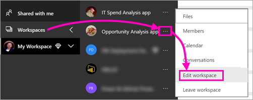
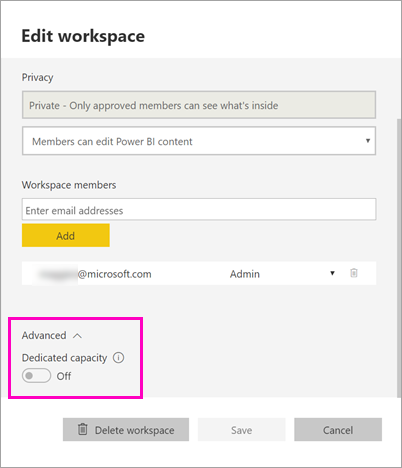
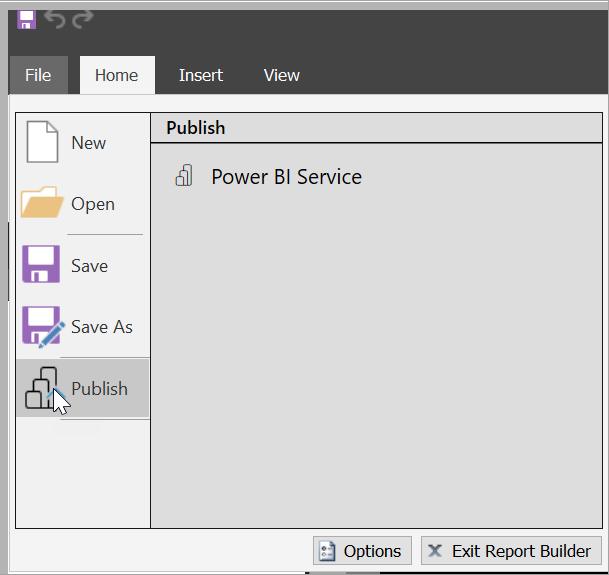
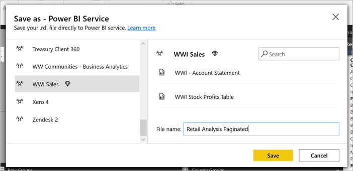
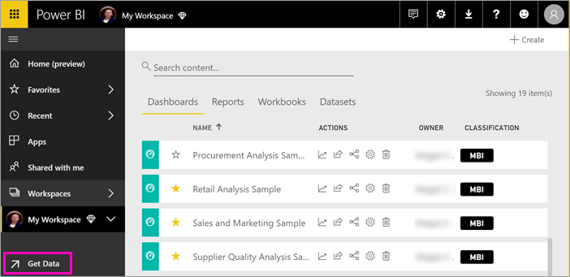
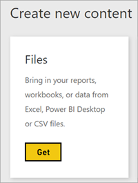
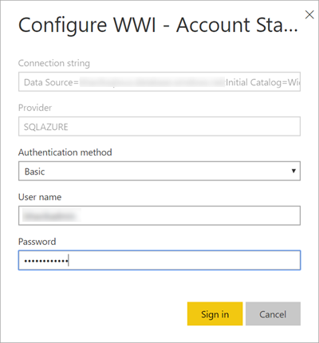

# Publish a paginated report to the Power BI service

In this article, you learn about publishing a paginated report to the Power BI service by uploading it from your local computer. You can upload paginated reports to your My Workspace or any other workspace, as long as the workspace is in a Premium capacity. Look for the diamond icon  next to the workspace name. 

If your report data source is on premises, you need to create a gateway after you upload the report. See the [Create a gateway](#create-a-gateway) section later in this article.

## Add a workspace to a Premium capacity

If the workspace doesn't have the diamond icon  next to the name, you need to add the workspace to a Premium capacity. 

1. Select **Workspaces**, select the ellipsis (**...**) next to the workspace name, then select **Edit workspace**.

    

1. In the **Edit workspace** dialog box, expand **Advanced**, then slide **Dedicated capacity** to **On**.

    

   You may not be able to change it. If not, then contact your Power BI Premium capacity admin to give you assignment rights to add your workspace to a Premium capacity.

## From Report Builder, publish a paginated report

1. Create your paginated report in Report Builder and save it to your local computer.

1. On the Report Builder **File** menu, select **Save as**.

    

    If you aren't signed in to Power BI yet, you need to sign in or create an account now. In the upper-right corner of Report Builder, select **Sign in** and complete the steps.

2. In the list of workspaces on the left, select a workspace with the diamond icon  next to its name. Type a **File name** in the box > **Save**. 

    

4. Open the Power BI service in a browser and browse to the Premium workspace where you published the paginated report. On the **Reports** tab, you see your report.

    

5. Select the paginated report to open it in the Power BI service. If it has parameters, you need to select them before you can view the report.

    

6. If your report data source is on premises, read about how to [create a gateway](#create-a-gateway) in this article to access the data source.

## From the Power BI service, upload a paginated report

You can also start from the Power BI service and upload a paginated report.

1. Create your paginated report in Report Builder and save it to your local computer.

1. Open the Power BI service in a browser and browse to the Premium workspace where you want to publish the report. Note the diamond icon  next to the name. 

1. Select **Get Data**.

    

1. In the **Files** box, select **Get**.

    

1. Select **Local file** > browse to the paginated report > **Open**.

    

1. Select **Continue** > **Edit credentials**.

    

1. Configure your credentials > **Sign in**.

    

   On the **Reports** tab, you see your report.

    

1. Select it to open it in the Power BI service. If it has parameters, you need to select them before you can view the report.
 
    

6. If your report data source is on premises, read about how to [create a gateway](#create-a-gateway) in this article to access the data source.

## Create a gateway

Just like any other Power BI report, if the report data source is on premises, then you need to create or connect to a gateway to access the data.

1. Next to the report name, select **Manage**.

   

1. See the Power BI service article [What is an on-premises data gateway](../connect-data/service-gateway-onprem.md) for details and next steps.

## Next steps

- [View a paginated report in the Power BI service](../consumer/paginated-reports-view-power-bi-service.md)
- [What are paginated reports in Power BI Premium?](paginated-reports-report-builder-power-bi.md)
- [Tutorial: Embed Power BI paginated reports into an application for your customers](../developer/embedded/embed-paginated-reports-customers.md)
