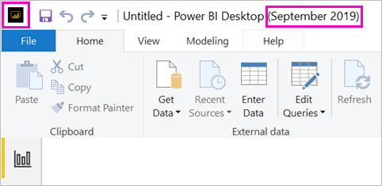

# Install Power BI Desktop optimized for Power BI Report Server

To create Power BI reports for Power BI Report Server, you need to download and install the version of Power BI Desktop that's optimized for Power BI Report Server. This release is different from the Power BI Desktop used with the Power BI service. For example, the version of Power BI Desktop for the Power BI service includes preview features that aren't in the Power BI Report Server version until they're generally available. Using this release makes sure that the report server can interact with a known version of the reports and model. 

The good news is that you can install Power BI Desktop, and Power BI Desktop optimized for Power BI Report Server, side by side on the same computer.

## Download and install Power BI Desktop

The easiest way to be sure you have the most up-to-date version of Power BI Desktop optimized for Power BI Report Server is to start from the web portal of your report server.

1. In the report server web portal, select the **Download** arrow > **Power BI Desktop**.

    

    Or go to the [Power BI Report Server](https://powerbi.microsoft.com/report-server/) home page and select **Advanced download options**.

2. In the Download Center page, select a language, then select **Download**.

3. Depending on your computer, select: 

    - **PBIDesktopRS.msi** (the 32-bit version) or
    - **PBIDesktopRS_x64.msi** (the 64-bit version).

1. After you download the installer, run the Power BI Desktop (September 2019) Setup Wizard.

2. At the end of the installation, select **Launch Power BI Desktop**.

    It starts automatically and you're ready to go.

## Verify you're using the correct version
It's easy to verify that you're using the correct Power BI Desktop: Look at the launch screen or title bar within Power BI Desktop. You can tell you have the right version because **Power BI Desktop (September 2019)** is in the title bar. Also, the Power BI logo colors are reversed, yellow on black instead of black on yellow.

The version of Power BI Desktop for the Power BI service doesn't have the month and year in the title bar.

## File extension association
If you install both Power BI Desktop and Power BI Desktop optimized for Power BI Report Server on the same machine, the most recent installation of Power BI Desktop has the file association with .pbix files. Thus, when you double-click a .pbix file, it launches the Power BI Desktop you installed most recently.

If you have Power BI Desktop and then install Power BI Desktop optimized for Power BI Report Server, all .pbix files open in Power BI Desktop optimized for Power BI Report Server by default. If you would rather have Power BI Desktop be the default to launch when opening a .pbix file, reinstall [Power BI Desktop from the Microsoft Store](https://aka.ms/pbidesktopstore).

You can always open the version of Power BI Desktop you want to use first. And then open the file from within Power BI Desktop.

Editing a Power BI report from within Power BI Report Server, or creating a new Power BI report from the web portal, always opens the correct version of Power BI Desktop.

## Considerations and limitations

Power BI reports in Power BI Report Server, in the Power BI service (`https://app.powerbi.com`), and in the Power BI mobile apps act almost exactly the same, but a few features are different.

### Selecting a language

For Power BI Desktop optimized for Power BI Report Server, you select the language when you install the app. You can't change it after, but you can install a version in another language.

### Report visuals in a browser

Power BI Report Server reports support almost all visualizations, including Power BI visuals. Power BI Report Server reports don’t support:

* R visuals
* ArcGIS maps
* Breadcrumbs
* Power BI Desktop preview features

### Reports in the Power BI mobile apps

Power BI Report Server reports support all the basic functionality in the [Power BI mobile apps](../consumer/mobile/mobile-apps-for-mobile-devices.md), including:

* [Phone report layout](../desktop-create-phone-report.md): You can optimize a report for the Power BI mobile apps. On your mobile phone, optimized reports have a special icon , and layout.
  
    

Power BI Report Server reports don’t support these features in the Power BI mobile apps:

* R visuals
* ArcGIS maps
* Power BI visuals
* Breadcrumbs
* Geo filtering or bar codes

### Custom Security

Power BI Desktop optimized for Power BI Report Server does not support custom security. If your Power BI Report Server is configured with a custom security extension, you can't save a Power BI report from Power BI Desktop (optimized for Power BI Report Server) to the Power BI Report Server instance. You need to save the .pbix report file from Power BI Desktop and upload it to the Power BI Report Server portal site.

## Power BI Desktop for earlier versions of Power BI Report Server

If your report server is an earlier version, you need the corresponding version of Power BI Desktop. Here's the link to download a previous version.

- Microsoft Power BI Desktop ([Optimized for Power BI Report Server - September 2019](https://go.microsoft.com/fwlink/?linkid=2103723))

## Next steps

Now that you have Power BI Desktop installed, you can start creating Power BI reports.

[Create a Power BI report for Power BI Report Server](quickstart-create-powerbi-report.md)  
[What is Power BI Report Server?](get-started.md)

More questions? [Try asking the Power BI Community](https://community.powerbi.com/)
