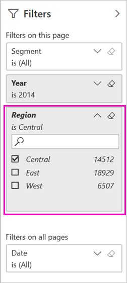
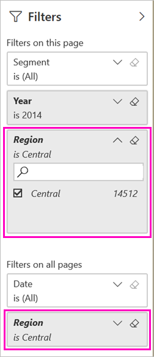

# Two ways to share a filtered Power BI report
*Sharing* is a good way to give a few people access to your dashboards and reports. What if you want to share a filtered version of a report? Maybe a report that only shows data for a specific city or salesperson or year. Try filtering a report and sharing it, or creating a custom URL. The report is filtered when recipients first open it. They can remove the filter by modifying the URL. 

Power BI also offers [other ways to collaborate and distribute your reports](service-how-to-collaborate-distribute-dashboards-reports.md). With sharing, you and your recipients need a [Power BI Pro license](service-features-license-type.md), or the content needs to be in a [Premium capacity](service-premium-what-is.md). 

## Two ways to filter a report

For both filtering techniques, we're using the Marketing and Sales sample template app. Want to try it? You can install the [Marketing and Sales sample template app](https://appsource.microsoft.com/product/power-bi/microsoft-retail-analysis-sample.salesandmarketingsample?tab=Overview), too.

### Set a filter

Open a report in [Editing view](consumer/end-user-reading-view.md) and apply a filter.

In this example, we're filtering the YTD Category page of the Marketing and Sales sample template app to show only values where **Region** equals **Central**. 
 

Save the report.

### Create a filter in the URL

When you add the filter to the end of the report page URL, the behavior is a little different. The filtered page looks the same. However, Power BI adds the filter to the whole report, and removes the other values from the filter pane.  

Add the following to the end of the report page URL:
   
    ?filter=*tablename*/*fieldname* eq *value*
   
The field must be of type number, datetime, or string. The *tablename* or *fieldname* values can't contain spaces.
   
In our example, the name of the table is **Geo**, the name of the field is **Region**, and the value we want to filter on is **Central**:
   
    ?filter=Geo/Region eq 'Central'

Your browser adds special characters to represent slashes, spaces, and apostrophes, so you end up with something like:
   
    app.powerbi.com/groups/xxxx/reports/xxxx/ReportSection4d00c3887644123e310e?filter=Geo~2FRegion%20eq%20'Central'

Save the report.

See the article [Filter a report using query string parameters in the URL](service-url-filters.md) for much more detail.

## Share the filtered report

1. When you [share the report](service-share-dashboards.md), clear the **Send email notification to recipients** check box.

    

4. Send the link with the filter that you created earlier.

## Next steps
* [Ways to share your work in Power BI](service-how-to-collaborate-distribute-dashboards-reports.md)
* [Share a dashboard](service-share-dashboards.md)
* More questions? [Try the Power BI Community](https://community.powerbi.com/).
* Have feedback? Go to the [Power BI Community site](https://community.powerbi.com/) with your suggestions.

