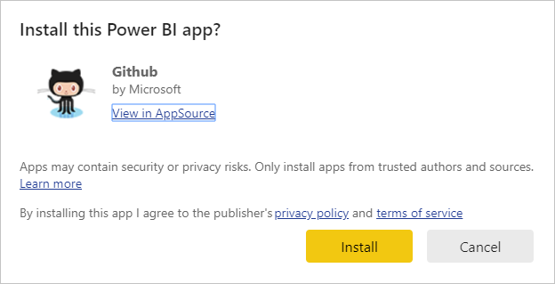
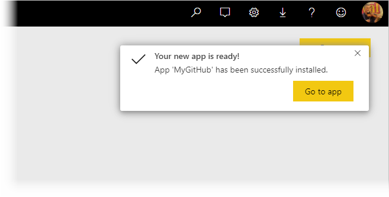
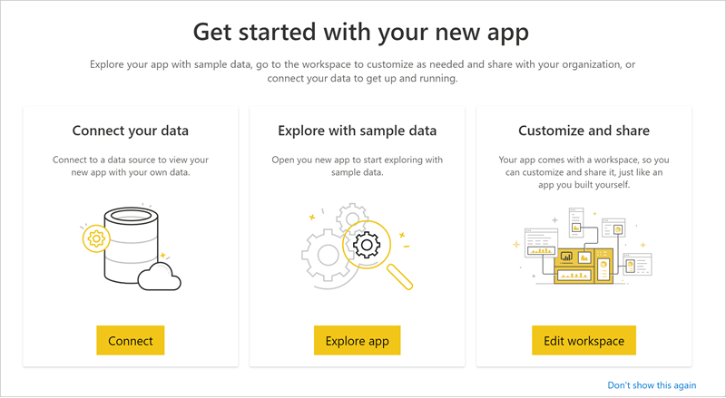
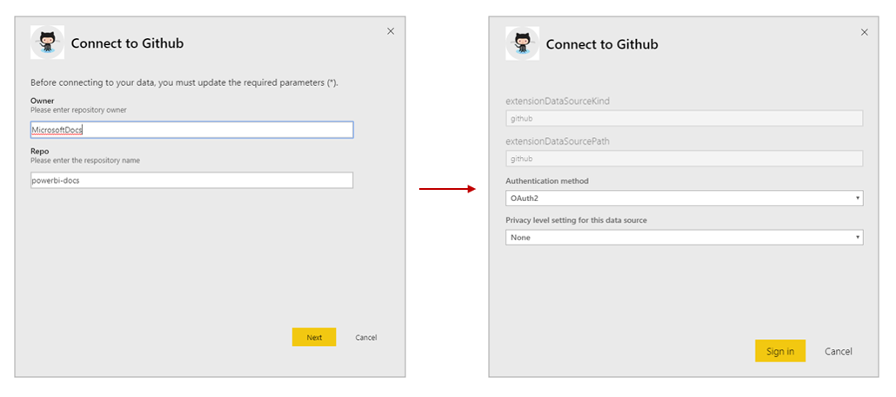

# Install and distribute template apps in your organization

Are you a Power BI analyst? If so, this article explains how you can  install [template apps](service-template-apps-overview.md) to connect to many of the services you use to run your business, such as Salesforce, Microsoft Dynamics, and Google Analytics. You can then modify the template app's pre-built dashboard and reports to suit the needs of your organization, and distribute them to your colleagues as [apps](consumer/end-user-apps.md). 

If you're interested in creating template apps yourself for distribution outside your organization, see [Create a template app in Power BI](service-template-apps-create.md). With little or no coding, Power BI partners can build Power BI apps and make them available to Power BI customers. 

## Prerequisites  

To install, customize, and distribute a template app, you need: 

* A [Power BI pro license](service-self-service-signup-for-power-bi.md).
* Permissions to install template apps on your tenant.
* A valid installation link for the app, which you get either from AppSource or from the app creator.
* A good familiarity with the [basic concepts of Power BI ](service-basic-concepts.md).

## Install a template app

1. In the nav pane in the Power BI service, select **Apps** > **Get apps**.

    

1. In the AppSource window that  appears, select **Apps**. Browse or search for the app you want, then select **Get it now**.

    

1. In the dialog box that appears, select **Install**.

    
    
    The app is installed with an associated workspace. **If you decide to customize the app, you will do so in this associated workspace**.

    > [!NOTE]
    > If you use an installation link for an app that isn't listed on AppSource, a validation dialog box will ask you to confirm your choice.
    >
    >To be able to install a template app that is not listed on AppSource, you need to request the relevant permissions from your admin. See the [Template app settings](service-admin-portal.md#template-apps-settings) in Power BI admin portal for details.

    When the installation finishes successfully, a notification tells you that your new app is ready.

    

## Connect to data

1. Select **Go to app**. The **Get started with your new app** window appears.

   

1. Click **Connect**.
    
    This opens a dialog or series of dialogs where you change the data source from the sample data to your own data source. This generally means redefining dataset parameters and data source credentials. See [Known limitations](service-template-apps-tips.md#known-limitations).
    
    In the example below, connecting to data involves two two dialogs.

   

    Once you've finished filling out the connection dialogs, the connection process starts. A banner informs you that you are viewing sample data.

    

    Wait for data to finish connecting and updating. To know when this process has finished, watch the progress indicator on the dataset row (new look) or tab (old look).

   When connection and data refresh is finished, refresh your browser; the banner now informs you that you need to update the app to apply any changes you make to the app and to share it.

    

## Customize and share the app

After you refresh the browser after connect-to-data and data refresh, you now see the workspace that is associated with the app. At this point you can edit any of the artifacts there, just as you would in any workspace. However, remember that any changes you make will be overwritten when you update the app with a new version, unless you save the items you changed under different names. [See details about overwriting](#overwrite-behavior).

For information about editing artifacts in the workspace, see
* [Tour the report editor in Power BI](service-the-report-editor-take-a-tour.md)
* [Basic concepts for designers in the Power BI service](service-basic-concepts.md)

Once you are done making any changes you wish to the artifacts in the workspace, you are ready to publish and share the app. See [Publish your app](service-create-distribute-apps.md#publish-your-app) to learn how to do this.

## Update a template app

From time to time, template app creators release new improved versions of their template apps, via either AppSource, direct link, or both.

If you originally downloaded the app from AppSource, when a new version of the template app becomes available, an update banner appears in the Power BI service informing you that a new app version is available.

  

>[!NOTE]
>If you originally got the app via direct link rather than through AppSource, the only way to know when a new version is available is to contact the template app creator.

  To install the update, either click **Get it** on the notification banner, or find the app again in AppSource and choose **Get it now**. If you got a direct link for the update from the Template app creator, simply click the link.
  
  You will be asked whether you wish to to overwrite the current version, or to install the new version in a new workspace. By default, "overwrite" is selected.

  

- **Overwrite an existing version:** Overwrites the existing workspace with the updated version of the template app. [See details about overwriting](#overwrite-behavior).

- **Install to a new workspace:** Installs a fresh version of the workspace and app that you need to reconfigure (that is, connect to data, define navigation and permissions).

### Overwrite behavior

* Overwriting updates the reports, dashboards, and dataset inside the workspace, not the app. Overwriting doesn't change app navigation, setup, and permissions.
* After you update the workspace, **you need to update the app to apply changes from the workspace to the app**.
* Overwriting keeps configured parameters and authentication. After update, an automatic dataset refresh starts. **During this refresh, the app, reports, and dashboards present sample data**.

  

* Overwriting always presents sample data until the refresh is complete. If the template app author made changes to the dataset or parameters, users of the workspace and app will not see the new data until the refresh is complete. Rather, they will continue to see sample data during this time.
* Overwriting never deletes new reports or dashboards you've added to the workspace. It only overwrites the original reports and dashboards with changes from the original author.

>[!IMPORTANT]
>Remember to [update the app](#customize-and-share-the-app) after overwriting to apply changes to the reports and dashboard for your organizational app users.

## Next steps

[Create workspaces with your colleagues in Power BI](service-create-workspaces.md)
