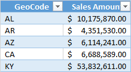

# Specify data categories in Power BI Desktop
In Power BI Desktop, you can specify the *data category* for a column so Power BI Desktop knows how it should treat its values when in a visualization.

When Power BI Desktop imports data, it gets other information than the data itself, like the table and column names, and whether the data is a primary key. With that information, Power BI Desktop makes some assumptions about how to give you a good default experience when creating a visualization.
For example, when a column has numeric values, you’ll probably want to aggregate it in some way, so Power BI Desktop places it in the **Values** area of the **Visualizations** pane. Or, for a column with date-time values on a line chart, Power BI Desktop assumes you’ll probably use it as a time hierarchy axis.

But, there are some cases that are a bit more challenging, like geography. Consider the following table from an Excel worksheet:

Should Power BI Desktop treat the codes in the **GeoCode** column as an abbreviation for a Country or a US State?  That's not clear because a code like this can mean either one. For instance, AL can mean Alabama or Albania, AR can mean Arkansas or Argentina, or CA can mean California or Canada. It makes a difference when we go to chart our GeoCode field on a map. 

Should Power BI Desktop show a picture of the world with countries highlighted? Or should it show a picture of the United States with states highlighted?  You can specify a data category for data just like this. Data categorization further refines the information Power BI Desktop can use to provide the best visualizations.  

**To specify a data category**

1. In **Report** View or **Data** View, in the **Fields** list, select the field you want to be sorted by a different categorization.
2. On the ribbon, in the **Properties** area of the **Modeling** tab, select the drop-down arrow next to **Data Category**.  This list shows the data categories you can choose for your column. Some selections might be disabled if they won’t work with the current data type of your column.  For example, if a column is a date or time data type, Power BI Desktop won’t let you choose geographic data categories. 
3. Select the category you want.

   

You might also be interested in learning about [geographic filtering for Power BI mobile apps](desktop-mobile-geofiltering.md).

