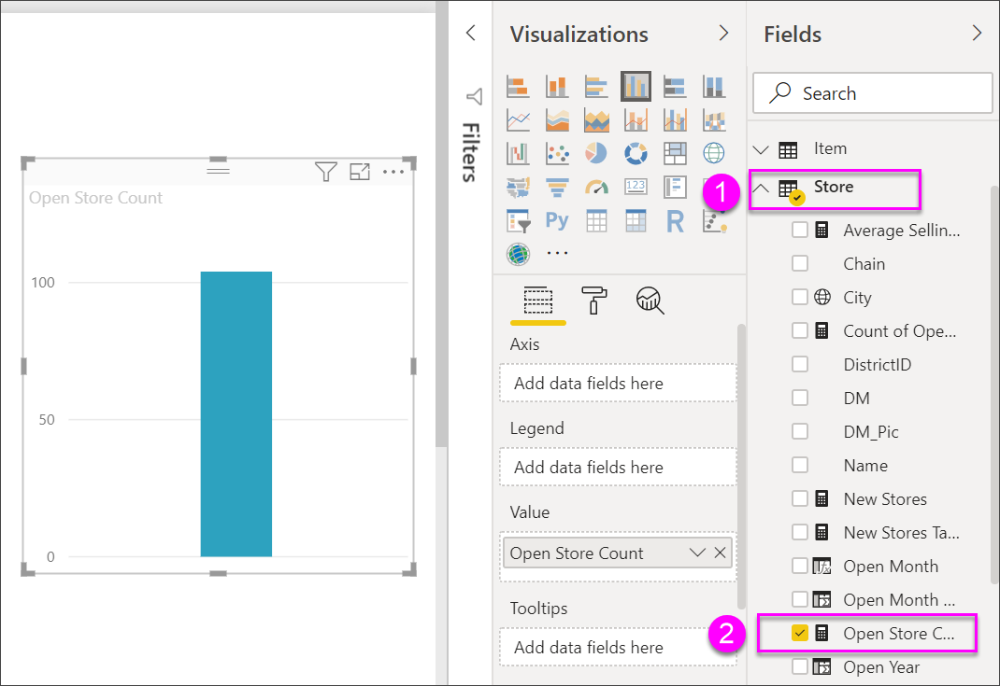
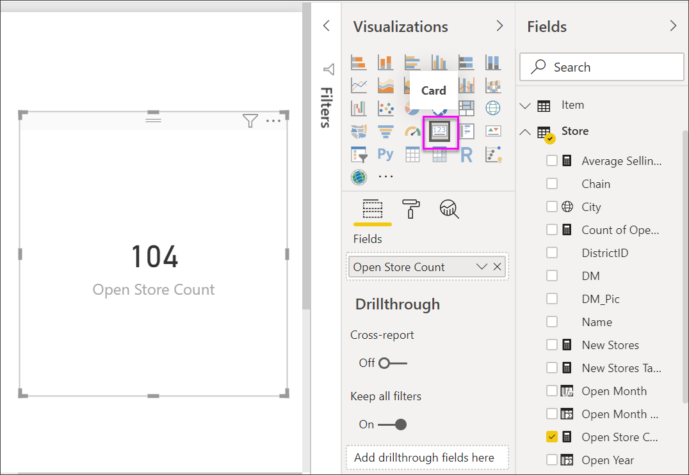
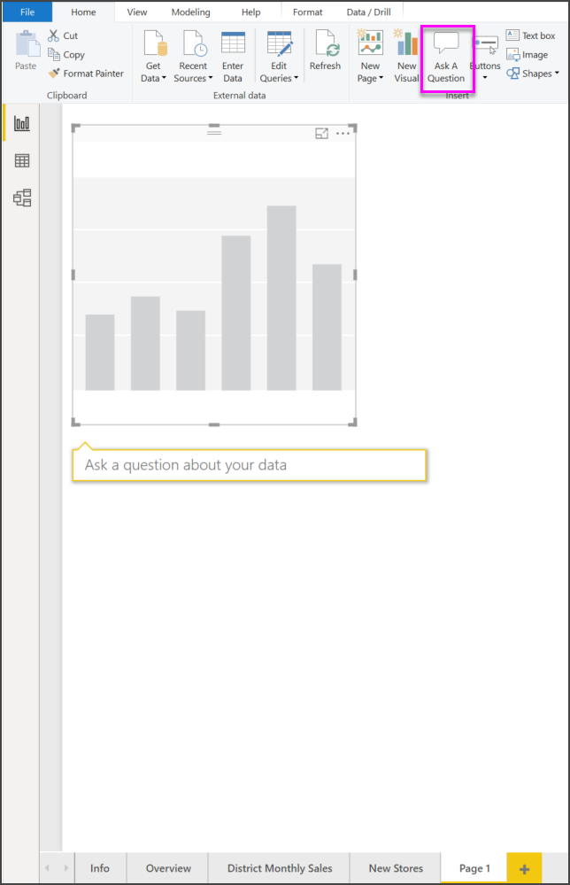
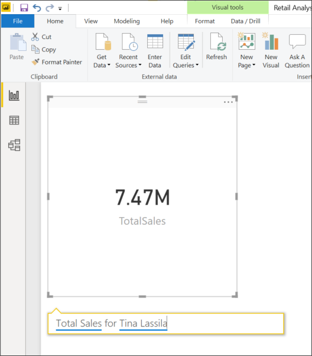
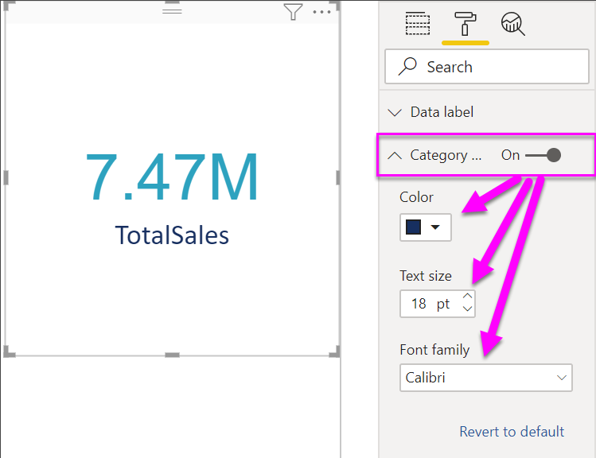

# Create card visualizations

[!INCLUDE[consumer-appliesto-nyyn](../includes/consumer-appliesto-nyyn.md)]

[!INCLUDE [power-bi-visuals-desktop-banner](../includes/power-bi-visuals-desktop-banner.md)]

Sometimes a single number is the most important thing you want to track in your Power BI dashboard or report, such as total sales, market share year over year, or total opportunities. This type of visualization is called a *Card*. As with almost all of the native Power BI visualizations, Cards can be created using the report editor or Q&A.

> [!NOTE]
> Sharing your report with a Power BI colleague requires that you both have individual Power BI Pro licenses or that the report is saved in Premium capacity.

## Prerequisite

This tutorial uses the [Retail Analysis sample PBIX file](https://download.microsoft.com/download/9/6/D/96DDC2FF-2568-491D-AAFA-AFDD6F763AE3/Retail%20Analysis%20Sample%20PBIX.pbix)

1. From the upper left section of the menubar, select **File** \> **Open**
   
2. Find your copy of the **Retail Analysis sample PBIX file**

1. Open the **Retail Analysis sample PBIX file** in report view .

1. Select  to add a new page.

## Option 1: Create a card using the report editor

The first method to create a card is to use the report editor in Power BI Desktop.

1. Start on a blank report page and select the **Store** \> **Open store count** field.

    Power BI creates a column chart with the one number.

   

2. In the Visualizations pane, select the card icon.

   

You have now successfully created a card with the report editor. Below is the second option for creating a card using the Q&A question box.

## Option 2: Create a card from the Q&A question box
The Q&A question box is another option for you to use when creating a card. The Q&A question box is available in Power BI Desktop report view.

1. Start on a blank report page

1. At the top of your window, select the **Ask a Question** icon. 

    Power BI will create a card and a box for your question. 

   

2. For example, type "Total Sales for Tina" in the question box.

    The question box helps you with suggestions and restatements, and finally displays the total number.  

   

   

You have now successfully created a card with the Q&A question box. Below are steps for formatting your card to your specific needs.

## Format a card
You have many options for changing labels, text, color and more. The best way to learn is to create a card and then explore the Formatting pane. Here are just a few of the formatting options available. 

The Formatting pane is available when interacting with the card in a report. 

1. Start by selecting the paint roller icon to open the Formatting pane. 

    

2. With the card selected, expand **Data label** and change the color, size, and font family. If you had thousands of stores, you could use **Display units** to show the number of stores by thousands and control the decimal places as well. For example, 125.8K instead of 125,832.00.

    

3.  Expand **Category label** and change the color and size.

    

4. Expand **Background** and move the slider to On.  Now you can change the background color and transparency.

    

5. Continue to explore the formatting options until your card is exactly how you'd like it. 

## Considerations and troubleshooting

If you do not see a question box at all, contact your Power BI admin.

## Next steps
[Combo charts in Power BI](power-bi-visualization-combo-chart.md)

[Visualization types in Power BI](power-bi-visualization-types-for-reports-and-q-and-a.md)
