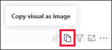
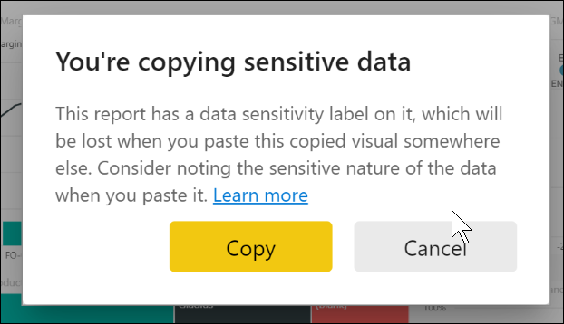
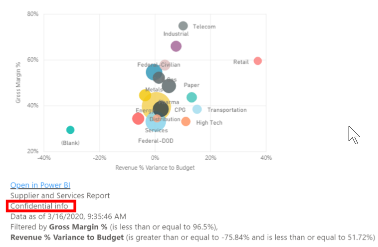
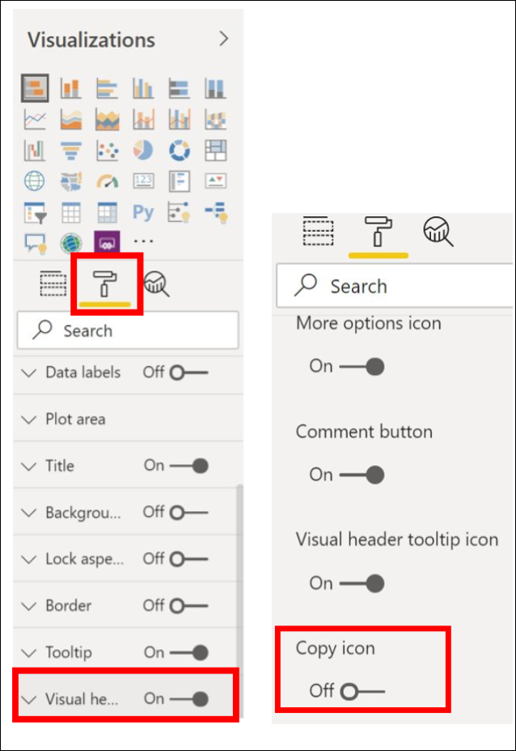
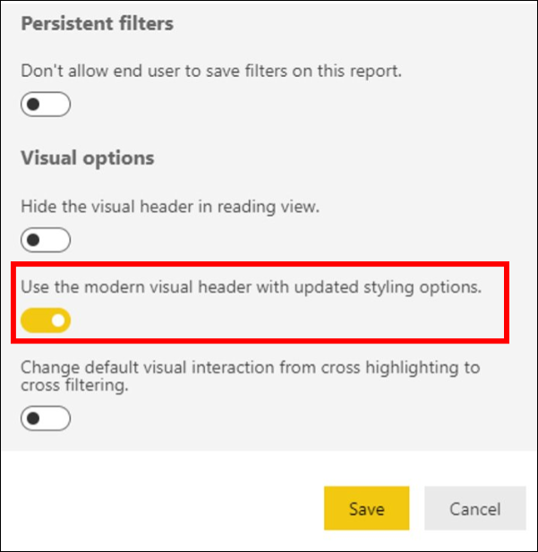
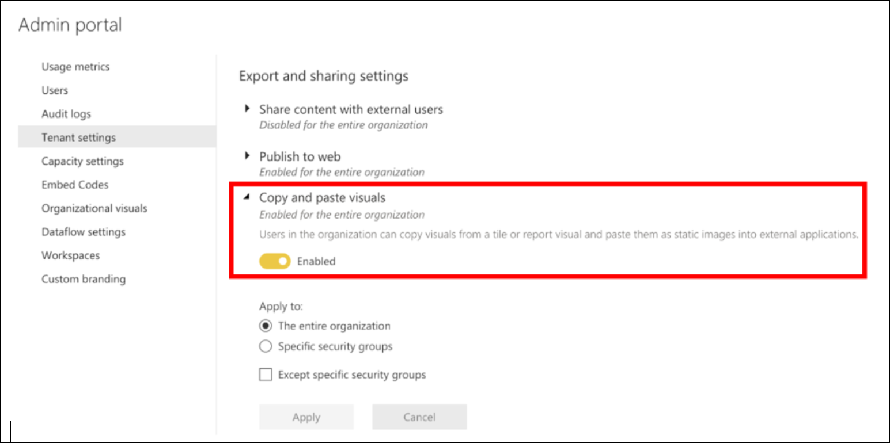
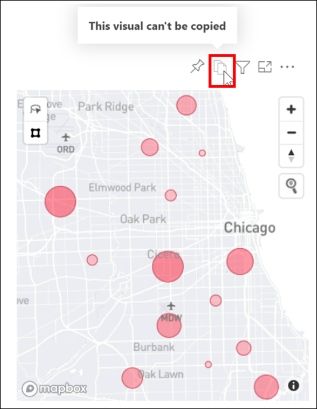

# Copy and paste a report visualization

[!INCLUDE[consumer-appliesto-yyyn](../includes/consumer-appliesto-yyyn.md)]

This article covers two different ways to copy and paste a visual. 
* copy a visual in a report and paste it onto another report page (requires editing permissions for the report)

* copy an image of a visual from Power BI to your clipboard, and paste it into other applications

## Copy and paste within the same report
Visuals in Power BI reports can be copied from one page in the report to the same page or different page in the same report. 

Copying and pasting a visualization requires edit permissions to the report. In the Power BI service, this means opening the report in [Editing View](../consumer/end-user-reading-view.md). 

Visualizations on *dashboards* can't be copied and pasted into Power BI reports or other dashboards.

1. Open a report that has at least one visualization.  

2. Select the visualization and use **Ctrl +C** to copy, and **Ctrl +V** to paste.      

   

## Copy a visual as an image to your clipboard

Have you ever wanted to share an image from a Power BI report or dashboard? Now you can copy the visual and paste it into any other application that supports pasting. 

When you copy a static image of a visual, you get a copy of the visual along with the metadata. This includes:
* link back to the Power BI report or dashboard
* title of the report or dashboard
* notice if the image contains confidential information
* last updated time stamp
* filters applied to the visual

### Copy from a dashboard tile

1. Navigate to the dashboard you want to copy from.

2. From the upper right corner of the visual, select **More options(...)** and choose **Copy visual as image**. 

    

3. When the **Your visual is ready to copy** dialog appears, select **Copy to clipboard**.

    

4. When your visual is ready, paste it into another application using **Ctrl + V** or right-click > Paste. In the screenshot below, we've pasted the visual into Microsoft Word. 

    

### Copy from a report visual 

1. Navigate to the report you want to copy from.

2. From the upper right corner of the visual, select the icon for **Copy visual as image**. 

    

3. When the **Your visual is ready to copy** dialog appears, select **Copy to clipboard**.

    

4. When your visual is ready, paste it into another application using **Ctrl + V** or right-click > Paste. In the screenshot below, we've pasted the visual into an email.

    

5. If there is a data sensitivity label applied to the report, you'll receive a warning when you select the copy icon.  

    

    And, a sensitivity label will be added to the metadata below the pasted visual. 

    

### Manage use of copying a visual as an image
If you own the content or are an administrator of the tenant, you can control whether a visual can be copied as an image from a report or dashboard.

#### Disable copy as an image for a specific visual
If you don't want users to be able to copy a specific visual, you can remove the copy icon from that visual.
1. Select the paint roller icon to open the Formatting pane. 

1. Open the **Visual formatting** card.
1. Scroll down to **Visual header**, expand the card, and toggle off **Copy icon**.

    

1. If you can't find the **Visual header** setting, turn on the modern visual header option under **Report settings**. 

    

1. Save changes. Reshare and republish as needed.

#### Disable copy as an image for a group of users

If you own the content or are an administrator of the tenant, you can control who can copy visuals. This setting disables *copying visual as image* for all content the user accesses in the Power BI tenant.
  
1. Navigate to the Admin Portal.

1. Under **Tenant settings**, select **Export and sharing settings**. 

    

1. Disable **Copy and paste visuals**, for your selected user groups. 

1. Save changes, and the specified groups will not be able to use **Copy visual as image** throughout Power BI. 
  

## Considerations and troubleshooting

   

Q: Why is the Copy icon disabled on a visual?    
A: We currently support native Power BI visuals and Certified Visuals. There is limited support for certain visuals including: 
- ESRI and other Map visuals 
- Python visuals 
- R visuals 
- PowerApps 
- Non-certified custom visuals 
For your custom visual to be supported, learn more about [how to certify your custom visual](../developer/visuals/power-bi-custom-visuals-certified.md). 

Q: Why is my visual not pasting correctly?    
A: There are limitations around copy visual as an image, including: 
- For custom visuals 
    - Visuals with applied themes and colors 
    - Tile scaling when pasting 
    - Custom visuals with animations 
- Copying constraints 
    - Cannot copy a freshly pinned dashboard tile 
    - Cannot redirect users to content with Odata filters and sticky states such as personal bookmarks 
- Applications with limited support for pasting HTML-formatted content from the clipboard may not render everything that was copied from the visual 

## Next steps
More about [Visualizations in Power BI reports](power-bi-report-visualizations.md)

More questions? [Try the Power BI Community](https://community.powerbi.com/)

